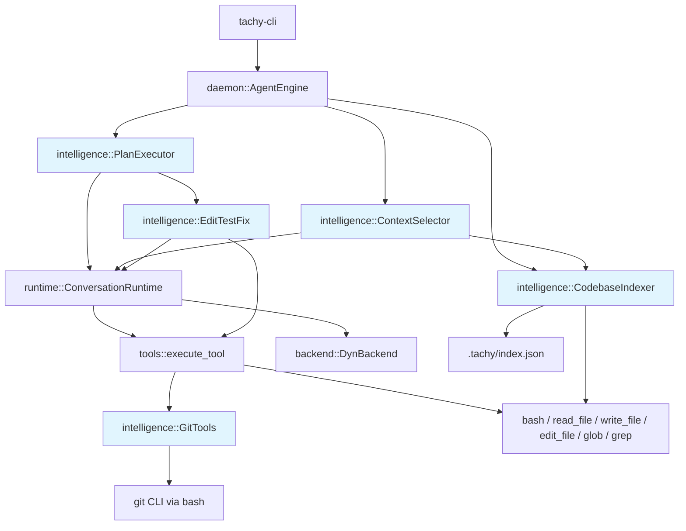
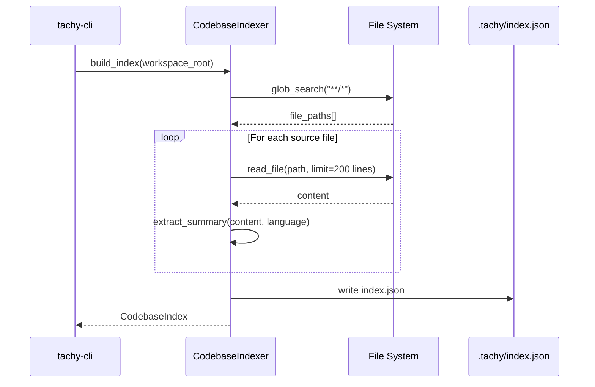
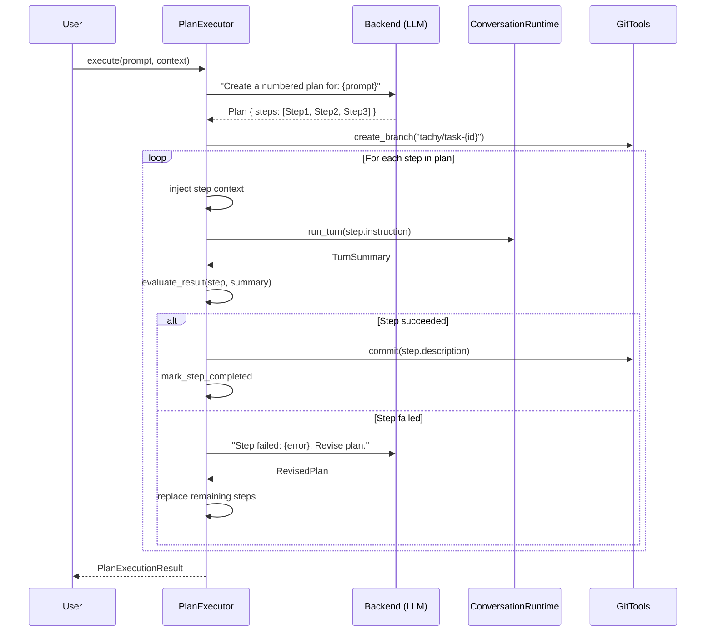
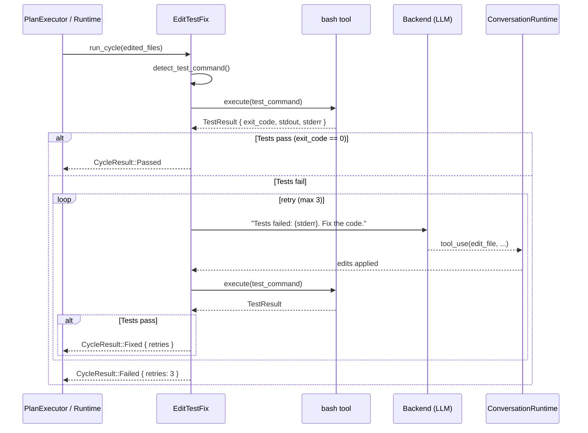
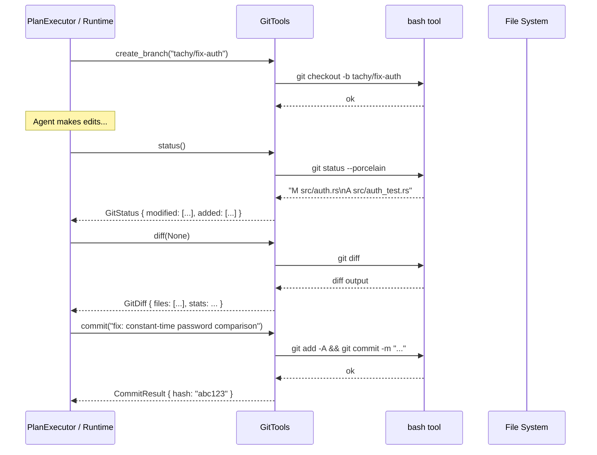
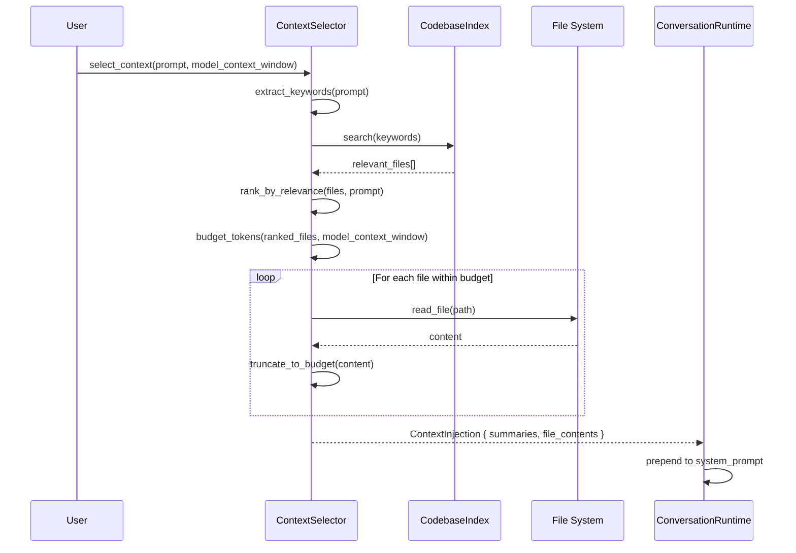
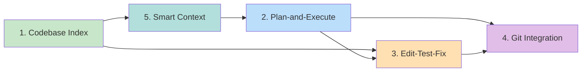

# Design Document: Agent Intelligence

## Overview

Tachy is an enterprise on-prem AI agent platform built in Rust that connects to local models via Ollama. It already has a working conversation runtime with an agentic tool-use loop, 6 built-in tools, audit logging, governance, and session persistence. However, it lacks the intelligence layer that makes Claude Code, Devin, and Cursor effective: the ability to understand a codebase holistically, plan multi-step tasks, self-correct from test failures, manage version control, and optimize context for small local models.

This design introduces 5 features that compose into a coherent intelligence stack. Codebase Indexing provides the foundation — a searchable map of the project. Smart Context Selection uses that index to inject only relevant files into the model's limited context window. Plan-and-Execute wraps the existing `ConversationRuntime::run_turn()` in an outer planning loop for complex tasks. Edit-Test-Fix automatically validates code changes by running tests and feeding failures back. Git Integration gives the agent structured version control so changes are safe and reversible.

These features are additive — each can be used independently, but they compound. A planning loop that knows the codebase structure, selects relevant context, commits after each successful step, and auto-fixes test failures is qualitatively different from a bare tool-use loop.

## Architecture



## New Crate: `intelligence`

All 5 features live in a single new crate `rust/crates/intelligence/` to avoid scattering intelligence logic across existing crates. The crate depends on `runtime`, `tools`, and `backend` but existing crates do not depend on it — the dependency flows one way.

```
rust/crates/intelligence/
├── Cargo.toml
└── src/
    ├── lib.rs              # Public API, re-exports
    ├── indexer.rs           # Feature 1: Codebase Indexing
    ├── planner.rs           # Feature 2: Plan-and-Execute Loop
    ├── edit_test_fix.rs     # Feature 3: Edit-Test-Fix Cycle
    ├── git.rs               # Feature 4: Git Integration
    └── context.rs           # Feature 5: Smart Context Selection
```

```toml
# Cargo.toml
[package]
name = "intelligence"
version.workspace = true
edition.workspace = true

[dependencies]
runtime = { path = "../runtime" }
tools = { path = "../tools" }
backend = { path = "../backend" }
serde = { version = "1", features = ["derive"] }
serde_json = "1"
```

Integration points:
- `daemon::AgentEngine::run_agent()` gains an optional `IntelligenceConfig` that enables/disables each feature
- `tachy-cli` passes `IntelligenceConfig` based on CLI flags or `.tachy/config.json`
- The `tools` crate's `execute_tool()` match arm is extended with git tool names that delegate to `intelligence::git`

---

## Feature 1: Codebase Indexing

### Sequence Diagram



### Data Model

```rust
use serde::{Deserialize, Serialize};
use std::collections::BTreeMap;
use std::path::PathBuf;

/// The full codebase index, persisted to .tachy/index.json
#[derive(Debug, Clone, Serialize, Deserialize)]
pub struct CodebaseIndex {
    /// Schema version for forward compatibility
    pub version: u32,
    /// Workspace root this index was built from
    pub workspace_root: String,
    /// When the index was last built (unix timestamp)
    pub built_at: u64,
    /// Indexed files keyed by relative path
    pub files: BTreeMap<String, FileEntry>,
    /// Project-level metadata
    pub project: ProjectMeta,
}

/// Metadata about the overall project
#[derive(Debug, Clone, Serialize, Deserialize)]
pub struct ProjectMeta {
    /// Detected primary language (e.g., "rust", "python", "typescript")
    pub primary_language: Option<String>,
    /// Detected build/test commands
    pub test_command: Option<String>,
    /// Detected package manager or build system
    pub build_system: Option<String>,
    /// Total file count
    pub total_files: usize,
    /// Total lines of code (approximate)
    pub total_lines: usize,
}

/// A single indexed file
#[derive(Debug, Clone, Serialize, Deserialize)]
pub struct FileEntry {
    /// Relative path from workspace root
    pub path: String,
    /// Detected language
    pub language: String,
    /// File size in bytes
    pub size: u64,
    /// Line count
    pub lines: usize,
    /// Key exports: function names, struct names, class names
    pub exports: Vec<String>,
    /// One-line summary of what this file does
    pub summary: String,
    /// File content hash for incremental re-indexing
    pub content_hash: String,
}
```

### Key Functions

```rust
impl CodebaseIndexer {
    /// Build a full index of the workspace. Uses glob_search and read_file
    /// from the existing tools crate under the hood.
    pub fn build_index(workspace_root: &Path) -> Result<CodebaseIndex, IndexError> { .. }

    /// Incrementally update the index — only re-index files whose
    /// content_hash has changed. Returns the number of files re-indexed.
    pub fn update_index(
        workspace_root: &Path,
        existing: &CodebaseIndex,
    ) -> Result<(CodebaseIndex, usize), IndexError> { .. }

    /// Load a previously persisted index from .tachy/index.json
    pub fn load_index(workspace_root: &Path) -> Result<CodebaseIndex, IndexError> { .. }

    /// Persist the index to .tachy/index.json
    pub fn save_index(
        workspace_root: &Path,
        index: &CodebaseIndex,
    ) -> Result<(), IndexError> { .. }

    /// Search the index for files matching a query string.
    /// Matches against path, exports, summary, and language.
    pub fn search(
        index: &CodebaseIndex,
        query: &str,
        max_results: usize,
    ) -> Vec<&FileEntry> { .. }
}
```

**Preconditions:**
- `workspace_root` exists and is a directory
- For `update_index`: `existing.workspace_root` matches `workspace_root`

**Postconditions:**
- `build_index` returns an index where `files.len() == total_files` in `project`
- `save_index` followed by `load_index` returns an equivalent index
- `search` returns at most `max_results` entries, sorted by relevance

### Extract Summary Algorithm

```rust
/// Extract exports and a summary from file content.
/// This is a lightweight regex-based parser, NOT a full AST.
fn extract_summary(path: &str, content: &str, language: &str) -> (Vec<String>, String) {
    // Language detection from file extension
    // For Rust: scan for `pub fn`, `pub struct`, `pub enum`, `pub trait`, `pub mod`
    // For Python: scan for `def `, `class `, lines starting at column 0
    // For TypeScript/JS: scan for `export function`, `export class`, `export const`
    // For Go: scan for capitalized function names (exported by convention)
    //
    // Summary = first doc comment or first non-empty line, truncated to 120 chars
    // Exports = collected names, capped at 20 per file
}

/// Detect language from file extension
fn detect_language(path: &str) -> &str {
    match path.rsplit('.').next() {
        Some("rs") => "rust",
        Some("py") => "python",
        Some("ts") | Some("tsx") => "typescript",
        Some("js") | Some("jsx") => "javascript",
        Some("go") => "go",
        Some("java") => "java",
        Some("rb") => "ruby",
        Some("c" | "h") => "c",
        Some("cpp" | "cc" | "hpp") => "cpp",
        Some("toml") => "toml",
        Some("json") => "json",
        Some("yaml" | "yml") => "yaml",
        Some("md") => "markdown",
        _ => "unknown",
    }
}

/// Detect the project's test command from build files
fn detect_test_command(workspace_root: &Path) -> Option<String> {
    if workspace_root.join("Cargo.toml").exists() {
        Some("cargo test".to_string())
    } else if workspace_root.join("package.json").exists() {
        Some("npm test".to_string())
    } else if workspace_root.join("pyproject.toml").exists()
        || workspace_root.join("setup.py").exists()
    {
        Some("pytest".to_string())
    } else if workspace_root.join("go.mod").exists() {
        Some("go test ./...".to_string())
    } else if workspace_root.join("Makefile").exists() {
        Some("make test".to_string())
    } else {
        None
    }
}
```

### Storage Format

The index is stored at `.tachy/index.json` as pretty-printed JSON. Example:

```json
{
  "version": 1,
  "workspace_root": "/home/user/project",
  "built_at": 1719849600,
  "project": {
    "primary_language": "rust",
    "test_command": "cargo test",
    "build_system": "cargo",
    "total_files": 42,
    "total_lines": 8500
  },
  "files": {
    "src/main.rs": {
      "path": "src/main.rs",
      "language": "rust",
      "size": 2048,
      "lines": 85,
      "exports": ["main", "run", "Config"],
      "summary": "CLI entry point — parses args and runs the application",
      "content_hash": "a1b2c3d4"
    }
  }
}
```

### Ignored Paths

The indexer skips:
- `.git/`, `.tachy/`, `node_modules/`, `target/`, `__pycache__/`, `.venv/`, `vendor/`
- Binary files (detected by extension: `.png`, `.jpg`, `.wasm`, `.o`, `.so`, `.exe`, etc.)
- Files larger than 100KB (configurable)
- Files matching patterns in `.gitignore` (if present)

---

## Feature 2: Plan-and-Execute Loop

### Sequence Diagram



### Data Model

```rust
/// A plan generated by the model before execution
#[derive(Debug, Clone, Serialize, Deserialize)]
pub struct Plan {
    /// Unique plan ID
    pub id: String,
    /// The original user prompt that triggered planning
    pub prompt: String,
    /// Ordered steps to execute
    pub steps: Vec<PlanStep>,
    /// Current step index (0-based)
    pub current_step: usize,
    /// Overall plan status
    pub status: PlanStatus,
}

#[derive(Debug, Clone, Serialize, Deserialize)]
pub struct PlanStep {
    /// Step number (1-based, for display)
    pub number: usize,
    /// What this step does (shown to user)
    pub description: String,
    /// The instruction to send to ConversationRuntime
    pub instruction: String,
    /// Which files this step is expected to touch
    pub expected_files: Vec<String>,
    /// Step execution status
    pub status: StepStatus,
    /// Result summary after execution
    pub result: Option<String>,
}

#[derive(Debug, Clone, Copy, PartialEq, Eq, Serialize, Deserialize)]
pub enum PlanStatus {
    Created,
    InProgress,
    Completed,
    Failed,
    Revised,
}

#[derive(Debug, Clone, Copy, PartialEq, Eq, Serialize, Deserialize)]
pub enum StepStatus {
    Pending,
    Running,
    Completed,
    Failed,
    Skipped,
}

/// Result of executing a full plan
#[derive(Debug, Clone, Serialize, Deserialize)]
pub struct PlanExecutionResult {
    pub plan: Plan,
    pub total_iterations: usize,
    pub total_tool_invocations: u32,
    pub revisions: usize,
    pub success: bool,
}
```

### Key Functions

```rust
impl PlanExecutor {
    /// Create a new plan executor that wraps a ConversationRuntime.
    pub fn new(
        runtime: ConversationRuntime<impl ApiClient, impl ToolExecutor>,
        config: PlanConfig,
    ) -> Self { .. }

    /// Generate a plan from a user prompt by asking the LLM.
    /// The LLM is prompted to return a structured JSON plan.
    pub fn create_plan(&mut self, prompt: &str) -> Result<Plan, PlanError> { .. }

    /// Execute all steps in the plan sequentially.
    /// After each step, evaluates the result and may revise the plan.
    pub fn execute(&mut self, plan: &mut Plan) -> Result<PlanExecutionResult, PlanError> { .. }

    /// Execute a single step by calling runtime.run_turn() with the
    /// step's instruction. Returns the TurnSummary.
    fn execute_step(
        &mut self,
        step: &mut PlanStep,
    ) -> Result<TurnSummary, PlanError> { .. }

    /// Ask the LLM to revise the remaining plan steps given a failure.
    fn revise_plan(
        &mut self,
        plan: &mut Plan,
        failed_step: usize,
        error: &str,
    ) -> Result<(), PlanError> { .. }
}

/// Configuration for the plan executor
#[derive(Debug, Clone, Serialize, Deserialize)]
pub struct PlanConfig {
    /// Maximum number of steps in a plan
    pub max_steps: usize,           // default: 10
    /// Maximum plan revisions before giving up
    pub max_revisions: usize,       // default: 3
    /// Whether to auto-commit after each step (requires git integration)
    pub auto_commit: bool,          // default: true
    /// Whether to create a branch before execution
    pub auto_branch: bool,          // default: true
    /// Whether to run edit-test-fix after code changes
    pub auto_test: bool,            // default: true
}
```

**Preconditions:**
- `runtime` is initialized with a valid backend and tool executor
- The LLM must be capable of generating structured JSON (tool-use capable models)

**Postconditions:**
- `create_plan` returns a `Plan` with 1..=`max_steps` steps, all in `Pending` status
- `execute` processes steps in order; on completion, all steps are `Completed`, `Failed`, or `Skipped`
- `revisions` count in result is <= `max_revisions`

### Plan Generation Prompt

The planner sends this prompt to the LLM to generate a plan:

```
You are a planning agent. Given the user's task, create a numbered plan.
Return ONLY a JSON object with this structure:
{
  "steps": [
    {
      "number": 1,
      "description": "Short description of what this step does",
      "instruction": "Detailed instruction for the agent to execute",
      "expected_files": ["path/to/file.rs"]
    }
  ]
}

Rules:
- Each step should be atomic and independently verifiable
- Steps should be ordered by dependency
- Keep steps small — prefer 3-5 steps over 1 giant step
- Include file paths the step will read or modify
- The instruction should be specific enough for an AI agent to execute

User's task: {prompt}

Project context:
{codebase_index_summary}
```

### Integration with Existing Runtime

The `PlanExecutor` does NOT replace `ConversationRuntime`. It wraps it:

```rust
// In daemon/src/engine.rs — modified run_agent()
if config.intelligence.planning_enabled {
    let mut planner = PlanExecutor::new(runtime, config.intelligence.plan_config);
    let mut plan = planner.create_plan(prompt)?;
    let result = planner.execute(&mut plan)?;
    // Convert PlanExecutionResult → AgentRunResult
} else {
    // Existing path: runtime.run_turn(prompt, None)
}
```

---

## Feature 3: Edit-Test-Fix Cycle

### Sequence Diagram



### Data Model

```rust
/// Result of an edit-test-fix cycle
#[derive(Debug, Clone, Serialize, Deserialize)]
pub struct CycleResult {
    pub outcome: CycleOutcome,
    /// Number of fix attempts made
    pub retries: usize,
    /// Test command that was run
    pub test_command: String,
    /// Files that were edited during fix attempts
    pub files_modified: Vec<String>,
    /// Final test output
    pub test_output: String,
}

#[derive(Debug, Clone, Copy, PartialEq, Eq, Serialize, Deserialize)]
pub enum CycleOutcome {
    /// Tests passed on first run (no fixes needed)
    Passed,
    /// Tests failed initially but were fixed
    Fixed,
    /// Tests still failing after max retries
    Failed,
    /// No test command detected for this project
    NoTestCommand,
    /// Test command timed out
    Timeout,
}

/// Configuration for the edit-test-fix cycle
#[derive(Debug, Clone, Serialize, Deserialize)]
pub struct EditTestFixConfig {
    /// Maximum fix attempts before giving up
    pub max_retries: usize,         // default: 3
    /// Test command override (None = auto-detect)
    pub test_command: Option<String>,
    /// Timeout per test run in seconds
    pub test_timeout_secs: u64,     // default: 120
    /// Whether to run only tests related to edited files
    /// (e.g., `cargo test --lib module_name` instead of `cargo test`)
    pub targeted_tests: bool,       // default: true
}
```

### Key Functions

```rust
impl EditTestFix {
    /// Run the edit-test-fix cycle.
    /// 1. Detect or use configured test command
    /// 2. Run tests
    /// 3. If tests fail, feed failure to LLM and let it fix
    /// 4. Repeat until pass or max_retries
    pub fn run_cycle(
        &mut self,
        edited_files: &[String],
        runtime: &mut ConversationRuntime<impl ApiClient, impl ToolExecutor>,
    ) -> Result<CycleResult, EditTestFixError> { .. }

    /// Detect the project's test command from build files.
    /// Uses the codebase index if available, otherwise checks for
    /// Cargo.toml, package.json, pyproject.toml, go.mod, Makefile.
    pub fn detect_test_command(
        workspace_root: &Path,
        index: Option<&CodebaseIndex>,
    ) -> Option<String> { .. }

    /// Build a targeted test command that only runs tests related
    /// to the edited files. Falls back to full test suite.
    fn targeted_test_command(
        base_command: &str,
        edited_files: &[String],
    ) -> String { .. }

    /// Run the test command via bash and capture output.
    fn run_tests(&self, command: &str) -> Result<TestResult, EditTestFixError> { .. }
}

struct TestResult {
    exit_code: i32,
    stdout: String,
    stderr: String,
    duration_secs: f64,
}
```

**Preconditions:**
- `edited_files` is non-empty (at least one file was changed)
- A test command is detectable or configured

**Postconditions:**
- If `outcome == Passed`, tests passed on first run, `retries == 0`
- If `outcome == Fixed`, tests passed after 1..=`max_retries` fix attempts
- If `outcome == Failed`, `retries == max_retries` and tests still fail
- `files_modified` contains only files changed during fix attempts (not the original edits)

### Targeted Test Commands

For efficiency with large test suites, the cycle tries to run only relevant tests:

```rust
fn targeted_test_command(base_command: &str, edited_files: &[String]) -> String {
    match base_command {
        "cargo test" => {
            // Extract module names from file paths
            // e.g., "src/indexer.rs" → "cargo test indexer"
            let modules: Vec<&str> = edited_files.iter()
                .filter_map(|f| f.strip_prefix("src/"))
                .filter_map(|f| f.strip_suffix(".rs"))
                .collect();
            if modules.is_empty() {
                base_command.to_string()
            } else {
                format!("cargo test {}", modules.join(" "))
            }
        }
        "npm test" => base_command.to_string(), // npm test doesn't support file targeting easily
        "pytest" => {
            // pytest can target specific files
            let test_files: Vec<&str> = edited_files.iter()
                .filter(|f| f.contains("test"))
                .map(String::as_str)
                .collect();
            if test_files.is_empty() {
                base_command.to_string()
            } else {
                format!("pytest {}", test_files.join(" "))
            }
        }
        _ => base_command.to_string(),
    }
}
```

### Fix Prompt

When tests fail, this prompt is injected into the conversation:

```
The following tests failed after your edits:

Command: {test_command}
Exit code: {exit_code}

stderr:
{stderr_truncated_to_4000_chars}

stdout (last 2000 chars):
{stdout_tail}

Files you edited: {edited_files}

Please fix the code to make the tests pass. Focus on the specific errors shown above.
Do NOT change the test files unless the tests themselves are wrong.
```

---

## Feature 4: Git Integration

### Sequence Diagram



### Data Model

```rust
/// Structured git status output
#[derive(Debug, Clone, Serialize, Deserialize)]
pub struct GitStatus {
    /// Current branch name
    pub branch: String,
    /// Files with staged changes
    pub staged: Vec<FileChange>,
    /// Files with unstaged changes
    pub unstaged: Vec<FileChange>,
    /// Untracked files
    pub untracked: Vec<String>,
    /// Whether the working tree is clean
    pub is_clean: bool,
}

#[derive(Debug, Clone, Serialize, Deserialize)]
pub struct FileChange {
    pub path: String,
    pub status: ChangeStatus,
}

#[derive(Debug, Clone, Copy, PartialEq, Eq, Serialize, Deserialize)]
pub enum ChangeStatus {
    Added,
    Modified,
    Deleted,
    Renamed,
}

/// Structured git diff output
#[derive(Debug, Clone, Serialize, Deserialize)]
pub struct GitDiff {
    /// Per-file diffs
    pub files: Vec<FileDiff>,
    /// Summary stats
    pub stats: DiffStats,
}

#[derive(Debug, Clone, Serialize, Deserialize)]
pub struct FileDiff {
    pub path: String,
    pub additions: usize,
    pub deletions: usize,
    /// The actual diff content (truncated for large diffs)
    pub content: String,
}

#[derive(Debug, Clone, Serialize, Deserialize)]
pub struct DiffStats {
    pub files_changed: usize,
    pub insertions: usize,
    pub deletions: usize,
}

/// Result of a git commit
#[derive(Debug, Clone, Serialize, Deserialize)]
pub struct CommitResult {
    pub hash: String,
    pub message: String,
    pub files_changed: usize,
}

/// Result of a branch operation
#[derive(Debug, Clone, Serialize, Deserialize)]
pub struct BranchResult {
    pub name: String,
    pub created: bool,
    pub previous_branch: String,
}
```

### Tool Specs (added to tools crate)

```rust
/// New tool specs for git operations, added to mvp_tool_specs()
pub fn git_tool_specs() -> Vec<ToolSpec> {
    vec![
        ToolSpec {
            name: "git_status",
            description: "Show the working tree status with structured output.",
            input_schema: json!({
                "type": "object",
                "properties": {},
                "additionalProperties": false
            }),
        },
        ToolSpec {
            name: "git_diff",
            description: "Show changes between working tree and HEAD.",
            input_schema: json!({
                "type": "object",
                "properties": {
                    "path": { "type": "string", "description": "Optional path to diff" },
                    "staged": { "type": "boolean", "description": "Show staged changes only" }
                },
                "additionalProperties": false
            }),
        },
        ToolSpec {
            name: "git_branch",
            description: "Create or switch branches.",
            input_schema: json!({
                "type": "object",
                "properties": {
                    "name": { "type": "string", "description": "Branch name" },
                    "create": { "type": "boolean", "description": "Create new branch" }
                },
                "required": ["name"],
                "additionalProperties": false
            }),
        },
        ToolSpec {
            name: "git_commit",
            description: "Stage all changes and commit with a message.",
            input_schema: json!({
                "type": "object",
                "properties": {
                    "message": { "type": "string", "description": "Commit message" }
                },
                "required": ["message"],
                "additionalProperties": false
            }),
        },
    ]
}
```

### Key Functions

```rust
impl GitTools {
    /// Get structured git status
    pub fn status() -> Result<GitStatus, GitError> { .. }

    /// Get structured diff output
    pub fn diff(path: Option<&str>, staged: bool) -> Result<GitDiff, GitError> { .. }

    /// Create or switch to a branch
    pub fn branch(name: &str, create: bool) -> Result<BranchResult, GitError> { .. }

    /// Stage all changes and commit
    pub fn commit(message: &str) -> Result<CommitResult, GitError> { .. }

    /// Check if the current directory is a git repository
    pub fn is_git_repo() -> bool { .. }

    /// Get the current branch name
    pub fn current_branch() -> Result<String, GitError> { .. }
}
```

**Preconditions:**
- Working directory is inside a git repository (for all operations)
- For `commit`: there are staged or unstaged changes to commit
- For `branch` with `create=true`: branch name doesn't already exist

**Postconditions:**
- `status` returns a `GitStatus` where `is_clean == (staged.is_empty() && unstaged.is_empty() && untracked.is_empty())`
- `commit` returns a `CommitResult` with a valid 7+ char hash
- `branch` with `create=true` returns `BranchResult { created: true, .. }` and HEAD is on the new branch

### Integration with tools crate

The `execute_tool` function in `tools/src/lib.rs` is extended:

```rust
pub fn execute_tool(name: &str, input: &Value) -> Result<String, String> {
    match name {
        "bash" => ...,
        "read_file" => ...,
        // ... existing tools ...
        "git_status" => intelligence::git::execute_git_status(),
        "git_diff" => intelligence::git::execute_git_diff(input),
        "git_branch" => intelligence::git::execute_git_branch(input),
        "git_commit" => intelligence::git::execute_git_commit(input),
        _ => Err(format!("unsupported tool: {name}")),
    }
}
```

The `tools` crate gains a dependency on `intelligence` for the git tool implementations. Alternatively, the git tool execution can be registered dynamically via the `ToolRegistry` to avoid a circular dependency — the `daemon` or `tachy-cli` wires them together at startup.

### Governance Integration

Git operations are subject to governance policy:
- `git_commit` is audited (every commit is logged)
- Branch names are prefixed with `tachy/` to distinguish agent-created branches
- The governance policy can block git operations via `allowed_tools` on the agent template

---

## Feature 5: Smart Context Selection

### Sequence Diagram



### Data Model

```rust
/// The context injection that gets prepended to the system prompt
#[derive(Debug, Clone, Serialize, Deserialize)]
pub struct ContextInjection {
    /// File summaries from the index (always included, cheap)
    pub summaries: Vec<FileSummary>,
    /// Full or partial file contents for highly relevant files
    pub file_contents: Vec<FileContent>,
    /// Total estimated tokens used by this injection
    pub estimated_tokens: usize,
    /// Token budget that was available
    pub token_budget: usize,
}

#[derive(Debug, Clone, Serialize, Deserialize)]
pub struct FileSummary {
    pub path: String,
    pub language: String,
    pub exports: Vec<String>,
    pub summary: String,
}

#[derive(Debug, Clone, Serialize, Deserialize)]
pub struct FileContent {
    pub path: String,
    pub content: String,
    /// Whether the content was truncated
    pub truncated: bool,
    /// Estimated token count for this file
    pub estimated_tokens: usize,
}

/// Configuration for context selection
#[derive(Debug, Clone, Serialize, Deserialize)]
pub struct ContextConfig {
    /// Maximum percentage of context window to use for injected context
    /// (leave room for system prompt, history, and model output)
    pub max_context_percentage: f32,    // default: 0.40 (40%)
    /// Maximum number of full file contents to inject
    pub max_full_files: usize,          // default: 5
    /// Maximum number of file summaries to inject
    pub max_summaries: usize,           // default: 20
    /// Minimum relevance score (0.0-1.0) to include a file
    pub min_relevance: f32,             // default: 0.1
}
```

### Key Functions

```rust
impl ContextSelector {
    /// Select relevant context for a user prompt.
    /// Uses the codebase index to find relevant files, then reads
    /// the most relevant ones within the token budget.
    pub fn select_context(
        prompt: &str,
        index: &CodebaseIndex,
        model_context_window: usize,
        config: &ContextConfig,
    ) -> Result<ContextInjection, ContextError> { .. }

    /// Extract keywords and file references from a user prompt.
    /// Looks for: file paths, function names, module names, error messages.
    fn extract_keywords(prompt: &str) -> Vec<String> { .. }

    /// Score each file's relevance to the prompt.
    /// Scoring factors:
    /// - Direct path mention in prompt (highest)
    /// - Export name match (high)
    /// - Summary keyword match (medium)
    /// - Language relevance (low)
    fn rank_files(
        files: &[&FileEntry],
        keywords: &[String],
        prompt: &str,
    ) -> Vec<(String, f32)> { .. }

    /// Estimate token count for a string.
    /// Uses the rough heuristic: 1 token ≈ 4 characters.
    fn estimate_tokens(text: &str) -> usize {
        text.len() / 4
    }

    /// Build the token budget based on model context window.
    fn token_budget(model_context_window: usize, config: &ContextConfig) -> usize {
        (model_context_window as f32 * config.max_context_percentage) as usize
    }

    /// Render the context injection as a string to prepend to system prompt.
    pub fn render_injection(injection: &ContextInjection) -> String { .. }
}
```

**Preconditions:**
- `index` is a valid, non-empty `CodebaseIndex`
- `model_context_window > 0`

**Postconditions:**
- `injection.estimated_tokens <= token_budget(model_context_window, config)`
- `injection.file_contents.len() <= config.max_full_files`
- `injection.summaries.len() <= config.max_summaries`
- Files in `file_contents` are ordered by relevance (highest first)

### Relevance Scoring Algorithm

```rust
fn score_file(entry: &FileEntry, keywords: &[String], prompt: &str) -> f32 {
    let mut score: f32 = 0.0;

    // Direct path mention: if the prompt contains the file path
    if prompt.contains(&entry.path) {
        score += 1.0;
    }

    // Partial path match: if prompt contains the filename
    if let Some(filename) = entry.path.rsplit('/').next() {
        if prompt.to_lowercase().contains(&filename.to_lowercase()) {
            score += 0.7;
        }
    }

    // Export name match
    for export in &entry.exports {
        if keywords.iter().any(|k| k.eq_ignore_ascii_case(export)) {
            score += 0.5;
        }
    }

    // Summary keyword overlap
    let summary_lower = entry.summary.to_lowercase();
    for keyword in keywords {
        if summary_lower.contains(&keyword.to_lowercase()) {
            score += 0.2;
        }
    }

    // Penalize very large files (they eat context budget)
    if entry.lines > 500 {
        score *= 0.8;
    }
    if entry.lines > 1000 {
        score *= 0.6;
    }

    score
}
```

### Rendered Context Format

The context injection is rendered as a system prompt section:

```
# Codebase Context

## Project: rust (42 files, primary language: rust)
Test command: cargo test

## Relevant File Summaries
- src/auth.rs [rust, 85 lines] — Authentication module with JWT token handling
  exports: authenticate, verify_token, AuthConfig
- src/db.rs [rust, 120 lines] — Database connection pool and query helpers
  exports: Pool, query, migrate

## File Contents

### src/auth.rs (full)
```rust
// ... file content ...
```

### src/db.rs (lines 1-50, truncated)
```rust
// ... partial content ...
```
```

### Integration with ConversationRuntime

Context selection hooks into the system prompt construction:

```rust
// In daemon/src/engine.rs or tachy-cli/src/main.rs
fn build_system_prompt_with_context(
    base_prompt: Vec<String>,
    prompt: &str,
    index: &CodebaseIndex,
    model_context_window: usize,
    config: &ContextConfig,
) -> Vec<String> {
    let injection = ContextSelector::select_context(
        prompt, index, model_context_window, config,
    ).unwrap_or_default();

    let mut sections = base_prompt;
    sections.push(ContextSelector::render_injection(&injection));
    sections
}
```

This is called before each `runtime.run_turn()` to inject fresh context based on the current prompt. The context changes per turn — if the user asks about auth, they get auth files; if they ask about the database, they get db files.

---

## Feature Interactions



| Interaction | Description |
|---|---|
| Index → Context | Context selector queries the codebase index to find relevant files |
| Index → Edit-Test-Fix | ETF uses `detect_test_command()` from the index's `project.test_command` |
| Context → Plan-Execute | Each plan step gets fresh context selection based on the step's instruction |
| Plan-Execute → ETF | After a step edits code, the planner triggers an ETF cycle |
| Plan-Execute → Git | Planner creates a branch before execution, commits after each successful step |
| ETF → Git | After a successful fix cycle, the fix is committed |

### Composite Flow: Full Intelligence Pipeline

When all 5 features are enabled, a user prompt like "Add rate limiting to the API" triggers:

1. **Index** — Load or build `.tachy/index.json`
2. **Context** — Analyze prompt, inject relevant files (api.rs, middleware.rs, config.rs)
3. **Plan** — LLM generates plan: (1) add rate limiter struct, (2) add middleware, (3) add config, (4) add tests
4. **Git** — Create branch `tachy/add-rate-limiting`
5. **Execute Step 1** — Context-selected prompt → `run_turn()` → edits `src/rate_limit.rs`
6. **ETF** — Run `cargo test` → passes → commit "feat: add rate limiter struct"
7. **Execute Step 2** — Fresh context → `run_turn()` → edits `src/middleware.rs`
8. **ETF** — Run `cargo test` → fails → LLM fixes → retry → passes → commit
9. ... continue for remaining steps ...
10. **Result** — All steps completed, branch has clean commit history

---

## IntelligenceConfig: Unified Configuration

```rust
/// Top-level configuration for all intelligence features.
/// Added to PlatformConfig and AgentTemplate.
#[derive(Debug, Clone, Serialize, Deserialize)]
pub struct IntelligenceConfig {
    /// Enable codebase indexing
    pub indexing_enabled: bool,         // default: true
    /// Enable smart context selection
    pub context_enabled: bool,          // default: true
    /// Enable plan-and-execute for complex tasks
    pub planning_enabled: bool,         // default: true
    /// Enable edit-test-fix cycle
    pub edit_test_fix_enabled: bool,    // default: true
    /// Enable git integration
    pub git_enabled: bool,              // default: true

    /// Indexer configuration
    pub indexer: IndexerConfig,
    /// Planner configuration
    pub plan: PlanConfig,
    /// Edit-test-fix configuration
    pub edit_test_fix: EditTestFixConfig,
    /// Context selection configuration
    pub context: ContextConfig,
}

#[derive(Debug, Clone, Serialize, Deserialize)]
pub struct IndexerConfig {
    /// Maximum file size to index (bytes)
    pub max_file_size: u64,             // default: 100_000
    /// Additional paths to ignore
    pub ignore_paths: Vec<String>,
    /// Whether to auto-rebuild index on each session start
    pub auto_rebuild: bool,             // default: false
}

impl Default for IntelligenceConfig {
    fn default() -> Self {
        Self {
            indexing_enabled: true,
            context_enabled: true,
            planning_enabled: true,
            edit_test_fix_enabled: true,
            git_enabled: true,
            indexer: IndexerConfig {
                max_file_size: 100_000,
                ignore_paths: vec![],
                auto_rebuild: false,
            },
            plan: PlanConfig {
                max_steps: 10,
                max_revisions: 3,
                auto_commit: true,
                auto_branch: true,
                auto_test: true,
            },
            edit_test_fix: EditTestFixConfig {
                max_retries: 3,
                test_command: None,
                test_timeout_secs: 120,
                targeted_tests: true,
            },
            context: ContextConfig {
                max_context_percentage: 0.40,
                max_full_files: 5,
                max_summaries: 20,
                min_relevance: 0.1,
            },
        }
    }
}
```

This config is added to `PlatformConfig` in `platform/src/workspace.rs`:

```rust
pub struct PlatformConfig {
    // ... existing fields ...
    /// Intelligence features configuration
    pub intelligence: IntelligenceConfig,
}
```

And to `.tachy/config.json`:

```json
{
  "intelligence": {
    "indexing_enabled": true,
    "context_enabled": true,
    "planning_enabled": true,
    "edit_test_fix_enabled": true,
    "git_enabled": true,
    "indexer": { "max_file_size": 100000, "auto_rebuild": false },
    "plan": { "max_steps": 10, "max_revisions": 3 },
    "edit_test_fix": { "max_retries": 3, "test_timeout_secs": 120 },
    "context": { "max_context_percentage": 0.40, "max_full_files": 5 }
  }
}
```

---

## Error Handling

### Error Types per Feature

```rust
#[derive(Debug)]
pub enum IndexError {
    Io(std::io::Error),
    Json(serde_json::Error),
    /// Workspace root doesn't exist
    WorkspaceNotFound(String),
}

#[derive(Debug)]
pub enum PlanError {
    /// LLM failed to generate a valid plan
    PlanGeneration(String),
    /// Step execution failed and couldn't be revised
    StepFailed { step: usize, reason: String },
    /// Max revisions exceeded
    MaxRevisions,
    /// Runtime error during step execution
    Runtime(RuntimeError),
}

#[derive(Debug)]
pub enum EditTestFixError {
    /// No test command could be detected
    NoTestCommand,
    /// Test command timed out
    Timeout { command: String, timeout_secs: u64 },
    /// Bash execution failed (not test failure — execution failure)
    Execution(String),
}

#[derive(Debug)]
pub enum GitError {
    /// Not a git repository
    NotARepo,
    /// Git command failed
    CommandFailed { command: String, stderr: String },
    /// Nothing to commit
    NothingToCommit,
}

#[derive(Debug)]
pub enum ContextError {
    /// Index not available
    NoIndex,
    /// IO error reading files
    Io(std::io::Error),
}
```

### Error Recovery Strategy

| Error | Recovery |
|---|---|
| `IndexError::Io` | Log warning, continue without index (degrade gracefully) |
| `PlanError::PlanGeneration` | Fall back to single `run_turn()` without planning |
| `PlanError::StepFailed` | Revise plan up to `max_revisions`, then report partial results |
| `EditTestFixError::NoTestCommand` | Skip ETF cycle, log info |
| `EditTestFixError::Timeout` | Report timeout, continue to next step |
| `GitError::NotARepo` | Skip git operations, log info |
| `ContextError::NoIndex` | Skip context injection, use base system prompt |

All features degrade gracefully — if any feature fails, the system falls back to the existing behavior (bare `run_turn()` with no intelligence).

---

## Testing Strategy

### Unit Tests (per module)

- **indexer**: Test `extract_summary()` for each language, `detect_language()`, `detect_test_command()`, index serialization round-trip
- **planner**: Test plan JSON parsing, step status transitions, revision logic with mock LLM
- **edit_test_fix**: Test `targeted_test_command()` generation, `CycleResult` state machine, mock test runner
- **git**: Test `GitStatus`/`GitDiff` parsing from git output, branch name validation
- **context**: Test `extract_keywords()`, `score_file()`, token budget calculation, injection rendering

### Integration Tests

- Build an index from a real directory, verify file counts and exports
- Run a plan with a scripted mock LLM, verify step execution order
- Run ETF cycle with a mock test runner that fails then passes
- Git operations in a temp repo: branch, commit, status, diff
- Context selection with a real index, verify token budget compliance

### Property-Based Tests

- For any valid `CodebaseIndex`, `save_index` → `load_index` produces an equivalent index
- For any prompt and index, `select_context` never exceeds the token budget
- For any `Plan`, executing all steps transitions all to a terminal status
- `score_file` returns 0.0..=max for any input (no panics, no NaN)

---

## Performance Considerations

- **Indexing**: Full index build is O(n) where n = number of source files. For a 1000-file project, expect ~2-5 seconds. Incremental update only re-indexes changed files (checked via content hash).
- **Context Selection**: Scoring is O(files × keywords). With 1000 files and 10 keywords, this is <1ms. The expensive part is reading file contents, which is bounded by `max_full_files` (default 5).
- **Plan Execution**: Each step is a full LLM round-trip. For local models on CPU, expect 10-60 seconds per step. Plans should be kept short (3-5 steps) for local models.
- **ETF Cycle**: Test execution time dominates. The 120-second timeout prevents runaway test suites. Max 3 retries bounds total time to ~8 minutes worst case.
- **Git Operations**: All git operations are synchronous shell commands, typically <100ms each.

## Security Considerations

- **Indexing**: The indexer only reads files — no writes, no execution. It respects `.gitignore` to avoid indexing secrets.
- **Git**: Commits are prefixed with `tachy/` branch names. The governance policy can block git tools entirely via `allowed_tools`.
- **ETF**: Test commands are auto-detected from build files, not user input. The bash tool's existing governance (block destructive commands) still applies.
- **Context**: File contents injected into context are read-only. The context selector never writes files.
- **Audit**: All intelligence operations (index builds, plan creation, git commits, test runs) are logged to the audit trail.

## Dependencies

- No new external crate dependencies required. All features use:
  - `serde` / `serde_json` (already in workspace)
  - `std::process::Command` for git and test execution (already used by bash tool)
  - `std::fs` for file operations (already used by file_ops)
  - Existing `tools::execute_tool` for bash, read_file, glob_search, grep_search
- The `intelligence` crate depends on `runtime`, `tools`, and `backend` (all existing)
- `daemon` and `tachy-cli` gain a dependency on `intelligence`

---

## Correctness Properties

*A property is a characteristic or behavior that should hold true across all valid executions of a system — essentially, a formal statement about what the system should do. Properties serve as the bridge between human-readable specifications and machine-verifiable correctness guarantees.*

### Property 1: Index file count invariant

*For any* valid workspace directory, building a CodebaseIndex should produce an index where `files.len()` equals `project.total_files`.

**Validates: Requirement 1.1**

### Property 2: Language detection is deterministic and total

*For any* file path with a recognized extension, `detect_language` should return the same language string every time, and for any unrecognized extension it should return `"unknown"` (never panic).

**Validates: Requirement 1.2**

### Property 3: Extract summary respects output bounds

*For any* source file content and language, `extract_summary` should return at most 20 exports and a summary of at most 120 characters.

**Validates: Requirements 1.3, 1.4**

### Property 4: Ignored paths are excluded from index

*For any* workspace containing files in ignored directories (`.git/`, `node_modules/`, `target/`, etc.), binary files, files exceeding `max_file_size`, or files matching `.gitignore` patterns, those files should not appear in the resulting CodebaseIndex.

**Validates: Requirements 1.5, 1.6, 1.7, 1.8**

### Property 5: Test command detection is deterministic

*For any* workspace root, `detect_test_command` should return a consistent result based solely on which build files exist (`Cargo.toml` → `"cargo test"`, `package.json` → `"npm test"`, etc.), and `None` when no recognized build file is present.

**Validates: Requirement 1.9**

### Property 6: Index serialization round-trip

*For any* valid CodebaseIndex, calling `save_index` followed by `load_index` should produce a CodebaseIndex equivalent to the original.

**Validates: Requirements 2.1, 2.2, 2.3, 14.1, 14.2, 14.3**

### Property 7: Incremental update only re-indexes changed files

*For any* existing CodebaseIndex and a set of file modifications, `update_index` should re-index exactly the files whose content hash changed, and the returned count should equal the number of changed files.

**Validates: Requirement 2.4**

### Property 8: Search respects max_results bound

*For any* CodebaseIndex and query, `search` should return at most `max_results` entries.

**Validates: Requirement 3.2**

### Property 9: Search results are sorted by relevance

*For any* CodebaseIndex and query, the search results should be in non-increasing order of relevance score.

**Validates: Requirements 3.1, 3.3**

### Property 10: Created plans have valid structure

*For any* successfully created Plan, the number of steps should be in `[1, max_steps]`, all steps should have `Pending` status, and each step should have a non-empty description and instruction.

**Validates: Requirements 4.2, 4.3**

### Property 11: Plan execution processes steps in order and transitions states correctly

*For any* Plan, execution should process steps in their numbered order, and each step should transition from `Pending` → `Running` → `Completed` or `Failed`. Completed steps should never revert.

**Validates: Requirements 5.1, 5.2**

### Property 12: Plan revision preserves completed steps

*For any* Plan undergoing revision after a step failure, all previously completed steps should remain in `Completed` status with their original result summaries unchanged.

**Validates: Requirement 5.4**

### Property 13: Plan execution respects revision limit and reports results

*For any* Plan where steps keep failing, the total number of revisions should not exceed `max_revisions`, and the returned `PlanExecutionResult` should accurately reflect the total iterations, tool invocations, and revision count.

**Validates: Requirements 5.5, 5.6, 12.3**

### Property 14: EditTestFix outcome consistency

*For any* EditTestFix cycle: if tests pass on first run, outcome is `Passed` with `retries == 0`; if tests pass after fix attempts, outcome is `Fixed` with `retries` in `[1, max_retries]`; if tests still fail after all retries, outcome is `Failed` with `retries == max_retries`.

**Validates: Requirements 6.2, 6.4, 6.5**

### Property 15: Targeted test command includes edited modules

*For any* base test command and list of edited file paths, `targeted_test_command` should produce a command string that references the modules corresponding to the edited files (when the test framework supports targeting).

**Validates: Requirement 6.8**

### Property 16: GitStatus is_clean consistency

*For any* `GitStatus` value, `is_clean` should be `true` if and only if `staged`, `unstaged`, and `untracked` are all empty.

**Validates: Requirement 7.2**

### Property 17: Agent-created branches are prefixed with tachy/

*For any* branch created by the PlanExecutor, the branch name should start with `"tachy/"`.

**Validates: Requirement 8.4**

### Property 18: Context injection respects token budget

*For any* prompt, CodebaseIndex, model context window size, and ContextConfig, the resulting `ContextInjection.estimated_tokens` should not exceed `max_context_percentage * model_context_window`.

**Validates: Requirement 10.4**

### Property 19: Context injection respects count limits

*For any* prompt and CodebaseIndex, the resulting ContextInjection should contain at most `max_full_files` file contents and at most `max_summaries` file summaries.

**Validates: Requirement 10.3**

### Property 20: Context injection files are ordered by relevance

*For any* ContextInjection with multiple file contents, the files should be ordered by relevance score in non-increasing order.

**Validates: Requirement 10.5**

### Property 21: Relevance scoring is non-negative and deterministic

*For any* FileEntry, keyword list, and prompt, `score_file` should return a non-negative `f32` value (no NaN, no negative), and calling it twice with the same inputs should return the same score.

**Validates: Requirement 10.2**

### Property 22: Feature flags disable corresponding behavior

*For any* IntelligenceConfig with a feature flag set to `false`, the AgentEngine should not invoke the corresponding feature's entry point during execution.

**Validates: Requirements 11.2, 12.1, 12.2, 12.4, 12.5, 12.6, 12.7**

### Property 23: Index serialization is deterministic and pretty-printed

*For any* valid CodebaseIndex, serializing it twice should produce identical byte-for-byte output, and the output should contain newline characters (pretty-printed JSON).

**Validates: Requirements 14.4, 14.5**
