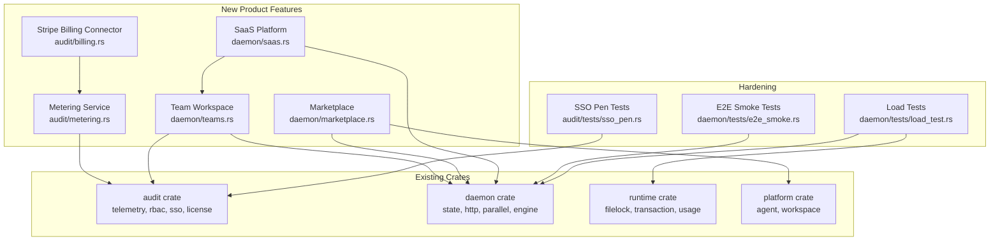
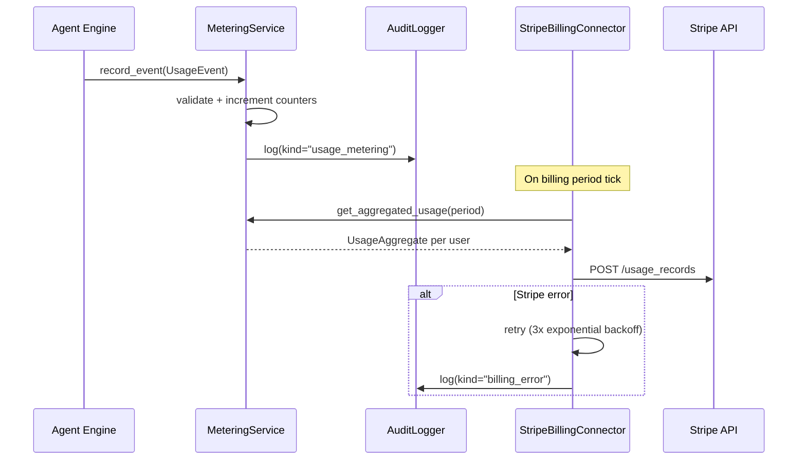

# Design Document: Product Hardening V3

## Overview

Product Hardening V3 extends the Tachy AI Agent platform with four product features (usage-based billing, team workspaces, agent marketplace, hosted SaaS) and three hardening initiatives (E2E smoke tests, load tests, SSO pen-tests). The design builds on the existing 11-crate Rust architecture, extending the `audit`, `daemon`, `platform`, and `runtime` crates with new modules while preserving the local-first, zero-cloud-dependency core.

### Design Principles

- **Additive, not invasive**: New features are added as new modules/structs; existing APIs are extended, not rewritten.
- **Trait-based abstraction**: Billing connectors, tenant stores, and marketplace backends are behind traits for testability.
- **Audit-first**: Every new subsystem emits events to the existing SHA-256 hash-chained audit trail.
- **Team-scoped isolation**: All new resources (agents, audit, policy) are scoped by team ID when operating in team mode.

---

## Architecture

### High-Level Component Map



### Data Flow: Usage Metering → Stripe



---

## Components and Interfaces

### 1. Metering Service (`audit/src/metering.rs`)

Records usage events and maintains in-memory counters per user and team.

```rust
/// A single usage event.
pub struct UsageEvent {
    pub event_type: UsageEventType,  // AgentRun | ToolInvocation
    pub user_id: String,
    pub team_id: Option<String>,
    pub agent_id: String,
    pub model_name: Option<String>,
    pub input_tokens: u64,
    pub output_tokens: u64,
    pub tool_name: Option<String>,
    pub tool_invocation_count: u32,
    pub timestamp: u64,
}

pub enum UsageEventType { AgentRun, ToolInvocation }

/// Aggregated usage counters.
pub struct UsageAggregate {
    pub user_id: String,
    pub team_id: Option<String>,
    pub total_input_tokens: u64,
    pub total_output_tokens: u64,
    pub total_tool_invocations: u64,
    pub total_agent_runs: u64,
    pub period_start: u64,
    pub period_end: u64,
}

pub struct MeteringService {
    counters: BTreeMap<String, UsageAggregate>,  // keyed by user_id
    audit_logger: AuditLogger,
}

impl MeteringService {
    pub fn record_event(&mut self, event: UsageEvent) -> Result<(), MeteringError>;
    pub fn get_usage(&self, user_id: &str, from: u64, to: u64) -> Option<UsageAggregate>;
    pub fn get_team_usage(&self, team_id: &str, from: u64, to: u64) -> Option<UsageAggregate>;
    pub fn drain_period(&mut self, period_end: u64) -> Vec<UsageAggregate>;
}
```

**Validation rules**: Reject events with negative token counts or empty `user_id`. Log warnings to audit trail.

### 2. Stripe Billing Connector (`audit/src/billing.rs`)

Aggregates usage per billing period and reports to Stripe. Behind a `BillingBackend` trait for testability.

```rust
pub trait BillingBackend: Send + Sync {
    fn report_usage(&self, subscription_item_id: &str, quantity: u64, timestamp: u64) -> Result<(), BillingError>;
    fn create_customer(&self, email: &str) -> Result<String, BillingError>;
    fn create_subscription(&self, customer_id: &str, price_ids: &[&str]) -> Result<SubscriptionInfo, BillingError>;
}

pub struct StripeBillingConnector {
    backend: Box<dyn BillingBackend>,
    user_subscription_map: BTreeMap<String, String>,  // user_id → subscription_item_id
    billing_period_secs: u64,  // default: 3600
    max_retries: u32,          // default: 3
}

impl StripeBillingConnector {
    pub fn flush_period(&mut self, metering: &mut MeteringService) -> Result<BillingReport, BillingError>;
    pub fn provision_user(&mut self, user_id: &str, email: &str) -> Result<(), BillingError>;
    pub fn status(&self) -> BillingStatus;
}
```

Three metered dimensions: `tokens_consumed`, `tool_invocations`, `agent_runs`.

### 3. Team Workspace (`daemon/src/teams.rs`)

Manages team creation, membership, invitations, and shared resources.

```rust
pub struct Team {
    pub id: String,
    pub name: String,
    pub created_at: u64,
    pub members: BTreeMap<String, TeamMember>,
}

pub struct TeamMember {
    pub user_id: String,
    pub role: Role,
    pub joined_at: u64,
}

pub struct WorkspaceInvitation {
    pub token: String,
    pub team_id: String,
    pub email: String,
    pub role: Role,
    pub created_at: u64,
    pub expires_at: u64,  // created_at + 72h
    pub used: bool,
}

pub struct TeamManager {
    teams: BTreeMap<String, Team>,
    invitations: BTreeMap<String, WorkspaceInvitation>,
}

impl TeamManager {
    pub fn create_team(&mut self, name: &str, admin_user_id: &str) -> Result<String, TeamError>;
    pub fn invite(&mut self, team_id: &str, email: &str, role: Role, inviter_id: &str) -> Result<String, TeamError>;
    pub fn join(&mut self, token: &str, user_id: &str) -> Result<TeamMember, TeamError>;
    pub fn update_member_role(&mut self, team_id: &str, user_id: &str, new_role: Role, admin_id: &str) -> Result<(), TeamError>;
    pub fn remove_member(&mut self, team_id: &str, user_id: &str, admin_id: &str) -> Result<(), TeamError>;
}
```

**Invariant**: Every team has at least one Admin. Removing the last Admin is rejected.

### 4. Team-Scoped RBAC Extension

The existing `check_permission(role, action)` is extended with a team-scoped variant:

```rust
pub fn check_team_permission(
    user_id: &str,
    team_id: &str,
    action: Action,
    team_manager: &TeamManager,
) -> AccessResult;
```

All permission checks in HTTP handlers are updated to pass the team context from the request path (`/api/teams/:id/...`).

### 5. Marketplace (`daemon/src/marketplace.rs`)

Publishing, discovery, installation, and rating of agent templates.

```rust
pub struct MarketplaceListing {
    pub id: String,
    pub name: String,
    pub description: String,
    pub author_id: String,
    pub versions: Vec<MarketplaceVersion>,
    pub default_version: String,
    pub average_rating: f64,
    pub rating_count: u32,
    pub ratings: BTreeMap<String, u8>,  // user_id → rating (1-5)
    pub created_at: u64,
    pub updated_at: u64,
}

pub struct MarketplaceVersion {
    pub version: String,  // semver: MAJOR.MINOR.PATCH
    pub template: AgentTemplate,
    pub published_at: u64,
}

pub struct Marketplace {
    listings: BTreeMap<String, MarketplaceListing>,
}

impl Marketplace {
    pub fn publish(&mut self, template: AgentTemplate, description: &str, version: &str, author_id: &str) -> Result<String, MarketplaceError>;
    pub fn search(&self, query: Option<&str>, page: usize, page_size: usize) -> Vec<&MarketplaceListing>;
    pub fn install(&self, listing_id: &str, version: Option<&str>) -> Result<AgentTemplate, MarketplaceError>;
    pub fn rate(&mut self, listing_id: &str, user_id: &str, rating: u8) -> Result<(), MarketplaceError>;
}
```

**Semver validation**: Regex `^\d+\.\d+\.\d+$`. Reject non-compliant versions.
**Conflict detection**: Reject publish if `(name, version)` already exists.
**Rating**: 1-5 integer. One rating per user per listing; subsequent calls update the existing rating.

### 6. SaaS Multi-Tenant Platform (`daemon/src/saas.rs`)

Tenant isolation, authentication, resource limits, and managed infrastructure.

```rust
pub struct Tenant {
    pub id: String,
    pub name: String,
    pub workspace_dir: PathBuf,
    pub ollama_endpoint: String,
    pub created_at: u64,
    pub resource_limits: ResourceLimits,
}

pub struct ResourceLimits {
    pub max_concurrent_agents: usize,
    pub max_tokens_per_day: u64,
    pub max_storage_bytes: u64,
}

pub struct SaaSPlatform {
    tenants: BTreeMap<String, Tenant>,
    jwt_secret: String,
    jwt_expiry_secs: u64,  // default: 86400 (24h)
}

impl SaaSPlatform {
    pub fn signup(&mut self, email: &str, password_hash: &str) -> Result<(Tenant, String), SaaSError>;
    pub fn authenticate(&self, email: &str, password_hash: &str) -> Result<String, SaaSError>;  // returns JWT
    pub fn validate_jwt(&self, token: &str) -> Result<TenantClaims, SaaSError>;
    pub fn check_limits(&self, tenant_id: &str, action: &str) -> Result<(), SaaSError>;  // returns 429 if exceeded
    pub fn dashboard(&self, tenant_id: &str) -> Result<DashboardSummary, SaaSError>;
}
```

**Isolation**: Each tenant gets a dedicated workspace directory. All state queries are scoped by `tenant_id`. No cross-tenant data access.
**Auth**: Email/password or SSO. JWT tokens with configurable expiry.
**Resource limits**: Enforced before agent execution. Returns HTTP 429 when exceeded.
**Ollama health**: If the managed Ollama endpoint is unreachable, return HTTP 503 with `Retry-After` header.


### 7. HTTP API Extensions

New endpoints added to `daemon/src/http.rs`:

| Method | Path | Handler | Requirement |
|--------|------|---------|-------------|
| `GET` | `/api/usage` | `handle_usage` | Req 1.5 |
| `GET` | `/api/billing/status` | `handle_billing_status` | Req 2.6 |
| `POST` | `/api/teams` | `handle_create_team` | Req 3.1 |
| `POST` | `/api/teams/:id/invite` | `handle_invite` | Req 3.3 |
| `POST` | `/api/teams/join` | `handle_join_team` | Req 3.4 |
| `PUT` | `/api/teams/:id/members/:uid` | `handle_update_member` | Req 4.3 |
| `GET` | `/api/teams/:id/agents` | `handle_team_agents` | Req 5.4 |
| `GET` | `/api/teams/:id/audit` | `handle_team_audit` | Req 5.4 |
| `GET` | `/api/teams/:id/policy` | `handle_team_policy` | Req 5.4 |
| `POST` | `/api/marketplace/publish` | `handle_publish` | Req 6.1 |
| `GET` | `/api/marketplace` | `handle_marketplace_list` | Req 7.1 |
| `POST` | `/api/marketplace/install` | `handle_install` | Req 7.2 |
| `POST` | `/api/marketplace/:id/rate` | `handle_rate` | Req 7.3 |
| `GET` | `/api/dashboard` | `handle_dashboard` | Req 8.4 |

### 8. DaemonState Extensions

`DaemonState` in `daemon/src/state.rs` gains new fields:

```rust
pub struct DaemonState {
    // ... existing fields ...
    pub metering: MeteringService,
    pub billing: Option<StripeBillingConnector>,
    pub team_manager: TeamManager,
    pub marketplace: Marketplace,
    pub saas: Option<SaaSPlatform>,
}
```

The `metering` field is always present (records usage even without Stripe). The `billing` and `saas` fields are `Option` — only initialized when the respective configuration is provided.

---

## Data Models

### Usage Event (persisted to audit trail)

```json
{
  "timestamp": "1711900800s",
  "session_id": "sess-agent-1",
  "kind": "usage_metering",
  "detail": "agent_run: model=gemma4:26b, input_tokens=1200, output_tokens=340, tools=5",
  "agent_id": "agent-1",
  "user_id": "user-42",
  "model_name": "gemma4:26b"
}
```

### Team (persisted to workspace state)

```json
{
  "id": "team-1",
  "name": "Engineering",
  "created_at": 1711900800,
  "members": {
    "user-1": { "user_id": "user-1", "role": "admin", "joined_at": 1711900800 },
    "user-2": { "user_id": "user-2", "role": "developer", "joined_at": 1711901000 }
  }
}
```

### Marketplace Listing (persisted to workspace state)

```json
{
  "id": "listing-1",
  "name": "react-reviewer",
  "description": "Reviews React components for accessibility and performance",
  "author_id": "user-1",
  "versions": [
    { "version": "1.0.0", "template": { "...AgentTemplate..." }, "published_at": 1711900800 }
  ],
  "default_version": "1.0.0",
  "average_rating": 4.2,
  "rating_count": 5,
  "ratings": { "user-2": 4, "user-3": 5 }
}
```

### Tenant (SaaS mode)

```json
{
  "id": "tenant-abc123",
  "name": "Acme Corp",
  "workspace_dir": "/data/tenants/tenant-abc123",
  "ollama_endpoint": "http://ollama-pool:11434",
  "resource_limits": {
    "max_concurrent_agents": 4,
    "max_tokens_per_day": 1000000,
    "max_storage_bytes": 10737418240
  }
}
```

---

## Correctness Properties

*A property is a characteristic or behavior that should hold true across all valid executions of a system — essentially, a formal statement about what the system should do. Properties serve as the bridge between human-readable specifications and machine-verifiable correctness guarantees.*

### Property 1: Usage event recording preserves all fields and produces audit entry

*For any* valid `UsageEvent` (with non-empty user_id, non-negative token counts, and valid event type), recording it via `MeteringService::record_event` SHALL preserve all fields (user_id, team_id, agent_id, model_name, token counts, tool_name, timestamp) in the in-memory store, AND produce an audit event with kind `"usage_metering"` in the `AuditLogger`.

**Validates: Requirements 1.1, 1.2, 1.3**

### Property 2: Usage counter consistency

*For any* sequence of valid `UsageEvent` records, the cumulative counters returned by `MeteringService::get_usage` SHALL equal the sum of the individual event values (input_tokens, output_tokens, tool_invocations, agent_runs) for the queried user and time range.

**Validates: Requirements 1.4**

### Property 3: Invalid usage events are rejected

*For any* `UsageEvent` with a negative token count (input_tokens or output_tokens) or an empty `user_id`, `MeteringService::record_event` SHALL return an error AND the cumulative counters SHALL remain unchanged.

**Validates: Requirements 1.6**

### Property 4: Billing aggregation reports correct totals per user across all three dimensions

*For any* set of `UsageEvent` records within a billing period, `StripeBillingConnector::flush_period` SHALL report to the `BillingBackend` the correct aggregated totals per user for all three dimensions: total tokens consumed, total tool invocations, and total agent runs.

**Validates: Requirements 2.1, 2.4**

### Property 5: Team creation and persistence round-trip

*For any* valid team name and admin user ID, creating a team via `TeamManager::create_team`, serializing the state to JSON, and deserializing it back SHALL produce a team with the same name, the creator as the sole Admin member, and all metadata (ID, created_at) preserved.

**Validates: Requirements 3.1, 3.2**

### Property 6: Invitation-join round-trip preserves role

*For any* valid team, email, and role, creating an invitation via `TeamManager::invite` and then joining via `TeamManager::join` with the returned token SHALL add the user to the team with the exact role specified in the invitation, and the invitation token SHALL be marked as used.

**Validates: Requirements 3.3, 3.4**

### Property 7: Expired or used invitations are rejected

*For any* `WorkspaceInvitation` that is either expired (created_at + 72h < now) or already used, calling `TeamManager::join` with that token SHALL return an error and the team membership SHALL remain unchanged.

**Validates: Requirements 3.5**

### Property 8: Last-admin invariant

*For any* team and any sequence of `update_member_role` and `remove_member` operations, the team SHALL always have at least one member with role `Admin`. Any operation that would remove the last Admin SHALL be rejected.

**Validates: Requirements 3.6**

### Property 9: Team-scoped permission isolation

*For any* user who is a member of multiple teams with different roles, `check_team_permission` SHALL evaluate permissions using the user's role in the specific team being queried. A user who is Admin in Team A and Viewer in Team B SHALL have Admin permissions in Team A and Viewer permissions in Team B.

**Validates: Requirements 4.1, 4.5**

### Property 10: Role changes are applied and audited

*For any* valid role change (Admin changing another member's role within a team), the target user's role SHALL be updated to the new role, AND an audit event with kind `"role_change"` SHALL be emitted containing the old role, new role, and the Admin's user ID.

**Validates: Requirements 4.3, 4.4**

### Property 11: Agent-team association

*For any* agent created within a team context, the agent SHALL be associated with the team ID and SHALL appear in the results of `GET /api/teams/:id/agents` for that team and no other team.

**Validates: Requirements 5.1**

### Property 12: Marketplace publish preserves all listing fields

*For any* valid `AgentTemplate`, description, and semver-compliant version string, publishing via `Marketplace::publish` SHALL create a `MarketplaceListing` containing the complete template definition, author ID, description, version, and publication timestamp.

**Validates: Requirements 6.1, 6.3**

### Property 13: Semver validation

*For any* string, `Marketplace::publish` SHALL accept it as a version if and only if it matches the pattern `MAJOR.MINOR.PATCH` where MAJOR, MINOR, and PATCH are non-negative integers.

**Validates: Requirements 6.2**

### Property 14: Version history is append-only with latest as default

*For any* sequence of version publishes to the same listing, all previously published versions SHALL be retained in the listing's version history, and the most recently published version SHALL be set as the default.

**Validates: Requirements 6.4**

### Property 15: Duplicate name+version conflict detection

*For any* existing `MarketplaceListing` with name N and version V, attempting to publish another listing with the same name N and version V SHALL return a conflict error.

**Validates: Requirements 6.5**

### Property 16: Marketplace search results are sorted by rating descending

*For any* set of `MarketplaceListing` entries and any search query, the results returned by `Marketplace::search` SHALL be sorted by `average_rating` in descending order.

**Validates: Requirements 7.1**

### Property 17: Marketplace install round-trip

*For any* published `MarketplaceListing`, installing it via `Marketplace::install` SHALL return an `AgentTemplate` that is identical to the originally published template (for the requested version, or the default version if none specified).

**Validates: Requirements 7.2**

### Property 18: Rating average correctness with idempotent per-user updates

*For any* sequence of ratings (1-5 integer) from multiple users on a listing, where a user may rate multiple times, the listing's `average_rating` SHALL equal the arithmetic mean of the latest rating from each unique user, and `rating_count` SHALL equal the number of unique users who have rated.

**Validates: Requirements 7.3, 7.4**

### Property 19: Missing tools detection on install

*For any* `AgentTemplate` with a set of `allowed_tools` and any workspace with a set of available tools, `Marketplace::install` SHALL warn about exactly the tools that are in `allowed_tools` but not in the workspace's available tools (set difference).

**Validates: Requirements 7.5**

### Property 20: Tenant data isolation

*For any* two tenants A and B, all queries scoped to tenant A (agents, audit, configuration) SHALL return only tenant A's data and never include any data belonging to tenant B.

**Validates: Requirements 8.1**

### Property 21: Tenant signup creates all required resources

*For any* valid signup (email, password), `SaaSPlatform::signup` SHALL create a `Tenant` with a non-empty ID, a dedicated workspace directory, a default configuration, and a managed Ollama endpoint.

**Validates: Requirements 8.2**

### Property 22: JWT authentication round-trip

*For any* valid user credentials, authenticating via `SaaSPlatform::authenticate` SHALL return a JWT that, when validated via `SaaSPlatform::validate_jwt`, returns the correct tenant ID and user claims, and the JWT SHALL be valid for the configured expiry duration.

**Validates: Requirements 8.3**

### Property 23: Resource limit enforcement

*For any* tenant with configured resource limits, `SaaSPlatform::check_limits` SHALL return an error (429) if and only if the tenant's current usage exceeds at least one of the configured limits (max_concurrent_agents, max_tokens_per_day, max_storage_bytes).

**Validates: Requirements 8.5**

### Property 24: DAG execution respects dependency order

*For any* parallel run with a dependency chain (task B depends on task A), task B SHALL not begin execution until task A has reached a terminal status (Completed or Failed).

**Validates: Requirements 10.2**

### Property 25: File lock mutual exclusion under contention

*For any* set of concurrent threads attempting to acquire locks on a shared set of files, at no point SHALL two different agents hold a lock on the same file simultaneously.

**Validates: Requirements 10.3**

### Property 26: File lock TTL expiry

*For any* file lock acquired with a TTL, after the TTL duration has elapsed, the lock SHALL no longer prevent other agents from acquiring the same file.

**Validates: Requirements 10.5**

### Property 27: release_all is selective

*For any* set of agents each holding locks on different files, calling `release_all(agent_id)` for one agent SHALL release all locks held by that agent AND SHALL not affect locks held by any other agent.

**Validates: Requirements 10.6**

### Property 28: Malicious NameID content is handled safely

*For any* SAMLResponse where the NameID field contains script tags, null bytes, control characters, or strings exceeding 1024 characters, the SAML parser SHALL either reject the response or store the value without propagating unescaped HTML/script content into the session or user store.

**Validates: Requirements 11.2, 11.5**

### Property 29: Forged issuer rejection

*For any* SAMLResponse where the Issuer value does not match the configured `idp_entity_id`, `SsoManager::process_callback` SHALL return an error containing "issuer mismatch".

**Validates: Requirements 11.3**

### Property 30: Session token replay after invalidation

*For any* valid SSO session, after calling `SsoManager::invalidate_session` with the session's token, `SsoManager::validate_session` with the same token SHALL return `None`.

**Validates: Requirements 11.4**

### Property 31: Expired session rejection

*For any* SSO session where `created_at + session_duration_secs < now`, `SsoManager::validate_session` SHALL return `None`.

**Validates: Requirements 11.6**

### Property 32: Base64 decoder rejects invalid input

*For any* string containing characters outside the base64 alphabet (A-Z, a-z, 0-9, +, /, =), the base64 decoder SHALL return an error. For any truncated base64 input (length not a multiple of 4 after padding removal), the decoder SHALL handle it without panic.

**Validates: Requirements 11.7**

### Property 33: SAML assertion round-trip

*For any* valid `SamlAssertion` (with non-empty subject_name_id, issuer, and well-formed attributes), encoding the assertion to XML and then parsing the XML back via `parse_saml_response` SHALL produce a `SamlAssertion` with equivalent `subject_name_id`, `issuer`, `attributes`, `session_index`, and `groups`.

**Validates: Requirements 11.9**

---

## Error Handling

### Metering Service Errors

| Error | Cause | Response |
|-------|-------|----------|
| `InvalidEvent` | Negative token count or empty user_id | Reject event, log warning to audit trail, return `MeteringError::InvalidEvent` |
| `StorageFull` | In-memory counter map exceeds configured limit | Flush oldest period to disk, continue recording |

### Billing Connector Errors

| Error | Cause | Response |
|-------|-------|----------|
| `StripeApiError` | Stripe API returns 4xx/5xx | Retry up to 3 times with exponential backoff (1s, 2s, 4s). Log each failure. After 3 failures, log critical audit event and skip this period. |
| `NoSubscriptionMapping` | User has no Stripe subscription item ID | Log warning, skip user in billing report. Do not block metering. |
| `ConfigMissing` | No Stripe API key configured | Billing connector is `None` in DaemonState. Metering continues without billing. |

### Team Workspace Errors

| Error | Cause | Response |
|-------|-------|----------|
| `TeamNotFound` | Invalid team ID in request path | HTTP 404 |
| `NotAdmin` | Non-admin user attempts admin action | HTTP 403 with reason |
| `LastAdmin` | Attempt to remove/demote the last admin | HTTP 409 with "team must have at least one admin" |
| `InvitationExpired` | Join with expired token | HTTP 410 with "invitation expired" |
| `InvitationUsed` | Join with already-used token | HTTP 409 with "invitation already used" |
| `AlreadyMember` | User already in team | HTTP 409 with "user is already a team member" |

### Marketplace Errors

| Error | Cause | Response |
|-------|-------|----------|
| `InvalidSemver` | Version string doesn't match MAJOR.MINOR.PATCH | HTTP 400 with "invalid version format" |
| `ConflictVersion` | Same name+version already published | HTTP 409 with "version already exists" |
| `ListingNotFound` | Invalid listing ID | HTTP 404 |
| `InvalidRating` | Rating outside 1-5 range | HTTP 400 with "rating must be 1-5" |
| `MissingTools` | Template requires tools not in workspace | HTTP 200 with warnings array listing missing tools |

### SaaS Platform Errors

| Error | Cause | Response |
|-------|-------|----------|
| `TenantNotFound` | Invalid tenant ID in JWT | HTTP 401 |
| `ResourceLimitExceeded` | Tenant exceeds configured limits | HTTP 429 with `Retry-After` header |
| `OllamaUnreachable` | Managed Ollama instance down | HTTP 503 with `Retry-After` header, log to tenant audit trail |
| `InvalidJwt` | Expired or malformed JWT | HTTP 401 |
| `DuplicateEmail` | Signup with existing email | HTTP 409 |

### SSO/SAML Errors

| Error | Cause | Response |
|-------|-------|----------|
| `InvalidBase64` | Non-base64 characters in SAMLResponse | HTTP 400 with "invalid base64" |
| `IssuerMismatch` | Forged or wrong IdP issuer | HTTP 403 with "issuer mismatch" |
| `MissingNameID` | SAMLResponse lacks NameID element | HTTP 400 with "missing NameID" |
| `SessionExpired` | Token past expiry time | HTTP 401 |
| `MaliciousInput` | Entity expansion, deeply nested XML, oversized NameID | Reject with specific error, no excessive resource consumption |

---

## Testing Strategy

### Unit Tests

Unit tests cover specific examples, edge cases, and error conditions for each new module:

- **Metering**: Record valid events, reject invalid events, verify counter arithmetic with known values.
- **Billing**: Mock `BillingBackend` to test aggregation, retry logic (mock that fails N times), and user provisioning.
- **Teams**: Create/join/leave lifecycle, invitation expiry, last-admin protection with specific scenarios.
- **Marketplace**: Publish/install/rate lifecycle, semver validation with known valid/invalid strings, conflict detection.
- **SaaS**: Signup, JWT round-trip with known claims, resource limit boundary cases.
- **SSO Pen Tests**: Billion laughs XML, CDATA NameID, deeply nested XML (depth > 100), specific injection payloads.
- **E2E Smoke**: Full agent pipeline tests against real Ollama (skipped if unavailable).
- **Load Tests**: 20-task parallel run, deep dependency chain, concurrent file lock contention, throughput benchmarks.

### Property-Based Tests

Property-based tests verify universal properties across randomly generated inputs. Each property test references a design property and runs a minimum of 100 iterations.

**Library**: `proptest` (Rust PBT library)

**Configuration**: Each test runs with `proptest::test_runner::Config { cases: 100, .. }` minimum.

**Tag format**: Each test includes a comment: `// Feature: product-hardening-v3, Property N: <title>`

**Properties to implement** (referencing the Correctness Properties section above):

| Property | Module | Key Generator |
|----------|--------|---------------|
| P1: Usage event field preservation | `audit/metering` | Random `UsageEvent` with valid fields |
| P2: Counter consistency | `audit/metering` | Random sequences of `UsageEvent` |
| P3: Invalid event rejection | `audit/metering` | `UsageEvent` with negative tokens or empty user_id |
| P4: Billing aggregation | `audit/billing` | Random events + mock backend |
| P5: Team round-trip | `daemon/teams` | Random team names + user IDs |
| P6: Invitation-join round-trip | `daemon/teams` | Random emails + roles |
| P7: Expired/used invitation rejection | `daemon/teams` | Invitations with past expiry or used=true |
| P8: Last-admin invariant | `daemon/teams` | Random sequences of role changes/removals |
| P9: Team-scoped permissions | `audit/rbac` | Random users in multiple teams with different roles |
| P10: Role change + audit | `daemon/teams` + `audit` | Random role changes |
| P11: Agent-team association | `daemon/teams` | Random agents in random teams |
| P12: Publish field preservation | `daemon/marketplace` | Random `AgentTemplate` + description + semver |
| P13: Semver validation | `daemon/marketplace` | Random strings (both valid and invalid semver) |
| P14: Version history append-only | `daemon/marketplace` | Random sequences of version publishes |
| P15: Duplicate conflict | `daemon/marketplace` | Existing listing + same name+version |
| P16: Search sort by rating | `daemon/marketplace` | Random listings with random ratings |
| P17: Install round-trip | `daemon/marketplace` | Random published templates |
| P18: Rating average correctness | `daemon/marketplace` | Random rating sequences from multiple users |
| P19: Missing tools detection | `daemon/marketplace` | Random tool sets (required vs available) |
| P20: Tenant isolation | `daemon/saas` | Random tenants with random data |
| P21: Signup resource creation | `daemon/saas` | Random signup data |
| P22: JWT round-trip | `daemon/saas` | Random credentials |
| P23: Resource limit enforcement | `daemon/saas` | Random limits + usage levels |
| P24: DAG dependency order | `daemon/parallel` | Random dependency chains |
| P25: Lock mutual exclusion | `runtime/filelock` | Random concurrent lock attempts |
| P26: Lock TTL expiry | `runtime/filelock` | Random locks with TTL |
| P27: release_all selectivity | `runtime/filelock` | Random agents with random locks |
| P28: Malicious NameID handling | `audit/sso` | Random strings with script tags, null bytes, control chars |
| P29: Forged issuer rejection | `audit/sso` | Random non-matching issuer strings |
| P30: Token replay after invalidation | `audit/sso` | Random sessions + invalidation |
| P31: Expired session rejection | `audit/sso` | Sessions with past expiry |
| P32: Base64 decoder robustness | `audit/sso` | Random strings with non-base64 chars |
| P33: SAML assertion round-trip | `audit/sso` | Random valid `SamlAssertion` objects |

### Integration Tests

Integration tests verify wiring between components and external service behavior:

- **E2E Smoke Tests** (Req 9): Full agent pipeline against running Ollama. Skip if Ollama unavailable. 300s timeout.
- **HTTP API Tests**: Verify new endpoints return correct status codes and response shapes.
- **Team Audit Trail**: Multiple users in a team perform actions, verify all appear in team audit.
- **Billing Period Flush**: End-to-end metering → aggregation → mock Stripe reporting.
- **Load Tests** (Req 10): 20-task parallel run, throughput benchmarks, concurrent lock contention.

### Test File Locations

| Test Suite | File |
|------------|------|
| Metering unit + property tests | `rust/crates/audit/tests/metering_test.rs` |
| Billing unit + property tests | `rust/crates/audit/tests/billing_test.rs` |
| Team unit + property tests | `rust/crates/daemon/tests/teams_test.rs` |
| Marketplace unit + property tests | `rust/crates/daemon/tests/marketplace_test.rs` |
| SaaS unit + property tests | `rust/crates/daemon/tests/saas_test.rs` |
| SSO pen tests + property tests | `rust/crates/audit/tests/sso_pen_test.rs` |
| E2E smoke tests | `rust/crates/daemon/tests/e2e_smoke.rs` (extend existing) |
| Load tests | `rust/crates/daemon/tests/load_test.rs` |
| File lock property tests | `rust/crates/runtime/tests/filelock_prop_test.rs` |
