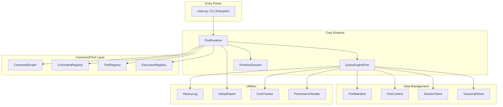
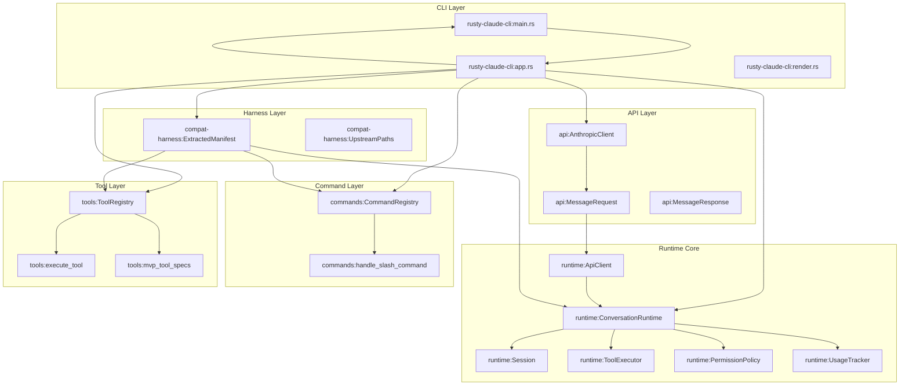
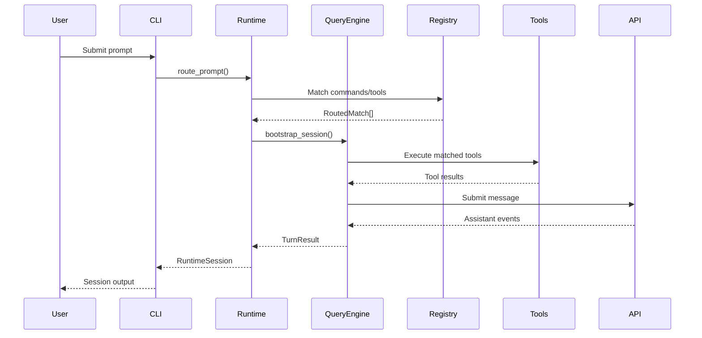
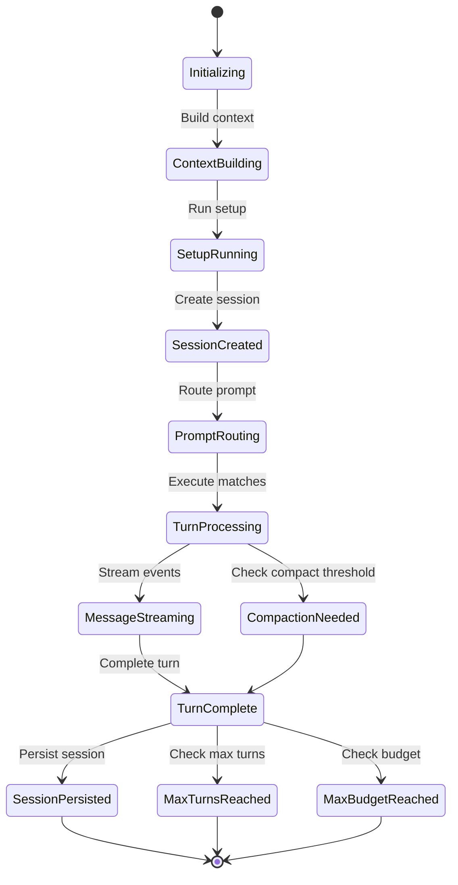

# Claw Code Architecture Document

This document provides a comprehensive overview of the Claw Code project architecture, covering both the Python workspace and the Rust port foundation.

---

## Table of Contents

1. [Python Workspace Architecture](#python-workspace-architecture)
2. [Rust Workspace Architecture](#rust-workspace-architecture)
3. [Component Interaction Diagrams](#component-interaction-diagrams)
4. [Data Flow and Runtime Execution](#data-flow-and-runtime-execution)

---

## Python Workspace Architecture

### Overview

The Python workspace is located in the `src/` directory and serves as the active porting workspace for the Claw Code project. It provides a clean-room Python implementation that captures the architectural patterns of the original Claude Code agent harness.

### Directory Structure

```
src/
├── __init__.py                    # Package initialization
├── main.py                        # CLI entrypoint with subcommand parsing
├── runtime.py                     # PortRuntime class for session management
├── query_engine.py                # QueryEnginePort for turn-based processing
├── command_graph.py               # CommandGraph for command categorization
├── port_manifest.py               # PortManifest for workspace metadata
├── models.py                      # Shared dataclasses (Subsystem, PortingModule)
├── commands.py                    # Command backlog metadata and execution
├── tools.py                       # Tool backlog metadata and execution
├── context.py                     # PortContext for workspace state
├── history.py                     # HistoryLog for session tracking
├── setup.py                       # WorkspaceSetup and SetupReport
├── system_init.py                 # System initialization messages
├── execution_registry.py          # Command/Tool execution registry
├── session_store.py               # Session persistence (save/load)
├── transcript.py                  # TranscriptStore for message history
├── cost_tracker.py                # Cost tracking utilities
├── permissions.py                 # Permission handling
├── bootstrap_graph.py             # Bootstrap/runtime graph stages
├── parity_audit.py                # Python vs TypeScript comparison
├── interactiveHelpers.py          # Interactive mode helpers
├── replLauncher.py                # REPL launcher
├── dialogLaunchers.py             # Dialog launchers
├── remote_runtime.py              # Remote mode support (SSH, teleport)
├── direct_modes.py                # Direct connect/deep link modes
├── costHook.py                    # Cost hook utilities
├── deferred_init.py               # Deferred initialization
├── task.py                        # Task-level planning structures
├── tasks.py                       # Task management
├── QueryEngine.py                 # Legacy query engine
├── query.py                       # Query utilities
├── QueryEngine.py                 # Query engine interface
├── Tool.py                        # Tool interface
├── tool_pool.py                   # Tool pool assembly
├── port_manifest.py               # Port manifest generation
└── ... (subdirectories)
```

### Subsystem Directories

The `src/` directory contains numerous subsystem directories, each representing a functional module:

| Subsystem | Purpose |
|-----------|---------|
| `assistant/` | Assistant-related functionality |
| `bootstrap/` | Bootstrap initialization |
| `bridge/` | Bridge components |
| `buddy/` | Buddy utilities |
| `cli/` | CLI utilities |
| `components/` | UI components |
| `constants/` | Constant definitions |
| `coordinator/` | Coordination logic |
| `entrypoints/` | Application entrypoints |
| `hooks/` | Hook system |
| `keybindings/` | Keybinding definitions |
| `memdir/` | Memory directory utilities |
| `migrations/` | Database migrations |
| `moreright/` | Additional utilities |
| `native_ts/` | Native TypeScript bindings |
| `outputStyles/` | Output styling |
| `plugins/` | Plugin system |
| `reference_data/` | Reference data and snapshots |
| `remote/` | Remote execution support |
| `schemas/` | Data schemas |
| `screens/` | Screen components |
| `server/` | Server functionality |
| `services/` | Service layer |
| `skills/` | Skill definitions |
| `state/` | State management |
| `types/` | Type definitions |
| `upstreamproxy/` | Upstream proxy utilities |
| `utils/` | Utility functions |
| `vim/` | Vim mode support |
| `voice/` | Voice functionality |

### Core Components

#### [`PortRuntime`](src/runtime.py:89)

The `PortRuntime` class is the central runtime engine for the Python workspace:

```python
class PortRuntime:
    def route_prompt(self, prompt: str, limit: int = 5) -> list[RoutedMatch]
    def bootstrap_session(self, prompt: str, limit: int = 5) -> RuntimeSession
```

Key responsibilities:
- **Prompt routing**: Routes user prompts to appropriate commands or tools
- **Session bootstrapping**: Creates and manages runtime sessions
- **Execution orchestration**: Coordinates command and tool execution

#### [`QueryEnginePort`](src/query_engine.py:36)

The `QueryEnginePort` handles turn-based message processing:

```python
@dataclass
class QueryEnginePort:
    manifest: PortManifest
    config: QueryEngineConfig
    session_id: str
    mutable_messages: list[str]
    permission_denials: list[PermissionDenial]
    total_usage: UsageSummary
    transcript_store: TranscriptStore
```

Key methods:
- [`submit_message()`](src/query_engine.py:61): Processes a single turn
- [`stream_submit_message()`](src/query_engine.py:106): Streams turn events
- [`compact_messages_if_needed()`](src/query_engine.py:129): Manages message compaction
- [`persist_session()`](src/query_engine.py:140): Saves session state

#### [`CommandGraph`](src/command_graph.py:10)

The `CommandGraph` categorizes commands into three types:

```python
@dataclass(frozen=True)
class CommandGraph:
    builtins: tuple[PortingModule, ...]
    plugin_like: tuple[PortingModule, ...]
    skill_like: tuple[PortingModule, ...]
```

#### [`PortManifest`](src/port_manifest.py:13)

The `PortManifest` provides workspace metadata:

```python
@dataclass(frozen=True)
class PortManifest:
    src_root: Path
    total_python_files: int
    top_level_modules: tuple[Subsystem, ...]
```

### Data Models

#### [`PortContext`](src/context.py)

Represents the current porting workspace state:
- Python file count
- Archive availability
- Workspace configuration

#### [`RuntimeSession`](src/runtime.py:25)

Captures a complete runtime session:
- Prompt and context
- Setup information
- System initialization message
- Routed matches
- Execution messages
- Stream events
- Turn result

#### [`TurnResult`](src/query_engine.py:25)

Represents the result of a single turn:
- Output text
- Matched commands and tools
- Permission denials
- Usage summary
- Stop reason

---

## Rust Workspace Architecture

### Overview

The Rust workspace is located in the `rust/` directory and provides a compatibility-first Rust foundation for a drop-in Claude Code CLI replacement. It follows a harness-first approach, extracting observable facts from the upstream TypeScript sources.

### Workspace Configuration

[`rust/Cargo.toml`](rust/Cargo.toml:1):

```toml
[workspace]
members = ["crates/*"]
resolver = "2"

[workspace.package]
version = "0.1.0"
edition = "2021"
license = "MIT"
publish = false

[workspace.lints.rust]
unsafe_code = "forbid"
```

### Crate Structure

```
rust/
├── Cargo.toml                   # Workspace configuration
├── Cargo.lock                   # Dependency lock file
├── README.md                    # Rust port documentation
└── crates/
    ├── rusty-claude-cli/        # Main CLI application
    ├── runtime/                 # Runtime core (bash, bootstrap, session, etc.)
    ├── commands/                # Command registry and handling
    ├── tools/                   # Tool registry and execution
    ├── compat-harness/          # Upstream TypeScript extraction
    └── api/                     # API client (Anthropic)
```

### Core Crates

#### [`runtime`](rust/crates/runtime/Cargo.toml:1)

The `runtime` crate is the foundation of the Rust implementation:

**Dependencies:**
- `glob` - File pattern matching
- `regex` - Regular expressions
- `serde` - Serialization/deserialization
- `serde_json` - JSON handling
- `tokio` - Async runtime
- `walkdir` - Directory traversal

**Modules:**

| Module | Purpose |
|--------|---------|
| [`bash.rs`](rust/crates/runtime/src/bash.rs:1) | Bash command execution |
| [`bootstrap.rs`](rust/crates/runtime/src/bootstrap.rs:1) | Bootstrap phase management |
| [`compact.rs`](rust/crates/runtime/src/compact.rs:1) | Session compaction |
| [`config.rs`](rust/crates/runtime/src/config.rs:1) | Runtime configuration |
| [`conversation.rs`](rust/crates/runtime/src/conversation.rs:1) | Conversation runtime |
| [`file_ops.rs`](rust/crates/runtime/src/file_ops.rs:1) | File operations |
| [`json.rs`](rust/crates/runtime/src/json.rs:1) | JSON utilities |
| [`permissions.rs`](rust/crates/runtime/src/permissions.rs:1) | Permission handling |
| [`prompt.rs`](rust/crates/runtime/src/prompt.rs:1) | System prompt building |
| [`session.rs`](rust/crates/runtime/src/session.rs:1) | Session management |
| [`sse.rs`](rust/crates/runtime/src/sse.rs:1) | Server-sent events |
| [`usage.rs`](rust/crates/runtime/src/usage.rs:1) | Token usage tracking |

**Key Exports:**

[`rust/crates/runtime/src/lib.rs`](rust/crates/runtime/src/lib.rs:1):

```rust
pub use bash::{execute_bash, BashCommandInput, BashCommandOutput};
pub use bootstrap::{BootstrapPhase, BootstrapPlan};
pub use compact::{compact_session, estimate_session_tokens, ...};
pub use config::{ConfigEntry, ConfigError, ConfigLoader, ...};
pub use conversation::{ApiClient, ApiRequest, ConversationRuntime, ...};
pub use file_ops::{edit_file, glob_search, grep_search, read_file, write_file, ...};
pub use permissions::{PermissionMode, PermissionOutcome, PermissionPolicy, ...};
pub use prompt::{load_system_prompt, prepend_bullets, ContextFile, ...};
pub use session::{ContentBlock, ConversationMessage, MessageRole, Session, ...};
pub use usage::{TokenUsage, UsageTracker};
```

#### [`commands`](rust/crates/commands/Cargo.toml:1)

The `commands` crate manages command registry and slash command handling:

**Key Types:**

[`rust/crates/commands/src/lib.rs`](rust/crates/commands/src/lib.rs:1):

```rust
#[derive(Debug, Clone, PartialEq, Eq)]
pub struct CommandManifestEntry {
    pub name: String,
    pub source: CommandSource,
}

#[derive(Debug, Clone, Copy, PartialEq, Eq)]
pub enum CommandSource {
    Builtin,
    InternalOnly,
    FeatureGated,
}

#[derive(Debug, Clone, Default, PartialEq, Eq)]
pub struct CommandRegistry {
    entries: Vec<CommandManifestEntry>,
}

#[derive(Debug, Clone, PartialEq, Eq)]
pub struct SlashCommandResult {
    pub message: String,
    pub session: Session,
}
```

**Key Functions:**

[`handle_slash_command()`](rust/crates/commands/src/lib.rs:40):

```rust
pub fn handle_slash_command(
    input: &str,
    session: &Session,
    compaction: CompactionConfig,
) -> Option<SlashCommandResult>
```

#### [`tools`](rust/crates/tools/Cargo.toml:1)

The `tools` crate manages tool registry and execution:

**Key Types:**

[`rust/crates/tools/src/lib.rs`](rust/crates/tools/src/lib.rs:1):

```rust
#[derive(Debug, Clone, PartialEq, Eq)]
pub struct ToolManifestEntry {
    pub name: String,
    pub source: ToolSource,
}

#[derive(Debug, Clone, Copy, PartialEq, Eq)]
pub enum ToolSource {
    Base,
    Conditional,
}

#[derive(Debug, Clone, Default, PartialEq, Eq)]
pub struct ToolRegistry {
    entries: Vec<ToolManifestEntry>,
}

#[derive(Debug, Clone, PartialEq, Eq)]
pub struct ToolSpec {
    pub name: &'static str,
    pub description: &'static str,
    pub input_schema: Value,
}
```

**MVP Tools:**

- `bash` - Shell command execution
- `read_file` - File reading
- `write_file` - File writing
- `edit_file` - File editing
- `glob_search` - Pattern-based file search
- `grep_search` - Content-based file search

#### [`compat-harness`](rust/crates/compat-harness/Cargo.toml:1)

The `compat-harness` crate extracts manifest data from upstream TypeScript sources:

**Key Types:**

[`rust/crates/compat-harness/src/lib.rs`](rust/crates/compat-harness/src/lib.rs:1):

```rust
#[derive(Debug, Clone, PartialEq, Eq)]
pub struct UpstreamPaths {
    repo_root: PathBuf,
}

#[derive(Debug, Clone, PartialEq, Eq)]
pub struct ExtractedManifest {
    pub commands: CommandRegistry,
    pub tools: ToolRegistry,
    pub bootstrap: BootstrapPlan,
}
```

**Extraction Functions:**

- [`extract_commands()`](rust/crates/compat-harness/src/lib.rs:69) - Parses command definitions
- [`extract_tools()`](rust/crates/compat-harness/src/lib.rs:150) - Parses tool definitions
- [`extract_bootstrap_plan()`](rust/crates/compat-harness/src/lib.rs:250) - Parses bootstrap phases

#### [`api`](rust/crates/api/Cargo.toml:1)

The `api` crate provides Anthropic API client functionality:

**Dependencies:**
- `reqwest` - HTTP client with JSON and TLS support
- `serde` - Serialization
- `serde_json` - JSON handling
- `tokio` - Async runtime

**Key Types:**

[`rust/crates/api/src/lib.rs`](rust/crates/api/src/lib.rs:1):

```rust
pub struct AnthropicClient;
pub struct ContentBlockDelta;
pub struct InputContentBlock;
pub struct InputMessage;
pub struct MessageRequest;
pub struct MessageResponse;
pub struct OutputContentBlock;
pub struct StreamEvent;
pub struct ToolChoice;
pub struct ToolDefinition;
pub struct ToolResultContentBlock;
```

#### [`rusty-claude-cli`](rust/crates/rusty-claude-cli/Cargo.toml:1)

The main CLI application crate:

**Modules:**

| Module | Purpose |
|--------|---------|
| [`app.rs`](rust/crates/rusty-claude-cli/src/app.rs:1) | Application state |
| [`args.rs`](rust/crates/rusty-claude-cli/src/args.rs:1) | Argument parsing |
| [`input.rs`](rust/crates/rusty-claude-cli/src/input.rs:1) | Input handling |
| [`main.rs`](rust/crates/rusty-claude-cli/src/main.rs:1) | Entry point |
| [`render.rs`](rust/crates/rusty-claude-cli/src/render.rs:1) | Terminal rendering |

**CLI Actions:**

[`rust/crates/rusty-claude-cli/src/main.rs`](rust/crates/rusty-claude-cli/src/main.rs:52):

```rust
enum CliAction {
    DumpManifests,
    BootstrapPlan,
    PrintSystemPrompt { cwd, date },
    ResumeSession { session_path, command },
    Prompt { prompt, model },
    Repl { model },
    Help,
}
```

---

## Component Interaction Diagrams

### Python Workspace Architecture



### Rust Workspace Architecture



### Component Interaction Sequence



---

## Data Flow and Runtime Execution

### Python Runtime Flow

1. **Initialization**
   - [`main.py`](src/main.py:94) parses CLI arguments
   - [`build_port_manifest()`](src/port_manifest.py:30) creates workspace metadata
   - [`PortRuntime`](src/runtime.py:89) is instantiated

2. **Prompt Routing**
   - [`route_prompt()`](src/runtime.py:90) tokenizes input
   - Matches against [`PORTED_COMMANDS`](src/commands.py) and [`PORTED_TOOLS`](src/tools.py)
   - Returns ranked [`RoutedMatch[]`](src/runtime.py:17)

3. **Session Bootstrapping**
   - [`build_port_context()`](src/context.py) creates workspace state
   - [`run_setup()`](src/setup.py:111) generates setup report
   - [`QueryEnginePort.from_workspace()`](src/query_engine.py:46) initializes query engine
   - [`route_prompt()`](src/runtime.py:90) matches commands/tools

4. **Turn Processing**
   - [`submit_message()`](src/query_engine.py:61) processes prompt
   - Executes matched commands via [`ExecutionRegistry`](src/execution_registry.py)
   - Executes matched tools via [`ExecutionRegistry`](src/execution_registry.py)
   - Tracks permission denials
   - Streams events via [`stream_submit_message()`](src/query_engine.py:106)

5. **Session Persistence**
   - [`persist_session()`](src/query_engine.py:140) flushes transcript
   - Saves to [`SessionStore`](src/session_store.py)

### Rust Runtime Flow

1. **CLI Entry**
   - [`main()`](rust/crates/rusty-claude-cli/src/main.rs:28) invokes [`run()`](rust/crates/rusty-claude-cli/src/main.rs:35)
   - [`parse_args()`](rust/crates/rusty-claude-cli/src/main.rs:74) determines action

2. **Manifest Extraction**
   - [`extract_manifest()`](rust/crates/compat-harness/src/lib.rs:56) reads upstream TypeScript
   - Creates [`ExtractedManifest`](rust/crates/compat-harness/src/lib.rs:50) with commands, tools, bootstrap

3. **Bootstrap Plan**
   - [`BootstrapPlan.claude_code_default()`](rust/crates/runtime/src/bootstrap.rs:24) defines phases
   - Phases: CliEntry → FastPathVersion → StartupProfiler → ... → MainRuntime

4. **Conversation Runtime**
   - [`ConversationRuntime`](rust/crates/runtime/src/conversation.rs:89) manages session
   - [`ApiClient`](rust/crates/runtime/src/conversation.rs:29) streams API events
   - [`ToolExecutor`](rust/crates/runtime/src/conversation.rs:33) executes tools
   - [`PermissionPolicy`](rust/crates/runtime/src/conversation.rs:93) handles permissions

5. **Tool Execution**
   - [`execute_tool()`](rust/crates/tools/src/lib.rs:150) dispatches to tool implementations
   - Tools: bash, read_file, write_file, edit_file, glob_search, grep_search

### Bootstrap Phase Sequence


### Session State Flow



---

## Key Design Principles

### Python Workspace

1. **Manifest-First**: Workspace structure is captured in [`PortManifest`](src/port_manifest.py:13)
2. **Query-Driven**: [`QueryEnginePort`](src/query_engine.py:36) manages turn-based processing
3. **Session-Persistent**: Sessions are persisted via [`SessionStore`](src/session_store.py)
4. **Command/Tool Separation**: Clear separation between commands and tools

### Rust Workspace

1. **Harness-First**: Extract observable facts from upstream TypeScript
2. **Module-Bound**: Clear crate boundaries (runtime, commands, tools, api)
3. **Type-Safe**: Strong typing with Rust's type system
4. **Async-Ready**: Tokio-based async runtime for scalability

---

## Comparison Summary

| Aspect | Python Workspace | Rust Workspace |
|--------|-----------------|----------------|
| **Location** | `src/` | `rust/` |
| **Entry Point** | [`main.py`](src/main.py:1) | [`main.rs`](rust/crates/rusty-claude-cli/src/main.rs:1) |
| **Runtime** | [`PortRuntime`](src/runtime.py:89) | [`ConversationRuntime`](rust/crates/runtime/src/conversation.rs:89) |
| **Query Engine** | [`QueryEnginePort`](src/query_engine.py:36) | N/A (built into runtime) |
| **Command Registry** | [`CommandGraph`](src/command_graph.py:10) | [`CommandRegistry`](rust/crates/commands/src/lib.rs:17) |
| **Tool Registry** | [`ToolRegistry`](src/tools.py) | [`ToolRegistry`](rust/crates/tools/src/lib.rs:21) |
| **Session Store** | [`SessionStore`](src/session_store.py) | [`Session`](rust/crates/runtime/src/session.rs:1) |
| **Manifest** | [`PortManifest`](src/port_manifest.py:13) | [`ExtractedManifest`](rust/crates/compat-harness/src/lib.rs:50) |
| **API Client** | N/A | [`AnthropicClient`](rust/crates/api/src/lib.rs:1) |
| **Bootstrap** | [`bootstrap_graph.py`](src/bootstrap_graph.py:1) | [`BootstrapPlan`](rust/crates/runtime/src/bootstrap.rs:18) |

---

## Future Directions

1. **Feature Parity**: Continue Python porting to match Rust implementation
2. **Integration**: Merge Python and Rust runtimes
3. **Performance**: Leverage Rust's performance for hot paths
4. **Type Safety**: Adopt Rust's type system for critical components

---

*Document generated for Claw Code architecture reference.*
