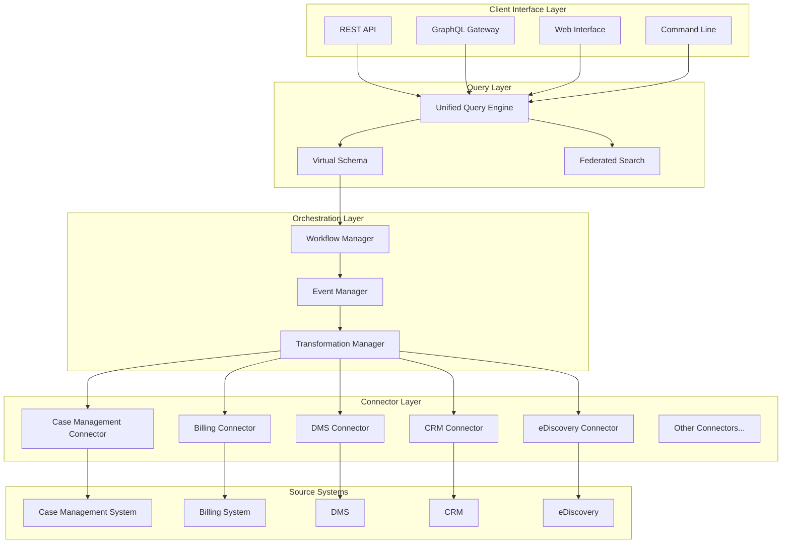
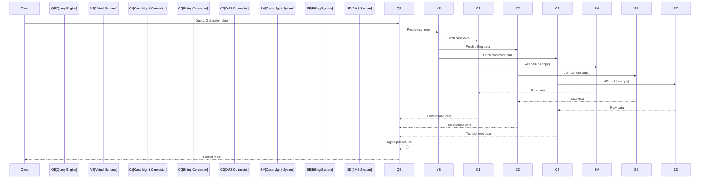
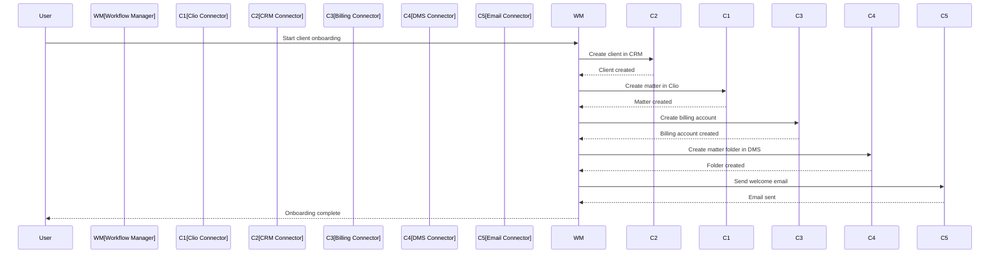
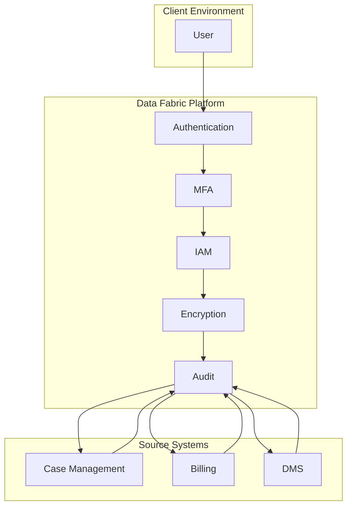

# Legal Data Fabric Platform Architecture

A Zero-Copy Integration Layer for Law Firms and Legal SaaS Ecosystems

---

## Executive Summary

The legal technology ecosystem is highly fragmented, with specialized SaaS tools for case management, document storage, billing, e-discovery, and client relationship management operating in silos. This document proposes a **Legal Data Fabric Platform**—a verticalized Integration Platform as a Service (iPaaS) leveraging zero-copy architecture that enables seamless interoperability between disparate legal systems without data replication.

---

## Problem Statement

### 1. Fragmented Legal SaaS Landscape

Law firms typically use multiple specialized tools that do not natively integrate:

- **Disconnected data silos**: Case management, billing, DMS, CRM, e-discovery systems operate independently
- **Manual reconciliation**: Staff spend hours reconciling data across platforms
- **No real-time consistency**: Data becomes stale and inconsistent across systems

### 2. High Human Capital Costs

Legal professionals waste significant time on:

- Manual data entry across systems
- "Swivel-chair integration" (copying data between applications)
- Verifying consistency across platforms

### 3. Inefficient Data Pipelines

Existing integrations rely on:

- Custom-built ETL pipelines
- Engineering-heavy maintenance
- Data duplication across systems

### 4. Risk and Compliance Exposure

Duplicated data introduces:

- Version control conflicts
- Increased discovery risk
- Compliance vulnerabilities (GDPR, CCPA, HIPAA, attorney-client privilege)

---

## Proposed Solution

### Legal Data Fabric Platform

A unified integration layer that connects existing legal systems and enables:

- **Real-time data access** across platforms
- **Centralized orchestration** without replacing existing tools
- **Elimination of redundant data storage**

### Core Architecture Principles

#### 1. Zero-Copy Data Access

```
┌─────────────────────────────────────────────────────────────────┐
│                    Legal Data Fabric Platform                    │
├─────────────────────────────────────────────────────────────────┤
│                                                                  │
│  Query Layer (Unified Schema)                                    │
│  ┌─────────────────────────────────────────────────────────┐    │
│  │  SELECT * FROM matters WHERE client_id = 'X'            │    │
│  │  → Routes to source systems                              │    │
│  │  → Aggregates results in real-time                       │    │
│  └─────────────────────────────────────────────────────────┘    │
│                                                                  │
│  ┌──────────┐  ┌──────────┐  ┌──────────┐  ┌──────────┐        │
│  │ Case Mgmt│  │  Billing │  │   DMS    │  │   CRM    │        │
│  │  System  │  │  System  │  │  System  │  │  System  │        │
│  └────┬─────┘  └────┬─────┘  └────┬─────┘  └────┬─────┘        │
│       │             │             │             │               │
│       └─────────────┴─────────────┴─────────────┘               │
│                         │                                       │
│              (Zero-Copy Query Routing)                          │
│                                                                  │
└─────────────────────────────────────────────────────────────────┘
```

**Benefits:**
- Query data directly from source systems
- Avoid replication and duplication
- Maintain a single source of truth

#### 2. Data Virtualization Layer

- Abstract underlying systems into a unified schema
- Provide a "single pane of glass" view
- Enable cross-system queries in real-time

#### 3. Integration Orchestration (iPaaS)

- Pre-built connectors for legal SaaS tools
- Workflow automation across systems
- Event-driven data synchronization

---

## System Architecture

### High-Level Architecture



### Zero-Copy Query Flow



### Connector Architecture

```python
class LegalSystemConnector:
    """Base class for all legal system connectors"""
    
    def __init__(self, config: ConnectorConfig):
        self.config = config
        self.auth = self._initialize_auth()
        self.rate_limiter = RateLimiter(config.rate_limits)
    
    @abstractmethod
    def authenticate(self) -> AuthToken:
        """Authenticate with the source system"""
        pass
    
    @abstractmethod
    def query(self, query: str) -> QueryResult:
        """Execute a query against the source system"""
        pass
    
    @abstractmethod
    def get_schema(self) -> SystemSchema:
        """Return the system's data schema"""
        pass
    
    @abstractmethod
    def transform(self, raw_data: dict) -> UnifiedData:
        """Transform source data to unified schema"""
        pass
    
    async def fetch_matter(self, matter_id: str) -> MatterData:
        """Fetch matter data from source system"""
        async with self.rate_limiter.acquire():
            result = await self.query(f"SELECT * FROM matters WHERE id = '{matter_id}'")
            return self.transform(result)
```

### Unified Schema Definition

```yaml
# Unified Legal Data Schema
entities:
  matter:
    fields:
      - name: id
        type: string
        source_fields:
          - system: case_mgmt
            field: matter_number
          - system: billing
            field: matter_id
      - name: client_id
        type: string
        source_fields:
          - system: case_mgmt
            field: client_id
          - system: crm
            field: client_id
      - name: title
        type: string
        source_fields:
          - system: case_mgmt
            field: matter_title
          - system: dms
            field: matter_name
      - name: status
        type: string
        source_fields:
          - system: case_mgmt
            field: matter_status
      - name: created_at
        type: datetime
        source_fields:
          - system: case_mgmt
            field: created_date
          - system: billing
            field: matter_opened
      - name: billing_total
        type: decimal
        source_fields:
          - system: billing
            field: total_billed
      - name: documents_count
        type: integer
        source_fields:
          - system: dms
            field: document_count

  client:
    fields:
      - name: id
        type: string
        source_fields:
          - system: crm
            field: client_id
          - system: case_mgmt
            field: client_number
      - name: name
        type: string
        source_fields:
          - system: crm
            field: client_name
          - system: case_mgmt
            field: client_name
      - name: email
        type: string
        source_fields:
          - system: crm
            field: email
          - system: case_mgmt
            field: contact_email
      - name: phone
        type: string
        source_fields:
          - system: crm
            field: phone
```

---

## Pre-Built Connectors

### Supported Systems

| Category | Systems |
|----------|---------|
| **Case Management** | Clio, MyCase, PracticePanther, Filevine, LEAP |
| **Document Management** | NetDocuments, iManage, Worldox, SharePoint |
| **Billing** | TimeSolv, QuickBooks, Xero, Bill4Time |
| **CRM** | Salesforce Legal, Clio Grow, LawPay |
| **eDiscovery** | Relativity, Everlaw, Disco, Logikcull |
| **Research** | Westlaw, LexisNexis, Bloomberg Law |
| **E-Signature** | DocuSign, HelloSign, Adobe Sign |
| **Calendar** | Google Calendar, Outlook, Clio Calendar |

### Connector Implementation Example

```python
class ClioConnector(LegalSystemConnector):
    """Connector for Clio case management system"""
    
    def __init__(self, api_key: str):
        super().__init__({
            'base_url': 'https://api.clio.com/v3',
            'auth_type': 'bearer',
            'rate_limits': {'requests_per_second': 10}
        })
        self.api_key = api_key
    
    def authenticate(self) -> AuthToken:
        return AuthToken(token=self.api_key, expires_at=None)
    
    def get_schema(self) -> SystemSchema:
        return SystemSchema({
            'matters': {
                'fields': ['id', 'name', 'client_id', 'status', 'created_at']
            },
            'clients': {
                'fields': ['id', 'name', 'email', 'phone']
            },
            'tasks': {
                'fields': ['id', 'matter_id', 'description', 'due_date']
            }
        })
    
    def transform(self, raw_data: dict) -> UnifiedData:
        return UnifiedData({
            'id': raw_data.get('id'),
            'title': raw_data.get('name'),
            'status': self._map_status(raw_data.get('status')),
            'created_at': raw_data.get('created_at'),
            'source_system': 'clio'
        })
    
    def _map_status(self, clio_status: str) -> str:
        mapping = {
            'active': 'open',
            'closed': 'closed',
            'archived': 'archived'
        }
        return mapping.get(clio_status, 'unknown')
```

---

## Workflow Automation

### Client Onboarding Workflow



### Matter Creation Workflow

```python
class MatterOnboardingWorkflow:
    """Automated matter onboarding across systems"""
    
    def __init__(self, connectors: dict[str, LegalSystemConnector]):
        self.connectors = connectors
    
    async def execute(self, client_data: ClientData, matter_data: MatterData) -> WorkflowResult:
        results = {}
        
        # Create in CRM
        results['crm'] = await self.connectors['crm'].create_client(client_data)
        
        # Create matter in case management
        results['case_mgmt'] = await self.connectors['case_mgmt'].create_matter({
            'client_id': results['crm']['client_id'],
            **matter_data
        })
        
        # Create billing account
        results['billing'] = await self.connectors['billing'].create_account({
            'client_id': results['crm']['client_id'],
            'matter_id': results['case_mgmt']['matter_id']
        })
        
        # Create document folder
        results['dms'] = await self.connectors['dms'].create_folder({
            'parent': 'matters',
            'name': f"{matter_data['title']}_{results['case_mgmt']['matter_id']}"
        })
        
        # Send welcome email
        await self.connectors['email'].send_welcome({
            'client_email': client_data['email'],
            'matter_number': results['case_mgmt']['matter_id']
        })
        
        return WorkflowResult(success=True, results=results)
```

---

## Security and Compliance

### Zero-Trust Architecture



### Security Controls

| Control | Implementation |
|---------|----------------|
| **Authentication** | OAuth 2.0, SSO, MFA |
| **Authorization** | RBAC, ABAC, matter-based access |
| **Encryption** | AES-256 at rest, TLS 1.3 in transit |
| **Audit Logging** | Immutable logs, 7-year retention |
| **Data Isolation** | Matter-level isolation, client segregation |
| **Privilege Protection** | Attorney-client privilege tagging |

### Compliance Framework

```yaml
compliance:
  soc2:
    type: Type II
    controls:
      - security
      - availability
      - confidentiality
      - processing_integrity
      - privacy
  
  attorney_client_privilege:
    tagging: automatic
    access_control: strict
    audit: mandatory
  
  gdpr:
    data_residency: configurable
    right_to_erasure: supported
    data_portability: supported
  
  hipaa:
    baa_available: true
    ephi_encryption: mandatory
    access_logging: comprehensive
```

---

## Data Ontology and Schema Mapping

### Ontology Challenge

```
┌─────────────────────────────────────────────────────────────────┐
│                    Data Ontology Challenge                       │
├─────────────────────────────────────────────────────────────────┤
│                                                                  │
│  System A (Clio)          System B (NetDocuments)  System C     │
│  ┌─────────────┐         ┌─────────────┐        (Salesforce)    │
│  │ matter_id   │         │ doc_id      │        ┌─────────────┐ │
│  │ client_id   │         │ client_id   │        │ account_id  │ │
│  │ title       │         │ title       │        │ name        │ │
│  └─────────────┘         └─────────────┘        └─────────────┘ │
│                                                                  │
│  Unified Schema:                                                 │
│  ┌─────────────────────────────────────────────────────────┐    │
│  │ matter:                                                   │    │
│  │   id: string (unified)                                   │    │
│  │   client_id: string (unified)                            │    │
│  │   title: string (unified)                                │    │
│  │   source_systems: [clio, netdocs, salesforce]            │    │
│  └─────────────────────────────────────────────────────────┘    │
│                                                                  │
└─────────────────────────────────────────────────────────────────┘
```

### AI-Assisted Schema Mapping

```python
class SchemaMapper:
    """AI-assisted schema mapping across systems"""
    
    def __init__(self, llm_client: LLMClient):
        self.llm = llm_client
        self.mappings = {}
    
    async def map_schemas(self, source_schema: SystemSchema, 
                          target_schema: SystemSchema) -> SchemaMapping:
        """Use AI to map source schema to target schema"""
        
        prompt = f"""
        Map the following source schema fields to target schema fields:
        
        Source Schema:
        {json.dumps(source_schema.to_dict(), indent=2)}
        
        Target Schema:
        {json.dumps(target_schema.to_dict(), indent=2)}
        
        Provide field mappings with confidence scores.
        """
        
        response = await self.llm.generate(prompt)
        return self._parse_mapping(response)
    
    def resolve_entities(self, records: list[dict]) -> list[EntityResolution]:
        """Resolve duplicate entities across systems"""
        # Use AI to identify matching entities
        # e.g., same client appearing in multiple systems
        pass
```

---

## Implementation Roadmap

### Phase 1: Foundation (Months 1-3)

**Goals:**
- Build core query engine
- Implement 3-5 key connectors
- Create unified schema framework

**Deliverables:**
- Zero-copy query engine
- Clio, NetDocuments, QuickBooks connectors
- REST API and GraphQL gateway

### Phase 2: Workflow Automation (Months 4-6)

**Goals:**
- Implement workflow engine
- Add 5-10 more connectors
- Build client onboarding workflows

**Deliverables:**
- Workflow manager
- Salesforce, iManage, TimeSolv connectors
- Client onboarding automation

### Phase 3: Advanced Features (Months 7-9)

**Goals:**
- Add federated search
- Implement AI-assisted schema mapping
- Build compliance framework

**Deliverables:**
- Federated search across systems
- Schema mapping AI
- SOC 2 compliance

### Phase 4: Production (Months 10-12)

**Goals:**
- Security hardening
- Performance optimization
- Enterprise features

**Deliverables:**
- SOC 2 Type II certification
- SSO integration
- Enterprise-grade audit logging

---

## Market Analysis

### Total Addressable Market

- **Legal industry size**: ~$1 trillion
- **Legal tech spend**: ~$30 billion
- **Integration opportunity**: ~$5-10 billion (infrastructure layer)

### Target Customers

| Segment | Size | Pain Level | Willingness to Pay |
|---------|------|------------|-------------------|
| Large Law Firms (500+ attorneys) | 100+ firms | High | High |
| Mid-size Firms (50-500 attorneys) | 2,000+ firms | High | Medium-High |
| Small Firms (1-50 attorneys) | 20,000+ firms | Medium | Medium |
| In-House Legal Departments | 10,000+ | High | High |

### Competitive Landscape

| Competitor | Approach | Limitations |
|------------|----------|-------------|
| Zapier/Make | General iPaaS | Not legal-specific |
| MuleSoft | Enterprise integration | Expensive, complex |
| Custom ETL | Point-to-point | High maintenance |
| Native integrations | Vendor-specific | Limited coverage |

**Your Advantage:**
- Legal-specific ontology
- Zero-copy architecture
- Compliance-first design
- Lower cost than enterprise integration

---

## Product Strategy

### Option A: Workflow Automation Platform (Recommended for MVP)

**Focus:** Predefined workflows with immediate ROI

**Examples:**
- Client onboarding
- Matter creation
- Document sync
- Billing sync

**Benefits:**
- Faster time to market
- Easier customer adoption
- Clear value proposition

### Option B: Universal Data Fabric (Long-term Vision)

**Focus:** Complete abstraction layer

**Features:**
- Unified query interface
- Federated search
- Advanced analytics
- Custom schema mapping

**Benefits:**
- Category creation
- Platform dominance
- Higher valuation

### Recommended Approach

**Start with Option A, evolve to Option B:**

1. Launch with 3-5 high-value workflows
2. Build connector ecosystem
3. Add unified query layer
4. Expand to full data fabric

---

## Conclusion

The Legal Data Fabric Platform addresses a critical inefficiency in the legal industry: fragmented systems and redundant data handling. By enabling zero-copy, real-time integration, it reduces costs, mitigates risk, and unlocks productivity.

**Key Success Factors:**
1. **Solve data ontology challenges** - Unified schema across systems
2. **Build trust through security** - Compliance-first design
3. **Navigate legacy constraints** - Flexible connector architecture
4. **Start with workflows** - Show immediate ROI
5. **Expand to platform** - Long-term vision

**Market Opportunity:**
- High demand (pain is real and expensive)
- Moderate readiness (trust and integration barriers)
- Huge opportunity (infrastructure layer in $1T industry)

This is not just a feature or product—it's a category-defining platform opportunity.

---

*Document generated for Legal Data Fabric Platform architecture.*
