# Legal Workflow Automation System Architecture

This document provides a comprehensive architecture for building an end-to-end legal workflow automation system using the multi-agent framework. It covers target users, workflows, deployment models, and compliance requirements.

---

## Table of Contents

1. [Executive Summary](#executive-summary)
2. [Target Users and Use Cases](#target-users-and-use-cases)
3. [Legal Workflows to Automate](#legal-workflows-to-automate)
4. [Deployment Models](#deployment-models)
5. [Compliance and Security Requirements](#compliance-and-security-requirements)
6. [Legal-Specific Agent Architecture](#legal-specific-agent-architecture)
7. [System Architecture Overview](#system-architecture-overview)
8. [Data Flow and Integration](#data-flow-and-integration)
9. [Implementation Roadmap](#implementation-roadmap)

---

## Executive Summary

This architecture outlines a multi-agent system designed specifically for legal workflow automation. The system leverages the Claw Code harness as its foundation, extending it with legal-specific agents, compliance controls, and secure deployment options.

**Key Features:**
- End-to-end legal workflow automation
- Attorney-client privilege protection
- Compliance with legal industry regulations
- Flexible deployment (SaaS, on-premise, hybrid)
- Multi-agent collaboration for complex legal tasks
- Audit trails for all actions

---

## Target Users and Use Cases

### 1. Law Firms

**Primary Users:**
- Partners and Associates
- Paralegals
- Legal Assistants
- Knowledge Management Teams

**Use Cases:**
- Contract review and redlining
- Due diligence for M&A transactions
- Discovery document review
- Legal research assistance
- Client intake and conflict checking
- Billing and time tracking
- Matter management

**Pain Points Addressed:**
- Reducing manual document review time
- Minimizing human error in contract analysis
- Streamlining client onboarding
- Automating repetitive legal tasks

### 2. In-House Legal Departments

**Primary Users:**
- General Counsel
- Corporate Counsel
- Legal Operations Managers
- Compliance Officers

**Use Cases:**
- Vendor contract management
- Employment agreement processing
- Regulatory compliance monitoring
- Policy document creation
- Intellectual property management
- Litigation support
- Board meeting preparation

**Pain Points Addressed:**
- Managing high volume of standard contracts
- Ensuring consistent contract terms
- Tracking compliance obligations
- Reducing external legal spend

### 3. Legal Tech Companies

**Primary Users:**
- Product Managers
- Legal Engineers
- Solution Architects

**Use Cases:**
- Building legal SaaS products
- Integrating with existing legal systems
- Creating legal AI applications
- Developing compliance automation tools

**Pain Points Addressed:**
- Rapid prototyping of legal workflows
- Integration with legal databases
- Ensuring regulatory compliance in products

### 4. Individual Lawyers and Solo Practitioners

**Primary Users:**
- Solo practitioners
- Small firm attorneys
- Legal consultants

**Use Cases:**
- Document drafting and review
- Client communication management
- Case file organization
- Deadline tracking
- Billing and invoicing

**Pain Points Addressed:**
- Limited resources for administrative tasks
- Need for efficient document management
- Compliance with ethical obligations

---

## Legal Workflows to Automate

### 1. Contract Review and Drafting

**Workflow Steps:**

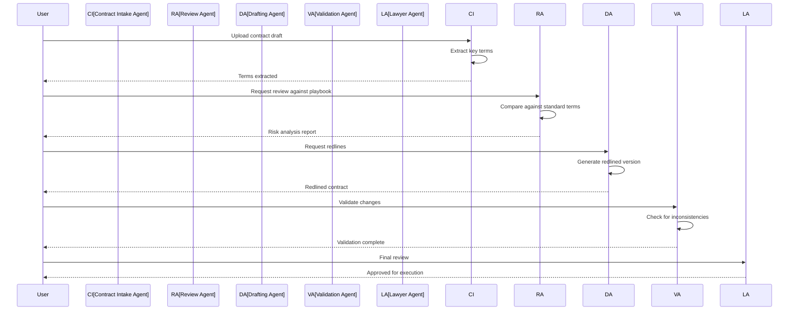

**Agents Involved:**
- **Contract Intake Agent**: Extracts terms, parties, dates
- **Review Agent**: Compares against playbook, identifies risks
- **Drafting Agent**: Generates redlines, suggests changes
- **Validation Agent**: Ensures consistency, completeness
- **Lawyer Agent**: Final review, approval

**Tools Required:**
- Document parsing (PDF, Word)
- OCR for scanned documents
- NLP for term extraction
- Comparison algorithms
- Template engine

### 2. Due Diligence

**Workflow Steps:**

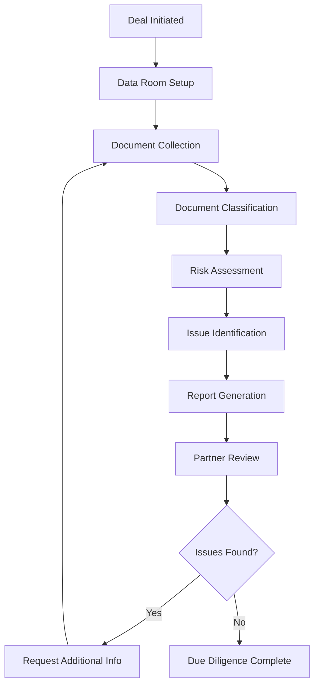

**Agents Involved:**
- **Data Room Agent**: Manages document repository
- **Classification Agent**: Categorizes documents
- **Review Agent**: Analyzes documents for issues
- **Risk Agent**: Assesses legal risks
- **Reporting Agent**: Generates due diligence reports

**Document Types:**
- Corporate records
- Financial statements
- Contracts and agreements
- Intellectual property
- Litigation history
- Employment agreements
- Regulatory filings

### 3. Compliance Monitoring

**Workflow Steps:**

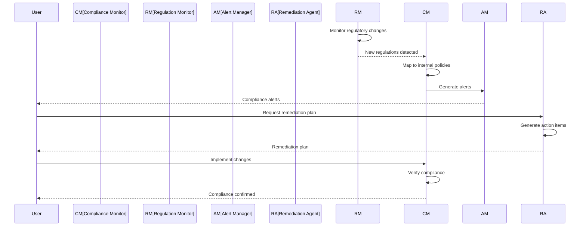

**Agents Involved:**
- **Regulation Monitor**: Tracks regulatory changes
- **Compliance Monitor**: Maps regulations to policies
- **Alert Manager**: Generates compliance alerts
- **Remediation Agent**: Creates action plans
- **Verification Agent**: Confirms compliance

**Compliance Areas:**
- GDPR/CCPA data privacy
- SOC 2 security controls
- HIPAA healthcare compliance
- SOX financial reporting
- Industry-specific regulations

### 4. Discovery Document Review

**Workflow Steps:**

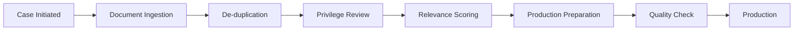

**Agents Involved:**
- **Ingestion Agent**: Processes document uploads
- **De-duplication Agent**: Removes duplicate documents
- **Privilege Agent**: Identifies privileged content
- **Relevance Agent**: Scores document relevance
- **Production Agent**: Prepares documents for production

### 5. Client Intake and Conflict Checking

**Workflow Steps:**

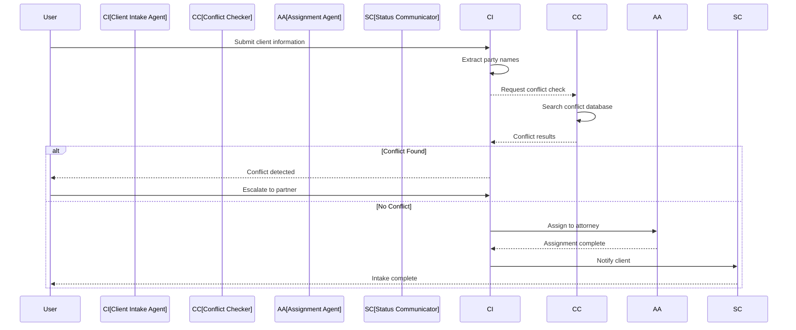

**Agents Involved:**
- **Client Intake Agent**: Collects client information
- **Conflict Checker**: Searches for conflicts
- **Assignment Agent**: Assigns to appropriate attorney
- **Status Communicator**: Updates client on status

### 6. Billing and Time Tracking

**Workflow Steps:**

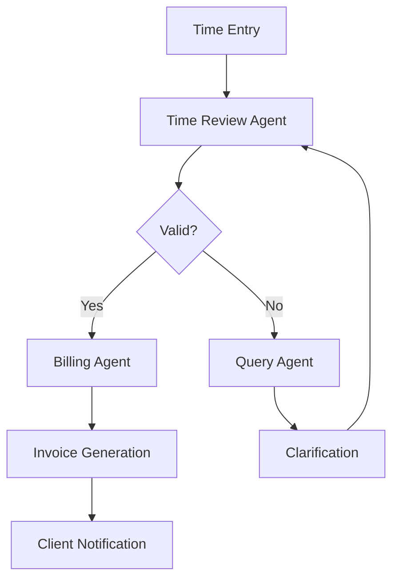

**Agents Involved:**
- **Time Review Agent**: Validates time entries
- **Billing Agent**: Processes billing
- **Invoice Agent**: Generates invoices
- **Query Agent**: Requests clarification on entries

---

## Deployment Models

### 1. SaaS Platform (Cloud-Hosted)

**Architecture:**

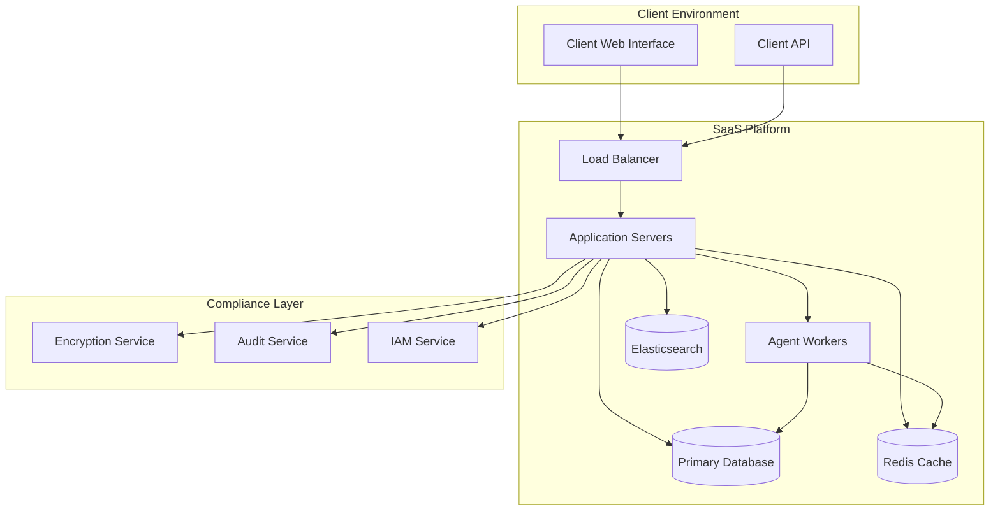

**Components:**
- **Multi-tenant Architecture**: Isolated data per client
- **Encryption**: AES-256 at rest, TLS 1.3 in transit
- **Audit Logging**: All actions logged and immutable
- **IAM**: Role-based access control with SSO
- **Backup**: Daily backups with point-in-time recovery

**Pros:**
- Quick deployment
- No infrastructure management
- Automatic updates
- Scalable

**Cons:**
- Data in third-party cloud
- Ongoing subscription costs
- Less customization

**Best For:**
- Small to medium law firms
- In-house legal departments
- Solo practitioners

### 2. On-Premise Deployment

**Architecture:**

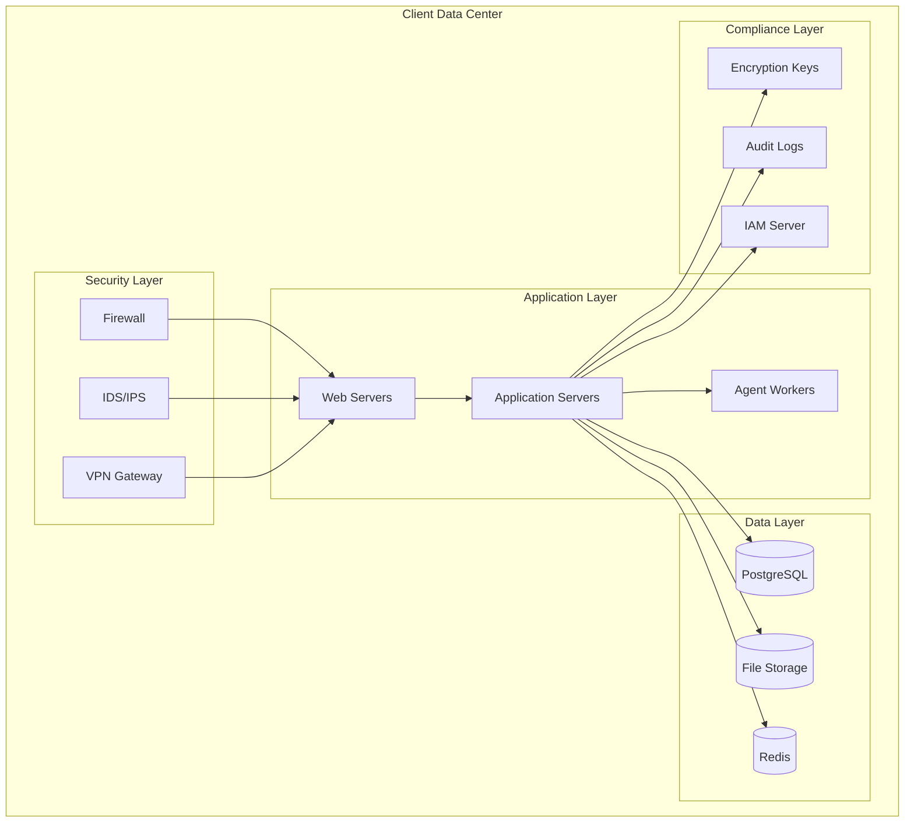

**Components:**
- **Self-Contained**: All components on-premise
- **Network Isolation**: Air-gapped option available
- **Custom Encryption**: Client-managed encryption keys
- **Local Audit**: Audit logs stored locally
- **Custom IAM**: Integration with existing directory

**Pros:**
- Full data control
- Customizable
- Meets strict compliance requirements
- No data leaving premises

**Cons:**
- Higher upfront costs
- Infrastructure management required
- Slower updates
- Requires IT staff

**Best For:**
- Large law firms
- Government legal departments
- Highly regulated industries

### 3. Hybrid Deployment

**Architecture:**

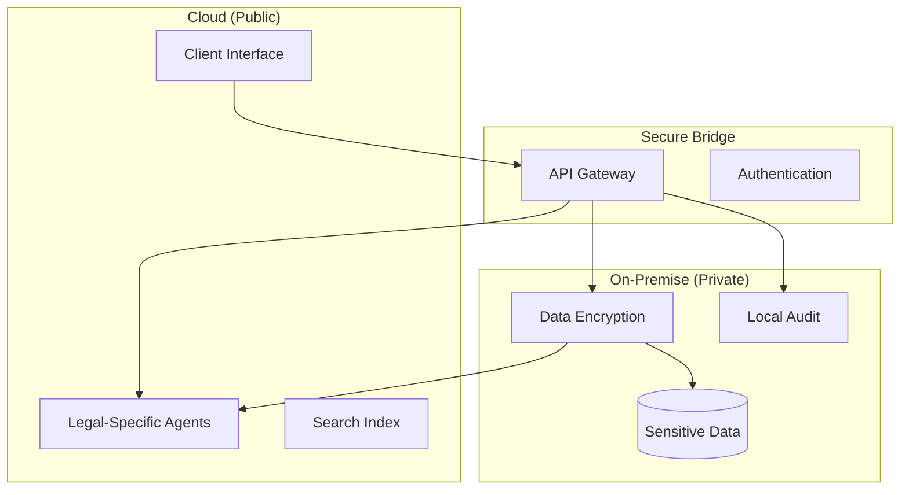

**Components:**
- **Cloud**: User interface, general processing
- **On-Premise**: Sensitive data, legal-specific agents
- **Secure Bridge**: Encrypted communication between environments
- **Data Classification**: Automatic classification of data sensitivity

**Pros:**
- Balance of convenience and control
- Sensitive data stays on-premise
- Scalable for non-sensitive work
- Flexible compliance

**Cons:**
- More complex architecture
- Requires both environments
- Integration complexity

**Best For:**
- Large enterprises
- Firms with mixed requirements
- Organizations transitioning to cloud

---

## Compliance and Security Requirements

### 1. Attorney-Client Privilege Protection

**Requirements:**
- **Data Isolation**: Client data strictly separated
- **Access Controls**: Only authorized personnel can access
- **Audit Trail**: All access logged and immutable
- **Encryption**: End-to-end encryption for privileged communications

**Implementation:**

```python
class PrivilegeManager:
    def __init__(self):
        self.privilege_tags = {}
        self.access_controls = {}
    
    def tag_as_privileged(self, document_id: str, matter_id: str) -> None:
        """Tag document as attorney-client privileged"""
        self.privilege_tags[document_id] = {
            'matter_id': matter_id,
            'tagged_at': datetime.now(),
            'tagged_by': current_user.id
        }
    
    def check_access(self, user_id: str, document_id: str) -> bool:
        """Check if user can access privileged document"""
        if document_id not in self.privilege_tags:
            return True
        
        matter_id = self.privilege_tags[document_id]['matter_id']
        return user_id in self.access_controls[matter_id]
    
    def log_access(self, user_id: str, document_id: str) -> None:
        """Log access to privileged document"""
        audit_log.append({
            'action': 'privileged_access',
            'user_id': user_id,
            'document_id': document_id,
            'timestamp': datetime.now()
        })
```

### 2. Data Privacy Compliance

**GDPR Requirements:**
- Right to access personal data
- Right to rectification
- Right to erasure (right to be forgotten)
- Data portability
- Consent management

**CCPA Requirements:**
- Right to know what data is collected
- Right to delete personal information
- Right to opt-out of data sales
- Non-discrimination for exercising rights

**Implementation:**

```python
class PrivacyCompliance:
    def __init__(self):
        self.consent_records = {}
        self.data_registry = {}
    
    def request_data_access(self, user_id: str) -> dict:
        """Fulfill GDPR Article 15 - Right of access"""
        return self.data_registry.get(user_id, {})
    
    def request_data_deletion(self, user_id: str) -> bool:
        """Fulfill GDPR Article 17 - Right to erasure"""
        # Delete all user data
        self._delete_user_data(user_id)
        # Delete from backups (after retention period)
        self._schedule_backup_deletion(user_id)
        return True
    
    def record_consent(self, user_id: str, purpose: str) -> None:
        """Record user consent for data processing"""
        self.consent_records.setdefault(user_id, {})[purpose] = {
            'consented_at': datetime.now(),
            'consented_by': user_id
        }
```

### 3. Security Controls

**Access Control Matrix:**

| Role | Document Read | Document Write | Privileged Access | Admin Functions |
|------|---------------|----------------|-------------------|-----------------|
| Partner | All matters | All matters | Yes | No |
| Associate | Assigned matters | Assigned matters | Yes | No |
| Paralegal | Assigned matters | Limited | No | No |
| Client | Assigned documents | No | No | No |
| Admin | System config | System config | No | Yes |

**Encryption Requirements:**

```yaml
encryption:
  at_rest:
    algorithm: AES-256-GCM
    key_management: AWS KMS / Azure Key Vault / HSM
    key_rotation: 90 days
  
  in_transit:
    protocol: TLS 1.3
    minimum_version: TLS 1.2
    certificate_authority: Internal CA + External CA
  
  database:
    column_level_encryption: true
    fields:
      - client_name
      - matter_number
      - privileged_content
      - billing_information
```

### 4. Audit and Logging

**Audit Requirements:**

```yaml
audit:
  events:
    - user_login
    - user_logout
    - document_access
    - document_modify
    - document_delete
    - privilege_tag
    - privilege_untag
    - export_data
    - import_data
    - user_permission_change
    - system_config_change
  
  retention:
    log_retention: 7 years
    immutable: true
    storage: WORM (Write Once Read Many)
  
  monitoring:
    real_time_alerts: true
    suspicious_activity_detection: true
    anomaly_detection: true
```

**Audit Log Structure:**

```json
{
  "audit_id": "uuid-v4",
  "timestamp": "ISO-8601",
  "user_id": "user-123",
  "user_name": "John Doe",
  "action": "document_access",
  "resource_type": "document",
  "resource_id": "doc-456",
  "matter_id": "matter-789",
  "ip_address": "192.168.1.1",
  "user_agent": "Mozilla/5.0...",
  "result": "success",
  "details": {
    "document_title": "Contract Review",
    "privilege_status": "privileged"
  },
  "signature": "sha256-hash"
}
```

### 5. Industry-Specific Compliance

**SOC 2 Requirements:**
- Security control implementation
- Regular security assessments
- Access control monitoring
- Change management procedures

**HIPAA Requirements (for healthcare law):**
- Business Associate Agreement
- Encryption of ePHI
- Access controls
- Audit controls
- Integrity controls
- Transmission security

**ISO 27001 Requirements:**
- Information security management system
- Risk assessment
- Security controls implementation
- Continuous improvement

---

## Legal-Specific Agent Architecture

### Agent Types for Legal Workflows

#### 1. Document Analysis Agents

**Document Parser Agent**
- Parses PDF, Word, Excel, email attachments
- Extracts text, tables, images
- Identifies document structure
- Handles OCR for scanned documents

**Term Extraction Agent**
- Identifies key legal terms
- Extracts parties, dates, amounts
- Identifies obligations and conditions
- Maps terms to legal concepts

**Risk Assessment Agent**
- Compares terms against playbook
- Identifies non-standard provisions
- Scores risk level
- Suggests mitigations

#### 2. Research Agents

**Legal Research Agent**
- Searches case law databases
- Finds relevant statutes
- Identifies jurisdiction-specific rules
- Summarizes findings

**Precedent Search Agent**
- Searches internal precedent library
- Finds similar past matters
- Extracts successful strategies
- Identifies lessons learned

#### 3. Drafting Agents

**Contract Drafting Agent**
- Generates contracts from templates
- Fills in variable terms
- Ensures consistent language
- Maintains formatting

**Motion Drafting Agent**
- Generates legal motions
- Cites relevant authorities
- Formats according to court rules
- Includes required exhibits

#### 4. Review Agents

**Contract Review Agent**
- Reviews contracts against standards
- Identifies deviations
- Suggests redlines
- Tracks negotiation history

**Discovery Review Agent**
- Reviews discovered documents
- Identifies privileged content
- Scores relevance
- Flags issues

#### 5. Compliance Agents

**Regulation Monitor Agent**
- Tracks regulatory changes
- Maps to internal policies
- Identifies impact
- Generates alerts

**Compliance Checker Agent**
- Verifies compliance status
- Identifies gaps
- Generates remediation plans
- Tracks remediation progress

#### 6. Workflow Agents

**Matter Management Agent**
- Tracks matter status
- Manages deadlines
- Coordinates team activities
- Generates status reports

**Billing Agent**
- Processes time entries
- Generates invoices
- Tracks payments
- Identifies billing issues

### Agent Communication for Legal Workflows

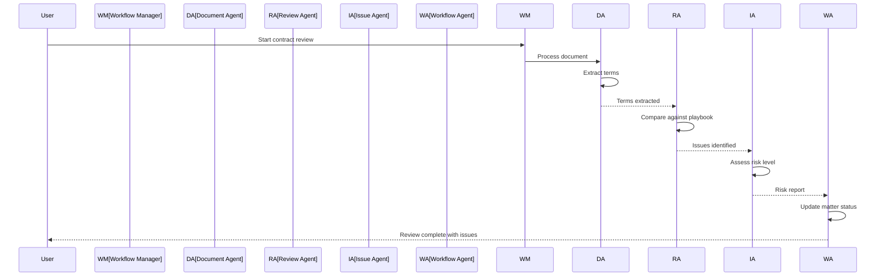

---

## System Architecture Overview

### High-Level Architecture

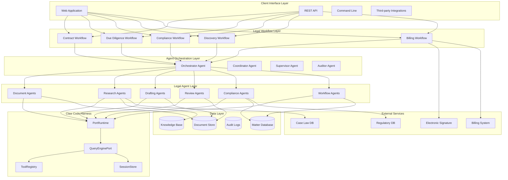

### Data Model

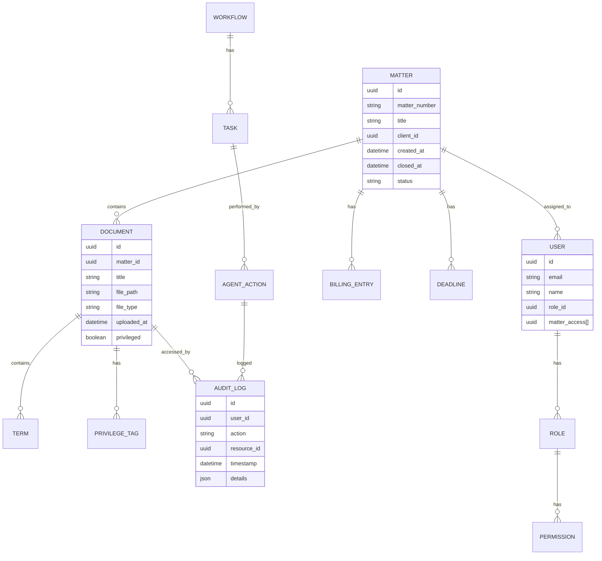

---

## Data Flow and Integration

### Document Ingestion Flow

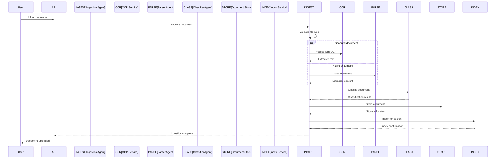

### Contract Review Flow

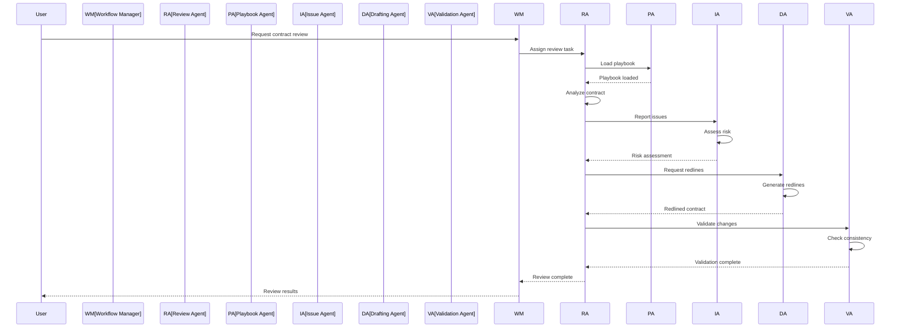

### Integration Points

**Third-Party Integrations:**

| Integration | Purpose | Method |
|-------------|---------|--------|
| DocuSign | Electronic signatures | API |
| NetDocuments | Document management | API |
| iManage | Document management | API |
| Salesforce | CRM integration | API |
| QuickBooks | Billing integration | API |
| Westlaw/LexisNexis | Legal research | API |
| Relativity | eDiscovery | API |
| SharePoint | Document storage | API |

**Integration Architecture:**

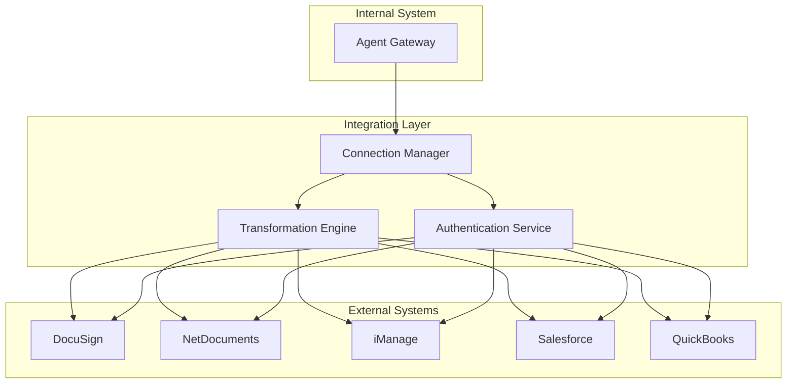

---

## Implementation Roadmap

### Phase 1: Foundation (Months 1-3)

**Goals:**
- Set up core multi-agent infrastructure
- Implement basic document processing
- Create initial agent templates

**Deliverables:**
- Multi-agent framework
- Document ingestion pipeline
- Basic contract review agent
- Audit logging system

### Phase 2: Core Workflows (Months 4-6)

**Goals:**
- Implement contract review workflow
- Add due diligence capabilities
- Build compliance monitoring

**Deliverables:**
- Contract review workflow
- Due diligence agent suite
- Compliance monitoring agent
- Playbook management system

### Phase 3: Advanced Features (Months 7-9)

**Goals:**
- Add research capabilities
- Implement drafting agents
- Build integration framework

**Deliverables:**
- Legal research agent
- Contract drafting agent
- Third-party integrations
- Knowledge base system

### Phase 4: Production Ready (Months 10-12)

**Goals:**
- Security hardening
- Compliance certification
- Performance optimization

**Deliverables:**
- SOC 2 certification
- HIPAA compliance (if needed)
- Production deployment
- User training materials

---

## Security Checklist

- [ ] Implement role-based access control
- [ ] Enable multi-factor authentication
- [ ] Configure encryption at rest and in transit
- [ ] Set up audit logging with 7-year retention
- [ ] Implement attorney-client privilege tagging
- [ ] Configure data isolation per matter
- [ ] Set up intrusion detection
- [ ] Implement backup and disaster recovery
- [ ] Conduct security penetration testing
- [ ] Complete SOC 2 Type II audit
- [ ] Complete HIPAA compliance assessment (if applicable)

---

## Conclusion

This architecture provides a comprehensive foundation for building a legal workflow automation system. The multi-agent approach allows for flexible, scalable automation of complex legal tasks while maintaining the security and compliance requirements essential to the legal profession.

Key success factors:
1. **Security First**: Attorney-client privilege and data protection are paramount
2. **Compliance by Design**: Built-in compliance with legal industry regulations
3. **Flexible Deployment**: Options for SaaS, on-premise, and hybrid
4. **Agent Specialization**: Domain-specific agents for different legal tasks
5. **Audit Trail**: Complete logging of all actions for accountability

---

*Document generated for Legal Workflow Automation System architecture.*
