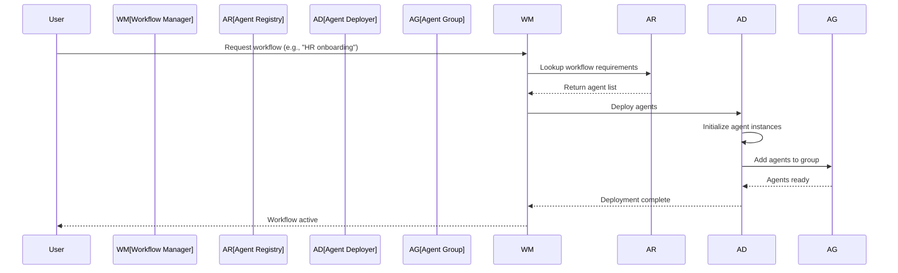
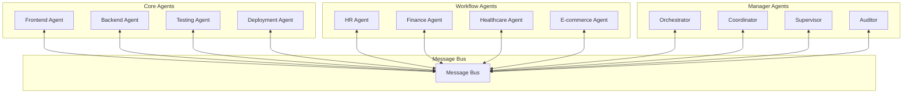
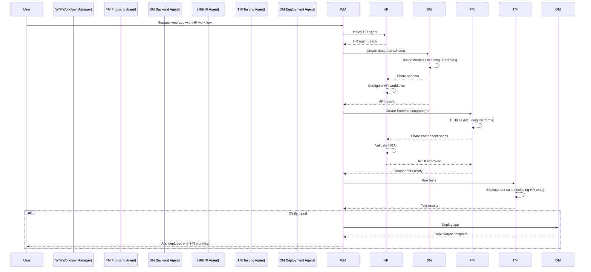
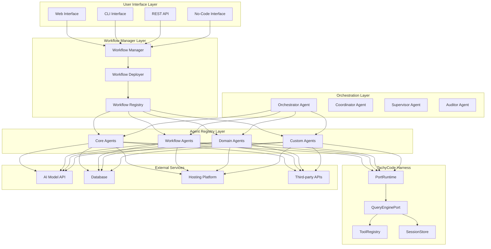
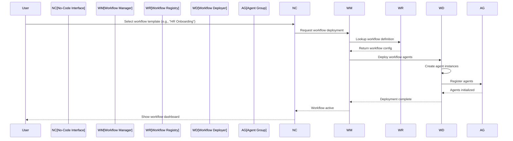
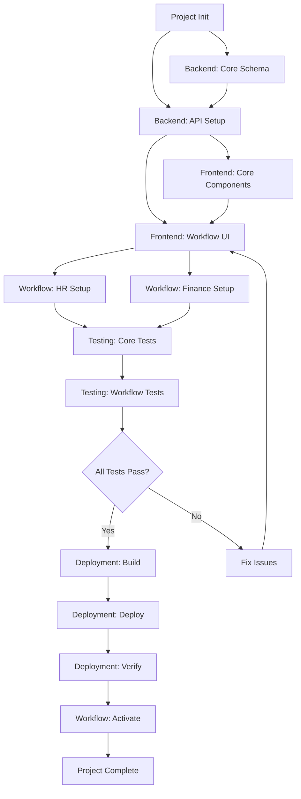
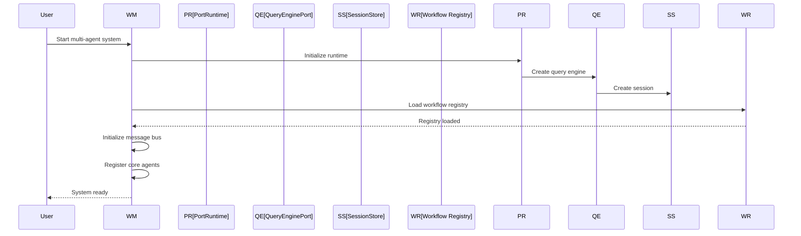
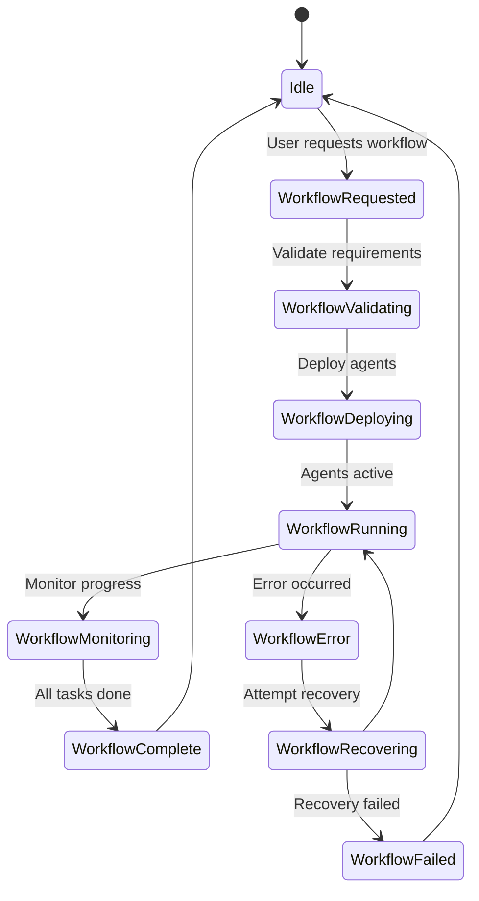
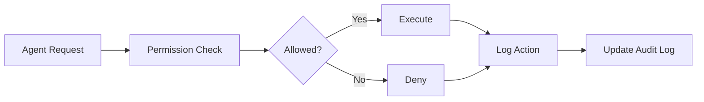
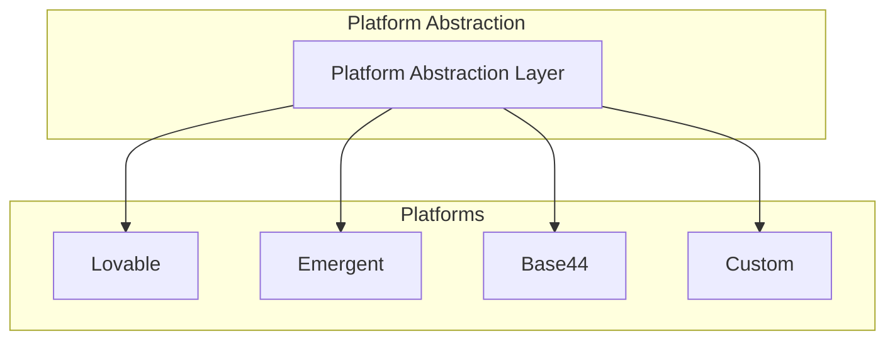

# Multi-Agent Web Application Automation System Architecture

This document outlines the architecture for building a multi-agent system for automated web application development, leveraging the TachyCode harness as its foundation. This system supports workflow-specific agent deployment and is designed for easy use by laypersons across multiple platforms.

---

## Table of Contents

1. [System Overview](#system-overview)
2. [Agent Roles and Responsibilities](#agent-roles-and-responsibilities)
3. [Workflow-Specific Agent Deployment](#workflow-specific-agent-deployment)
4. [Agent Communication Protocols](#agent-communication-protocols)
5. [Data Flow Between Agents](#data-flow-between-agents)
6. [Component Interaction Diagrams](#component-interaction-diagrams)
7. [Runtime Execution Flow](#runtime-execution-flow)
8. [Integration with TachyCode](#integration-with-tachycode)
9. [Platform Support (Lovable, Emergent, Base44)](#platform-support-lovable-emergent-base44)
10. [Layperson Deployment Guide](#layperson-deployment-guide)

---

## System Overview

### Vision

A multi-agent system where specialized AI agents collaborate to build, test, and deploy web applications autonomously. The system supports **workflow-specific agent deployment**, allowing users to easily add domain-specific agents (HR, finance, healthcare, etc.) to handle specialized business processes.

### Core Principles

1. **Specialization**: Each agent focuses on a specific domain
2. **Workflow-Adaptive**: Agents can be deployed dynamically based on workflow requirements
3. **Easy Deployment**: Laypersons can add new agents through simple configuration
4. **Platform-Agnostic**: Works across Lovable, Emergent, Base44, and other platforms
5. **Safety**: Permission system prevents unauthorized operations
6. **Persistence**: All agent interactions and state are persisted for audit and recovery
7. **Extensibility**: New agents and workflows can be added without disrupting existing functionality

### System Components

```
┌─────────────────────────────────────────────────────────────────────────────┐
│                        User Interface Layer                                  │
├─────────────────────────────────────────────────────────────────────────────┤
│  ┌─────────────┐  ┌─────────────┐  ┌─────────────┐  ┌─────────────┐        │
│  │  Web App    │  │  CLI        │  │  API        │  │  No-Code    │        │
│  │  Builder    │  │  Interface  │  │  Gateway    │  │  Interface  │        │
│  └─────────────┘  └─────────────┘  └─────────────┘  └─────────────┘        │
├─────────────────────────────────────────────────────────────────────────────┤
│                        Workflow Manager Layer                                │
├─────────────────────────────────────────────────────────────────────────────┤
│  ┌─────────────────────────────────────────────────────────────────────┐    │
│  │                    Workflow Orchestrator                             │    │
│  │  - Detect workflow requirements                                      │    │
│  │  - Deploy appropriate agents                                         │    │
│  │  - Monitor workflow progress                                         │    │
│  │  - Handle workflow exceptions                                        │    │
│  └─────────────────────────────────────────────────────────────────────┘    │
├─────────────────────────────────────────────────────────────────────────────┤
│                        Agent Registry Layer                                  │
├─────────────────────────────────────────────────────────────────────────────┤
│  ┌─────────────┐  ┌─────────────┐  ┌─────────────┐  ┌─────────────┐        │
│  │  Core       │  │  Workflow   │  │  Domain     │  │  Custom     │        │
│  │  Agents     │  │  Agents     │  │  Agents     │  │  Agents     │        │
│  └─────────────┘  └─────────────┘  └─────────────┘  └─────────────┘        │
├─────────────────────────────────────────────────────────────────────────────┤
│                        TachyCode Harness Layer                               │
├─────────────────────────────────────────────────────────────────────────────┤
│  ┌─────────────┐  ┌─────────────┐  ┌─────────────┐  ┌─────────────┐        │
│  │  Port       │  │  Query      │  │  Tool       │  │  Session    │        │
│  │  Runtime    │  │  Engine     │  │  Registry   │  │  Store      │        │
│  └─────────────┘  └─────────────┘  └─────────────┘  └─────────────┘        │
└─────────────────────────────────────────────────────────────────────────────┘
```

---

## Agent Roles and Responsibilities

### Core Agents (Always Active)

#### 1. Frontend Agent

**Responsibilities:**
- Generate React/Vue/Svelte components
- Create responsive layouts with Tailwind CSS
- Implement state management (Redux, Zustand, Pinia)
- Build navigation and routing
- Create UI/UX components (forms, modals, tables)
- Optimize for accessibility (WCAG compliance)

**Tools:**
- `read_file`, `write_file`, `edit_file` - File operations
- `bash` - Run build tools, linters, formatters
- `glob_search`, `grep_search` - Code exploration

#### 2. Backend Agent

**Responsibilities:**
- Design database schemas
- Create API endpoints (REST, GraphQL)
- Implement business logic
- Set up authentication/authorization
- Configure database connections
- Write data models and migrations

#### 3. Testing Agent

**Responsibilities:**
- Write unit tests for components and functions
- Create integration tests for APIs
- Set up end-to-end testing (Playwright, Cypress)
- Configure test runners and coverage
- Analyze test results and report failures

#### 4. Deployment Agent

**Responsibilities:**
- Configure build pipelines
- Set up CI/CD workflows (GitHub Actions, GitLab CI)
- Configure hosting platforms (Vercel, Netlify, AWS)
- Create Docker containers
- Set up environment variables and secrets

### Workflow Agents (Deployed on Demand)

#### 5. HR Workflow Agent

**Responsibilities:**
- Employee onboarding workflows
- Leave management
- Performance reviews
- Payroll processing
- Benefits administration
- Compliance tracking

**Tools:**
- All core tools plus HR-specific integrations
- HRIS system connectors (Workday, BambooHR)
- Document generation for employment contracts

#### 6. Finance Workflow Agent

**Responsibilities:**
- Invoice generation
- Expense tracking
- Budget management
- Financial reporting
- Tax compliance
- Payment processing

**Tools:**
- All core tools plus finance-specific integrations
- Accounting software connectors (QuickBooks, Xero)
- Payment gateway integrations (Stripe, PayPal)

#### 7. Healthcare Workflow Agent

**Responsibilities:**
- Patient intake workflows
- Appointment scheduling
- Medical record management
- Insurance claim processing
- HIPAA compliance
- Telemedicine integration

**Tools:**
- All core tools plus healthcare-specific integrations
- EHR system connectors (Epic, Cerner)
- HIPAA-compliant storage

#### 8. E-commerce Workflow Agent

**Responsibilities:**
- Product catalog management
- Shopping cart functionality
- Order processing
- Inventory management
- Customer support workflows
- Analytics and reporting

**Tools:**
- All core tools plus e-commerce integrations
- Payment gateway connectors
- Shipping API integrations

### Agent Manager (Orchestrator)

**Responsibilities:**
- Coordinate agent activities
- Resolve conflicts between agents
- Manage agent priorities and scheduling
- Handle agent failures and retries
- Track overall system progress
- Generate system status reports

### Agent Coordinator

**Responsibilities:**
- Maintain shared workspace state
- Facilitate inter-agent communication
- Track dependencies between tasks
- Ensure consistency across agent outputs
- Manage shared resources

### Agent Supervisor

**Responsibilities:**
- Monitor agent performance
- Validate agent outputs against requirements
- Enforce quality standards
- Trigger rework when needed
- Manage agent permissions

### Agent Auditor

**Responsibilities:**
- Log all agent actions
- Track system state changes
- Generate audit trails
- Detect security issues
- Report compliance violations

---

## Workflow-Specific Agent Deployment

### Workflow Detection System

The system automatically detects workflow requirements based on:

1. **User Input**: Direct specification of workflow needs
2. **Project Analysis**: Analyzing project structure and requirements
3. **API Integration**: Detecting connected third-party services
4. **Pattern Recognition**: Identifying common workflow patterns

### Workflow Agent Registry

```yaml
# config/workflow_registry.yaml
workflows:
  - name: "hr_workflow"
    description: "Human Resources management workflow"
    agents:
      - name: "hr_agent"
        type: "DomainAgent"
        template: "hr_agent_template"
        tools:
          - read_file
          - write_file
          - edit_file
          - hris_connector
          - document_generator
        permissions:
          max_file_size: 10000
          allowed_extensions:
            - .json
            - .yaml
            - .pdf
          denied_operations:
            - rm -rf
    triggers:
      - "onboarding_required"
      - "leave_request"
      - "performance_review"
    
  - name: "finance_workflow"
    description: "Financial management workflow"
    agents:
      - name: "finance_agent"
        type: "DomainAgent"
        template: "finance_agent_template"
        tools:
          - read_file
          - write_file
          - edit_file
          - accounting_connector
          - payment_processor
        permissions:
          max_file_size: 10000
          allowed_extensions:
            - .json
            - .yaml
            - .csv
          denied_operations:
            - rm -rf
    triggers:
      - "invoice_required"
      - "expense_report"
      - "payment_due"
```

### Agent Deployment Process



### Dynamic Agent Loading

```python
class AgentDeployer:
    def __init__(self, registry: AgentRegistry):
        self.registry = registry
        self.active_agents: dict[str, Agent] = {}
    
    async def deploy_workflow(self, workflow_name: str) -> list[Agent]:
        workflow = self.registry.get_workflow(workflow_name)
        deployed_agents = []
        
        for agent_config in workflow.agents:
            agent = await self._create_agent(agent_config)
            self.active_agents[agent.name] = agent
            deployed_agents.append(agent)
        
        return deployed_agents
    
    async def _create_agent(self, config: AgentConfig) -> Agent:
        template = self.registry.get_agent_template(config.template)
        agent = template.create_instance(config)
        await agent.initialize()
        return agent
    
    async def undeploy_workflow(self, workflow_name: str) -> None:
        # Remove workflow-specific agents
        for agent_name in list(self.active_agents.keys()):
            if self._is_workflow_agent(agent_name, workflow_name):
                await self.active_agents[agent_name].shutdown()
                del self.active_agents[agent_name]
```

---

## Agent Communication Protocols

### Message Format

All agent communications use a standardized message format:

```json
{
  "message_id": "uuid-v4",
  "timestamp": "ISO-8601",
  "sender": "agent_type",
  "recipient": "agent_type | *",
  "message_type": "request | response | notification | error | workflow_event",
  "priority": "low | normal | high | critical",
  "workflow_id": "uuid-v4",
  "payload": {
    "action": "string",
    "data": {},
    "context": {}
  },
  "dependencies": ["message_id", ...],
  "requires_response": true | false
}
```

### Workflow Events

Special message type for workflow coordination:

```json
{
  "message_type": "workflow_event",
  "workflow_id": "wf-123",
  "event_type": "stage_complete | stage_start | workflow_complete | workflow_error",
  "payload": {
    "stage": "onboarding",
    "data": {...}
  }
}
```

### Communication Channels



---

## Data Flow Between Agents

### Development Workflow with Workflow Agents



### Shared Workspace Structure

```
/workspace/
├── frontend/
│   ├── components/
│   ├── pages/
│   ├── styles/
│   └── state/
├── backend/
│   ├── api/
│   ├── models/
│   ├── middleware/
│   └── utils/
├── workflows/
│   ├── hr/
│   │   ├── onboarding/
│   │   ├── leave/
│   │   └── performance/
│   ├── finance/
│   │   ├── invoicing/
│   │   └── expenses/
│   └── healthcare/
│       ├── patient/
│       └── appointments/
├── tests/
│   ├── unit/
│   ├── integration/
│   └── e2e/
├── deployment/
│   ├── docker/
│   ├── ci-cd/
│   └── config/
├── shared/
│   ├── types/
│   ├── constants/
│   └── utils/
└── agent_state/
    ├── messages/
    ├── tasks/
    └── audit/
```

---

## Component Interaction Diagrams

### High-Level System Architecture



### Workflow Agent Deployment Flow



### Task Dependency Graph with Workflow Agents



---

## Runtime Execution Flow

### Initialization Sequence



### Workflow Activation Flow



### Permission Flow



---

## Integration with TachyCode

### Reusing Existing Components

| TachyCode Component | Multi-Agent Usage |
|---------------------|-------------------|
| [`PortRuntime`](src/runtime.py:89) | Base runtime for all agents |
| [`QueryEnginePort`](src/query_engine.py:36) | Agent message processing |
| [`CommandGraph`](src/command_graph.py:10) | Agent command categorization |
| [`SessionStore`](src/session_store.py) | Agent state persistence |
| [`ToolRegistry`](src/tools.py) | Agent tool capabilities |
| [`PermissionHandler`](src/permissions.py) | Agent permission system |

### Extension Points

#### 1. New Agent Types

To add a new agent type, create a new agent class that extends the base agent:

```python
class NewAgent:
    def __init__(self, runtime: PortRuntime):
        self.runtime = runtime
        self.tools = self._register_tools()
    
    def _register_tools(self) -> list[ToolSpec]:
        return [
            ToolSpec(name="custom_tool", description="...", input_schema={...}),
        ]
    
    async def process_message(self, message: AgentMessage) -> AgentResponse:
        # Agent logic
        pass
```

#### 2. Workflow Templates

Create workflow templates for easy deployment:

```yaml
# config/workflow_templates/hr_onboarding.yaml
name: hr_onboarding
description: "Complete HR onboarding workflow"
agents:
  - name: hr_agent
    type: DomainAgent
    template: hr_agent
    config:
      hris_system: "workday"
      document_templates:
        - employment_contract
        - nda
        - benefits_enrollment
triggers:
  - new_hire
  - role_change
  - promotion
```

#### 3. Custom Tools

Add custom tools to the tool registry:

```python
from src.tools import ToolRegistry, ToolSpec

def register_custom_tools(registry: ToolRegistry):
    registry.add_tool(ToolSpec(
        name="deploy_to_vercel",
        description="Deploy application to Vercel",
        input_schema={...}
    ))
```

---

## Platform Support (Lovable, Emergent, Base44)

### Platform Abstraction Layer



### Platform Configuration

```yaml
# config/platforms.yaml
platforms:
  lovable:
    name: "Lovable"
    type: "web_app_builder"
    deployment:
      method: "direct"
      endpoint: "https://api.lovable.dev"
      auth: "api_key"
    features:
      - auto_deploy
      - preview_mode
      - version_control
    agent_compatibility:
      - frontend
      - backend
      - testing
      - deployment

  emergent:
    name: "Emergent"
    type: "ai_app_builder"
    deployment:
      method: "api"
      endpoint: "https://api.emergent.ai"
      auth: "oauth"
    features:
      - ai_generation
      - natural_language
      - visual_builder
    agent_compatibility:
      - frontend
      - backend
      - workflow
      - custom

  base44:
    name: "Base44"
    type: "low_code_platform"
    deployment:
      method: "docker"
      endpoint: "self_hosted"
      auth: "token"
    features:
      - visual_builder
      - database_integration
      - api_generation
    agent_compatibility:
      - frontend
      - backend
      - database
      - workflow
```

### Platform-Specific Agent Adaptation

```python
class PlatformAdapter:
    def __init__(self, platform_config: PlatformConfig):
        self.config = platform_config
        self.client = self._create_client()
    
    def _create_client(self):
        if self.config.type == "web_app_builder":
            return LovableClient(self.config)
        elif self.config.type == "ai_app_builder":
            return EmergentClient(self.config)
        elif self.config.type == "low_code_platform":
            return Base44Client(self.config)
    
    async def deploy_agent(self, agent: Agent) -> DeploymentResult:
        # Platform-specific deployment logic
        pass
    
    async def sync_state(self, state: AgentState) -> SyncResult:
        # Platform-specific state synchronization
        pass
```

---

## Layperson Deployment Guide

### No-Code Interface

The system provides a no-code interface for laypersons to deploy workflows:

```
┌─────────────────────────────────────────────────────────────────┐
│                    Workflow Deployment Wizard                    │
├─────────────────────────────────────────────────────────────────┤
│                                                                  │
│  Step 1: Choose Workflow Type                                    │
│  ┌─────────────┐ ┌─────────────┐ ┌─────────────┐               │
│  │  HR         │ │  Finance    │ │  Healthcare │               │
│  │  Workflow   │ │  Workflow   │ │  Workflow   │               │
│  └─────────────┘ └─────────────┘ └─────────────┘               │
│                                                                  │
│  Step 2: Configure Workflow                                      │
│  ┌─────────────────────────────────────────────────────────┐    │
│  │ HRIS System: [Workday ▼]                                │    │
│  │ Document Templates: [✓] Employment Contract             │    │
│  │                    [✓] NDA                              │    │
│  │                    [✓] Benefits Enrollment              │    │
│  └─────────────────────────────────────────────────────────┘    │
│                                                                  │
│  Step 3: Review and Deploy                                       │
│  ┌─────────────────────────────────────────────────────────┐    │
│  │ Summary: HR Workflow with Workday integration           │    │
│  │ Agents: 1 HR Agent                                      │    │
│  │ Estimated Time: 5 minutes                               │    │
│  │                                                         │    │
│  │ [Deploy Workflow]                                       │    │
│  └─────────────────────────────────────────────────────────┘    │
│                                                                  │
└─────────────────────────────────────────────────────────────────┘
```

### Quick Start Commands

```bash
# Deploy HR workflow
python -m multi_agent.deploy --workflow hr_onboarding

# Deploy Finance workflow
python -m multi_agent.deploy --workflow finance_management

# Deploy multiple workflows
python -m multi_agent.deploy --workflow hr_onboarding,finance_management

# Deploy with custom configuration
python -m multi_agent.deploy --workflow hr_onboarding --config custom_hr.yaml
```

### Configuration Files

Create a simple configuration file for custom workflows:

```yaml
# config/my_workflow.yaml
name: my_custom_workflow
description: "My custom workflow"
agents:
  - name: custom_agent
    type: DomainAgent
    template: custom_template
    config:
      setting1: value1
      setting2: value2
triggers:
  - event1
  - event2
platform: lovable
```

### Deployment Status

```
Workflow: hr_onboarding
Status: Active
Agents:
  - hr_agent (running)
  - hr_document_generator (running)
Last Activity: 2 minutes ago
Next Scheduled: None
```

---

## Security Considerations

### Permission System

Each agent has a permission policy that defines:
- Allowed file operations
- Allowed shell commands
- Maximum file sizes
- Allowed file extensions
- Denied operations

### Audit Trail

All agent actions are logged:
- Message sent/received
- Tools executed
- Files modified
- Errors encountered
- Workflow events

### Isolation

Agents operate in isolated contexts:
- Separate session stores
- Limited tool access
- Permission-based access control

---

## Future Enhancements

1. **Agent Learning**: Enable agents to learn from past interactions
2. **Auto-Scaling**: Dynamically scale agent count based on workload
3. **Multi-Project Support**: Run multiple projects concurrently
4. **Visual Debugger**: Visual interface for debugging agent interactions
5. **Agent Marketplace**: Share and download custom agent configurations
6. **Workflow Templates Library**: Pre-built workflow templates for common use cases
7. **Platform Integrations**: Support for more platforms (Bubble, Webflow, etc.)
8. **Collaborative Editing**: Multiple users working on same project

---

*Document generated for Multi-Agent Web Application Automation System architecture with workflow-specific agent deployment.*
