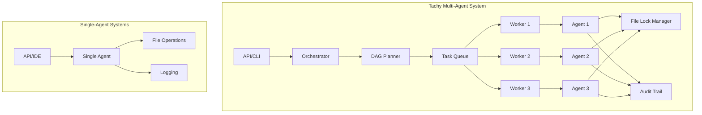
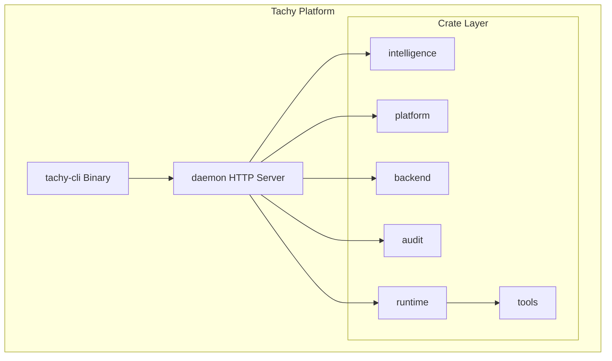
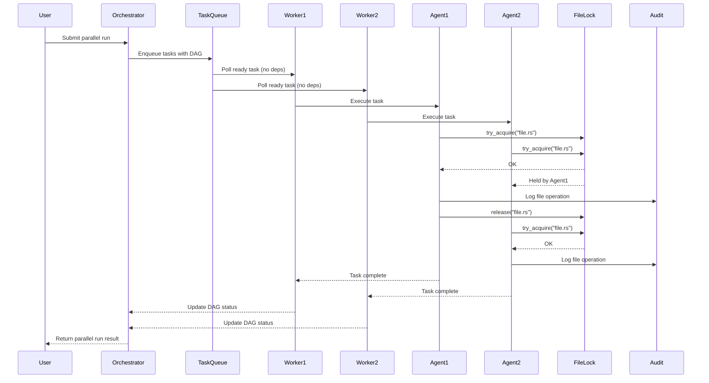

# Tachy AI Agent Platform vs. Competitors

A comprehensive comparison of Tachy against Claude Code, Cursor, and other AI coding assistants.

---

## Executive Summary

Tachy is a **local-first AI agent platform** that distinguishes itself through multi-agent parallel execution, enterprise-grade security, and complete data sovereignty. While competitors like Claude Code and Cursor focus on single-agent sequential workflows with cloud dependencies, Tachy provides a Kubernetes-like orchestration layer for AI agents with DAG-based scheduling, file-level cooperative locking, and SHA-256 hash-chained audit trails.

---

## 1. Architecture Comparison

### 1.1 Local-First vs. Cloud-Dependent

| Feature | Tachy | Claude Code | Cursor | GitHub Copilot |
|---------|-------|-------------|--------|----------------|
| **Local Execution** | ✅ Single Rust binary, zero cloud dependency | ❌ Cloud-dependent (Anthropic API) | ⚠️ Hybrid (local editor + cloud LLM) | ❌ Cloud-dependent (Microsoft API) |
| **Data Privacy** | ✅ Zero data leaves your machine | ❌ Data sent to Anthropic | ⚠️ Data sent to Cursor servers | ❌ Data sent to Microsoft |
| **Offline Support** | ✅ Full functionality offline | ❌ Requires internet | ⚠️ Limited offline | ❌ Requires internet |
| **Model Flexibility** | ✅ Ollama + OpenAI-compatible backends | ❌ Anthropic models only | ⚠️ Limited model selection | ❌ Microsoft models only |

**Tachy Implementation:**
- [`rust/crates/backend/ollama.rs`](rust/crates/backend/ollama.rs) — Ollama client with tool call parsing and streaming
- [`rust/crates/backend/openai_compat.rs`](rust/crates/backend/openai_compat.rs) — OpenAI-compatible API client
- [`rust/crates/backend/registry.rs`](rust/crates/backend/registry.rs) — Model-to-backend mapping with auto-discovery

### 1.2 Multi-Agent Parallel Execution vs. Single-Agent Sequential

| Feature | Tachy | Claude Code | Cursor | GitHub Copilot |
|---------|-------|-------------|--------|----------------|
| **Parallel Agents** | ✅ DAG-based parallel execution | ❌ Single-agent sequential | ❌ Single-agent sequential | ❌ Single-agent sequential |
| **Task Dependencies** | ✅ Full DAG scheduling | ❌ No dependency tracking | ❌ No dependency tracking | ❌ No dependency tracking |
| **Worker Pool** | ✅ Configurable concurrency | ❌ N/A | ❌ N/A | ❌ N/A |
| **Process Isolation** | ✅ Isolated working directory per task | ❌ N/A | ❌ N/A | ❌ N/A |

**Tachy Implementation:**
- [`rust/crates/daemon/src/parallel.rs`](rust/crates/daemon/src/parallel.rs:1) — Parallel execution engine with DAG scheduling
- [`rust/crates/daemon/src/parallel.rs:24-41`](rust/crates/daemon/src/parallel.rs:24-41) — `AgentTask` struct with dependency tracking (`deps: Vec<TaskId>`)
- [`rust/crates/daemon/src/parallel.rs:84-119`](rust/crates/daemon/src/parallel.rs:84-119) — `TaskQueue` with priority-based scheduling and dependency resolution
- [`rust/crates/daemon/src/parallel.rs:122-150`](rust/crates/daemon/src/parallel.rs:122-150) — `Orchestrator` with worker pool management

**Architecture Diagram:**

### 1.3 File Locking and Concurrent Access

| Feature | Tachy | Claude Code | Cursor | GitHub Copilot |
|---------|-------|-------------|--------|----------------|
| **File-Level Locking** | ✅ Cooperative locking with TTL | ❌ No locking | ❌ No locking | ❌ No locking |
| **Lock Timeout** | ✅ Configurable wait timeout | ❌ N/A | ❌ N/A | ❌ N/A |
| **Deadlock Prevention** | ✅ Auto-expire locks (5 min TTL) | ❌ N/A | ❌ N/A | ❌ N/A |
| **Lock Audit** | ✅ All lock acquisitions logged | ❌ N/A | ❌ N/A | ❌ N/A |

**Tachy Implementation:**
- [`rust/crates/runtime/src/filelock.rs`](rust/crates/runtime/src/filelock.rs:1) — File-level locking for parallel agent safety
- [`rust/crates/runtime/src/filelock.rs:41-65`](rust/crates/runtime/src/filelock.rs:41-65) — `try_acquire()` with collision detection
- [`rust/crates/runtime/src/filelock.rs:68-84`](rust/crates/runtime/src/filelock.rs:68-84) — `acquire_with_wait()` with timeout-based waiting
- [`rust/crates/runtime/src/filelock.rs:28`](rust/crates/runtime/src/filelock.rs:28) — 5-minute TTL for automatic deadlock prevention

---

## 2. Security & Compliance

### 2.1 SSO/SAML Support

| Feature | Tachy | Claude Code | Cursor | GitHub Copilot |
|---------|-------|-------------|--------|----------------|
| **SAML 2.0** | ✅ Full SAML SP support | ❌ No | ❌ No | ✅ Enterprise only |
| **OIDC Support** | ✅ Token exchange support | ❌ No | ⚠️ Limited | ✅ Enterprise only |
| **IdP Group Mapping** | ✅ Role mapping from IdP groups | ❌ No | ❌ No | ✅ Enterprise only |
| **Session Management** | ✅ JWT-based sessions | ❌ N/A | ❌ N/A | ✅ Enterprise only |

**Tachy Implementation:**
- [`rust/crates/audit/src/sso.rs`](rust/crates/audit/src/sso.rs:1) — SSO/SAML integration for enterprise authentication
- [`rust/crates/audit/src/sso.rs:19-42`](rust/crates/audit/src/sso.rs:19-42) — `SsoConfig` with SAML IdP configuration
- [`rust/crates/audit/src/sso.rs:108-139`](rust/crates/audit/src/sso.rs:108-139) — SAML AuthnRequest URL generation
- [`rust/crates/audit/src/sso.rs:142-150`](rust/crates/audit/src/sso.rs:142-150) — SAML callback processing with validation

### 2.2 Audit Trail Integrity

| Feature | Tachy | Claude Code | Cursor | GitHub Copilot |
|---------|-------|-------------|--------|----------------|
| **SHA-256 Hash Chain** | ✅ Tamper-proof audit trail | ❌ No | ❌ No | ❌ No |
| **Event Sequence** | ✅ Ordered sequence numbers | ❌ No | ❌ No | ❌ No |
| **Chain Verification** | ✅ `verify_audit_chain()` | ❌ No | ❌ No | ❌ No |
| **Redaction** | ✅ Automatic secret redaction | ❌ No | ⚠️ Partial | ❌ No |

**Tachy Implementation:**
- [`rust/crates/audit/src/event.rs`](rust/crates/audit/src/event.rs:1) — Audit event with SHA-256 hash chain
- [`rust/crates/audit/src/event.rs:46-52`](rust/crates/audit/src/event.rs:46-52) — Hash chain fields (`hash`, `prev_hash`)
- [`rust/crates/audit/src/event.rs:134-147`](rust/crates/audit/src/event.rs:134-147) — `sign()` and `verify()` methods for hash chain
- [`rust/crates/audit/src/event.rs:150-172`](rust/crates/audit/src/event.rs:150-172) — `verify_audit_chain()` for entire chain verification

### 2.3 RBAC and Team-Level Permissions

| Feature | Tachy | Claude Code | Cursor | GitHub Copilot |
|---------|-------|-------------|--------|----------------|
| **Role-Based Access** | ✅ Viewer/Developer/Admin | ❌ No | ❌ No | ✅ Enterprise only |
| **Action-Level Permissions** | ✅ Granular action control | ❌ No | ❌ No | ✅ Enterprise only |
| **Team Isolation** | ✅ Multi-team workspaces | ❌ No | ❌ No | ✅ Enterprise only |
| **Permission Checks** | ✅ `check_permission()` | ❌ No | ❌ No | ✅ Enterprise only |

**Tachy Implementation:**
- [`rust/crates/audit/src/rbac.rs`](rust/crates/audit/src/rbac.rs:1) — Role-Based Access Control (RBAC)
- [`rust/crates/audit/src/rbac.rs:8-17`](rust/crates/audit/src/rbac.rs:8-17) — `Role` enum (Viewer, Developer, Admin)
- [`rust/crates/audit/src/rbac.rs:40-52`](rust/crates/audit/src/rbac.rs:40-52) — `Action` enum with 11 granular actions
- [`rust/crates/audit/src/rbac.rs:55-74`](rust/crates/audit/src/rbac.rs:55-74) — `check_permission()` with role-based evaluation

### 2.4 Governance Policy Engine

| Feature | Tachy | Claude Code | Cursor | GitHub Copilot |
|---------|-------|-------------|--------|----------------|
| **Policy Rules** | ✅ Declarative policy engine | ❌ No | ❌ No | ❌ No |
| **Auto-Approval** | ✅ Safe patches auto-approved | ❌ No | ❌ No | ❌ No |
| **Path Protection** | ✅ Protected path patterns | ❌ No | ❌ No | ❌ No |
| **Content Blocking** | ✅ Secret pattern detection | ❌ No | ❌ No | ❌ No |
| **Patch Size Limits** | ✅ Max lines per patch | ❌ No | ❌ No | ❌ No |

**Tachy Implementation:**
- [`rust/crates/audit/src/policy_engine.rs`](rust/crates/audit/src/policy_engine.rs:1) — Policy engine for governance validation
- [`rust/crates/audit/src/policy_engine.rs:47-60`](rust/crates/audit/src/policy_engine.rs:47-60) — `PolicyRuleType` with 5 rule types
- [`rust/crates/audit/src/policy_engine.rs:79-114`](rust/crates/audit/src/policy_engine.rs:79-114) — `enterprise_default()` with pre-configured rules
- [`rust/crates/audit/src/policy_engine.rs:117-125`](rust/crates/audit/src/policy_engine.rs:117-125) — `evaluate()` method for patch evaluation

---

## 3. Collaboration Features

### 3.1 Team Workspaces

| Feature | Tachy | Claude Code | Cursor | GitHub Copilot |
|---------|-------|-------------|--------|----------------|
| **Team Creation** | ✅ Programmatic team creation | ❌ No | ❌ No | ✅ Enterprise only |
| **Member Management** | ✅ Add/remove team members | ❌ No | ❌ No | ✅ Enterprise only |
| **Role Assignment** | ✅ Per-team role assignment | ❌ No | ❌ No | ✅ Enterprise only |
| **Shared Resources** | ✅ Shared audit trails | ❌ No | ❌ No | ❌ No |

**Tachy Implementation:**
- [`rust/crates/daemon/src/teams.rs`](rust/crates/daemon/src/teams.rs:1) — Team Workspace management
- [`rust/crates/daemon/src/teams.rs:9-15`](rust/crates/daemon/src/teams.rs:9-15) — `Team` struct with members map
- [`rust/crates/daemon/src/teams.rs:112-135`](rust/crates/daemon/src/teams.rs:112-135) — `create_team()` with admin initialization
- [`rust/crates/daemon/src/teams.rs:97-102`](rust/crates/daemon/src/teams.rs:97-102) — `get_member_role()` for team-specific permissions

### 3.2 Invitation-Based Membership

| Feature | Tachy | Claude Code | Cursor | GitHub Copilot |
|---------|-------|-------------|--------|----------------|
| **Invitation Tokens** | ✅ Secure token-based invites | ❌ No | ❌ No | ✅ Enterprise only |
| **Invitation Expiry** | ✅ 72-hour expiry | ❌ No | ❌ No | ✅ Enterprise only |
| **Email-Based** | ✅ Email-targeted invites | ❌ No | ❌ No | ✅ Enterprise only |
| **Invitation Status** | ✅ Track used/expired | ❌ No | ❌ No | ❌ No |

**Tachy Implementation:**
- [`rust/crates/daemon/src/teams.rs:26-36`](rust/crates/daemon/src/teams.rs:26-36) — `WorkspaceInvitation` struct with token and expiry
- [`rust/crates/daemon/src/teams.rs:137-175`](rust/crates/daemon/src/teams.rs:137-175) — `invite()` method with token generation
- [`rust/crates/daemon/src/teams.rs:67`](rust/crates/daemon/src/teams.rs:67) — 72-hour invitation expiry constant

### 3.3 Shared Audit Trails

| Feature | Tachy | Claude Code | Cursor | GitHub Copilot |
|---------|-------|-------------|--------|----------------|
| **Team Audit Access** | ✅ All members view audit | ❌ No | ❌ No | ❌ No |
| **Cross-Session Persistence** | ✅ SHA-256 hash chain survives sessions | ❌ No | ❌ No | ❌ No |
| **Audit Event Types** | ✅ 13 event types | ❌ No | ❌ No | ❌ No |

**Tachy Implementation:**
- [`rust/crates/audit/src/event.rs:13-28`](rust/crates/audit/src/event.rs:13-28) — `AuditEventKind` with 13 event types
- [`rust/crates/audit/src/logger.rs`](rust/crates/audit/src/logger.rs) — `AuditLogger` with append-only JSONL persistence

---

## 4. Deployment Options

### 4.1 Local-Only Deployment

| Feature | Tachy | Claude Code | Cursor | GitHub Copilot |
|---------|-------|-------------|--------|----------------|
| **Single Binary** | ✅ Single Rust binary | ❌ No | ⚠️ VS Code extension | ❌ No |
| **No Cloud Dependency** | ✅ Zero cloud dependency | ❌ No | ❌ No | ❌ No |
| **Local Model Support** | ✅ Ollama integration | ❌ No | ⚠️ Limited | ❌ No |
| **Self-Contained** | ✅ All-in-one platform | ❌ No | ❌ No | ❌ No |

**Tachy Implementation:**
- [`rust/crates/daemon/src/lib.rs`](rust/crates/daemon/src/lib.rs) — Daemon with HTTP server, agent engine, web UI
- [`rust/crates/tachy-cli/src/main.rs`](rust/crates/tachy-cli/src/main.rs) — CLI binary entry point

### 4.2 Self-Hosted SaaS Mode

| Feature | Tachy | Claude Code | Cursor | GitHub Copilot |
|---------|-------|-------------|--------|----------------|
| **Multi-Tenant** | ✅ SaaS platform mode | ❌ No | ❌ No | ✅ Enterprise only |
| **Tenant Isolation** | ✅ Workspace directory isolation | ❌ No | ❌ No | ❌ No |
| **JWT Authentication** | ✅ JWT-based tenant auth | ❌ No | ❌ No | ✅ Enterprise only |
| **Managed Infrastructure** | ✅ Managed Ollama endpoints | ❌ No | ❌ No | ❌ No |

**Tachy Implementation:**
- [`rust/crates/daemon/src/saas.rs`](rust/crates/daemon/src/saas.rs:1) — SaaS Multi-Tenant Platform
- [`rust/crates/daemon/src/saas.rs:10-18`](rust/crates/daemon/src/saas.rs:10-18) — `Tenant` struct with workspace isolation
- [`rust/crates/daemon/src/saas.rs:95-102`](rust/crates/daemon/src/saas.rs:95-102) — `SaaSPlatform` with tenant management
- [`rust/crates/daemon/src/saas.rs:142-175`](rust/crates/daemon/src/saas.rs:142-175) — `signup()` with tenant creation

### 4.3 Resource Limits and Quotas

| Feature | Tachy | Claude Code | Cursor | GitHub Copilot |
|---------|-------|-------------|--------|----------------|
| **Concurrent Agent Limits** | ✅ Per-tenant limits | ❌ No | ❌ No | ✅ Enterprise only |
| **Token Quotas** | ✅ Daily token limits | ❌ No | ❌ No | ✅ Enterprise only |
| **Storage Quotas** | ✅ Per-tenant storage limits | ❌ No | ❌ No | ✅ Enterprise only |
| **Usage Tracking** | ✅ Real-time usage dashboard | ❌ No | ❌ No | ✅ Enterprise only |

**Tachy Implementation:**
- [`rust/crates/daemon/src/saas.rs:21-36`](rust/crates/daemon/src/saas.rs:21-36) — `ResourceLimits` struct with 3 quota types
- [`rust/crates/daemon/src/saas.rs:105-112`](rust/crates/daemon/src/saas.rs:105-112) — `TenantUsage` for real-time tracking
- [`rust/crates/daemon/src/saas.rs:48-55`](rust/crates/daemon/src/saas.rs:48-55) — `DashboardSummary` for tenant metrics

---

## 5. Developer Experience

### 5.1 Agent Marketplace

| Feature | Tachy | Claude Code | Cursor | GitHub Copilot |
|---------|-------|-------------|--------|----------------|
| **Template Marketplace** | ✅ Publish/discover agents | ❌ No | ❌ No | ❌ No |
| **Version Management** | ✅ Semantic versioning | ❌ No | ❌ No | ❌ No |
| **Rating System** | ✅ 1-5 star ratings | ❌ No | ❌ No | ❌ No |
| **Template Installation** | ✅ One-click install | ❌ No | ❌ No | ❌ No |

**Tachy Implementation:**
- [`rust/crates/daemon/src/marketplace.rs`](rust/crates/daemon/src/marketplace.rs:1) — Agent Marketplace
- [`rust/crates/daemon/src/marketplace.rs:9-22`](rust/crates/daemon/src/marketplace.rs:9-22) — `MarketplaceListing` with ratings
- [`rust/crates/daemon/src/marketplace.rs:25-31`](rust/crates/daemon/src/marketplace.rs:25-31) — `MarketplaceVersion` with semantic versioning
- [`rust/crates/daemon/src/marketplace.rs:101-150`](rust/crates/daemon/src/marketplace.rs:101-150) — `publish()` with version conflict detection

### 5.2 E2E Testing Infrastructure

| Feature | Tachy | Claude Code | Cursor | GitHub Copilot |
|---------|-------|-------------|--------|----------------|
| **E2E Smoke Tests** | ✅ Comprehensive test suite | ❌ No | ❌ No | ❌ No |
| **Load Testing** | ✅ Built-in load tests | ❌ No | ❌ No | ❌ No |
| **Integration Tests** | ✅ Full integration test suite | ❌ No | ❌ No | ❌ No |
| **Test Coverage** | ✅ 283 tests | ❌ No | ❌ No | ❌ No |

**Tachy Implementation:**
- [`rust/crates/daemon/tests/e2e_smoke.rs`](rust/crates/daemon/tests/e2e_smoke.rs) — E2E smoke tests
- [`rust/crates/daemon/tests/load_test.rs`](rust/crates/daemon/tests/load_test.rs) — Load testing infrastructure
- [`rust/crates/daemon/tests/integration.rs`](rust/crates/daemon/tests/integration.rs) — Integration tests

### 5.3 Tool Integration (MCP, LSP)

| Feature | Tachy | Claude Code | Cursor | GitHub Copilot |
|---------|-------|-------------|--------|----------------|
| **MCP Server** | ✅ JSON-RPC 2.0 over stdio | ❌ No | ✅ MCP compatible | ❌ No |
| **LSP Integration** | ✅ Language-aware diagnostics | ⚠️ Limited | ✅ Full LSP | ✅ Full LSP |
| **Custom Tools** | ✅ YAML-defined tools | ❌ No | ❌ No | ❌ No |
| **Tool Registry** | ✅ Built-in + custom tools | ❌ No | ❌ No | ❌ No |

**Tachy Implementation:**
- [`rust/crates/daemon/src/mcp.rs`](rust/crates/daemon/src/mcp.rs) — JSON-RPC 2.0 MCP server over stdio
- [`rust/crates/intelligence/src/lsp.rs`](rust/crates/intelligence/src/lsp.rs) — `LspManager` with language-specific diagnostics
- [`rust/crates/tools/lib.rs`](rust/crates/tools/lib.rs) — `mvp_tool_specs()` with 13 built-in tools
- [`rust/crates/tools/custom.rs`](rust/crates/tools/custom.rs) — `CustomToolRegistry` for YAML-defined tools

---

## 6. Billing & Metering

### 6.1 Usage-Based Billing

| Feature | Tachy | Claude Code | Cursor | GitHub Copilot |
|---------|-------|-------------|--------|----------------|
| **Stripe Integration** | ✅ Stripe billing integration | ❌ No | ❌ No | ✅ Enterprise only |
| **Token Tracking** | ✅ Input/output token metering | ❌ No | ❌ No | ✅ Enterprise only |
| **Tool Invocation Tracking** | ✅ Per-tool usage tracking | ❌ No | ❌ No | ❌ No |
| **Agent Run Tracking** | ✅ Per-agent run metering | ❌ No | ❌ No | ❌ No |

**Tachy Implementation:**
- [`rust/crates/audit/src/metering.rs`](rust/crates/audit/src/metering.rs:1) — Usage metering service
- [`rust/crates/audit/src/metering.rs:23-35`](rust/crates/audit/src/metering.rs:23-35) — `UsageEvent` with token and tool tracking
- [`rust/crates/audit/src/metering.rs:38-48`](rust/crates/audit/src/metering.rs:38-48) — `UsageAggregate` for aggregated counters
- [`rust/crates/audit/src/metering.rs:85-150`](rust/crates/audit/src/metering.rs:85-150) — `record_event()` with audit trail persistence

### 6.2 License System

| Feature | Tachy | Claude Code | Cursor | GitHub Copilot |
|---------|-------|-------------|--------|----------------|
| **Offline License** | ✅ HMAC-SHA256 license keys | ❌ No | ❌ No | ❌ No |
| **Trial Period** | ✅ 7-day trial | ❌ No | ⚠️ Free tier | ⚠️ Free tier |
| **Tier Management** | ✅ Multi-tier licensing | ❌ No | ❌ No | ✅ Enterprise only |
| **License Verification** | ✅ Offline verification | ❌ No | ❌ No | ❌ No |

**Tachy Implementation:**
- [`rust/crates/audit/src/license.rs`](rust/crates/audit/src/license.rs) — License system with HMAC-SHA256
- [`rust/crates/audit/src/license.rs`](rust/crates/audit/src/license.rs) — Offline verification with 7-day trial

---

## 7. Unique Differentiators

### 7.1 Tachy's Competitive Advantages

1. **Multi-Agent Parallel Execution with DAG Scheduling**
   - Only platform with Kubernetes-like orchestration for AI agents
   - Dependency-aware task scheduling with worker pool
   - [`rust/crates/daemon/src/parallel.rs`](rust/crates/daemon/src/parallel.rs:1)

2. **SHA-256 Hash-Chained Audit Trail**
   - Tamper-proof audit trail that survives across sessions
   - Chain verification for compliance and forensics
   - [`rust/crates/audit/src/event.rs`](rust/crates/audit/src/event.rs:46-52)

3. **Local-First Architecture**
   - Single Rust binary with zero cloud dependency
   - Full functionality offline with Ollama integration
   - [`rust/crates/backend/ollama.rs`](rust/crates/backend/ollama.rs)

4. **Enterprise-Grade Security**
   - SAML 2.0 SSO with IdP group mapping
   - File-level cooperative locking for parallel safety
   - [`rust/crates/audit/src/sso.rs`](rust/crates/audit/src/sso.rs:1)
   - [`rust/crates/runtime/src/filelock.rs`](rust/crates/runtime/src/filelock.rs:1)

5. **Governance Policy Engine**
   - Declarative policy rules with auto-approval for safe patches
   - Path protection, content blocking, patch size limits
   - [`rust/crates/audit/src/policy_engine.rs`](rust/crates/audit/src/policy_engine.rs:1)

### 7.2 Areas Where Competitors May Excel

1. **Claude Code**
   - Access to Claude 3.5/4 models with superior reasoning
   - Larger context window (200K tokens)
   - Mature Anthropic ecosystem and integrations

2. **Cursor**
   - Tighter IDE integration with VS Code
   - Larger user base and community
   - More polished UI/UX for individual developers

3. **GitHub Copilot**
   - Deep GitHub integration
   - Enterprise SSO/SAML (already established)
   - Widespread adoption in enterprises

---

## 8. Technical Specifications

### 8.1 Tachy Architecture Overview

### 8.2 Multi-Agent Execution Flow

---

## 9. Summary Comparison Table

| Category | Feature | Tachy | Claude Code | Cursor | GitHub Copilot |
|----------|---------|-------|-------------|--------|----------------|
| **Architecture** | Local-first | ✅ | ❌ | ⚠️ | ❌ |
| | Multi-agent parallel | ✅ | ❌ | ❌ | ❌ |
| | DAG scheduling | ✅ | ❌ | ❌ | ❌ |
| | File locking | ✅ | ❌ | ❌ | ❌ |
| **Security** | SAML 2.0 SSO | ✅ | ❌ | ❌ | ✅ (Ent) |
| | SHA-256 audit chain | ✅ | ❌ | ❌ | ❌ |
| | RBAC | ✅ | ❌ | ❌ | ✅ (Ent) |
| | Policy engine | ✅ | ❌ | ❌ | ❌ |
| **Collaboration** | Team workspaces | ✅ | ❌ | ❌ | ✅ (Ent) |
| | Invitation system | ✅ | ❌ | ❌ | ✅ (Ent) |
| | Shared audit trails | ✅ | ❌ | ❌ | ❌ |
| **Deployment** | Local-only | ✅ | ❌ | ⚠️ | ❌ |
| | Self-hosted SaaS | ✅ | ❌ | ❌ | ❌ |
| | Multi-tenant | ✅ | ❌ | ❌ | ✅ (Ent) |
| **Developer Experience** | Marketplace | ✅ | ❌ | ❌ | ❌ |
| | E2E tests | ✅ | ❌ | ❌ | ❌ |
| | MCP server | ✅ | ❌ | ✅ | ❌ |
| | Custom tools (YAML) | ✅ | ❌ | ❌ | ❌ |
| **Billing** | Stripe integration | ✅ | ❌ | ❌ | ✅ (Ent) |
| | Token metering | ✅ | ❌ | ❌ | ✅ (Ent) |
| | Offline license | ✅ | ❌ | ❌ | ❌ |

---

## 10. Conclusion

Tachy represents a fundamentally different approach to AI coding assistants. While competitors focus on single-agent workflows with cloud dependencies, Tachy provides:

1. **Enterprise-grade security** with SAML SSO, SHA-256 audit trails, and governance policies
2. **Multi-agent orchestration** with DAG scheduling and file-level locking
3. **Complete data sovereignty** with local-first architecture and offline support
4. **Team collaboration** with workspaces, invitations, and shared audit trails
5. **Flexible deployment** from local-only to self-hosted SaaS

For organizations requiring data privacy, compliance, and team collaboration, Tachy offers capabilities that competitors simply do not provide. For individual developers prioritizing model quality over architecture, competitors like Claude Code may still be preferable.

---

*Document generated from Tachy source code analysis. All feature claims are based on implemented functionality in the Tachy codebase.*
